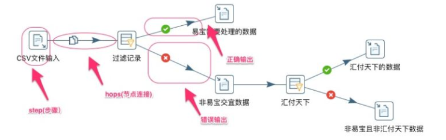
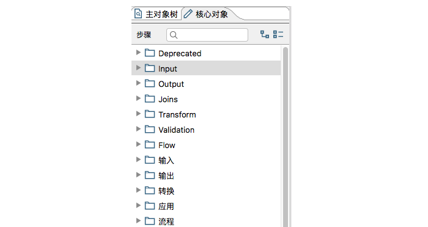

## Kettle 调研

导读：1. ETL是什么？2.Kettle是什么？

### 1. ETL是什么

#### ETL简介

ETL分别是“Extract”、“ Transform” 、“Load”三个单词的首字母缩写也即数据抽取、转换、装载的过程，但我们日常往往简称其为数据抽取。ETL是BI/DW（ Business Intelligence/Data Warehouse , 商务智能/数据仓库）的核心和灵魂，按照统一的规则集成并提高数据的价值，是负责完成数据从数据源向目标数据仓库转化的过程，是实施数据仓库的重要步骤。

ETL包含了三方面：

`Extract`（抽取）：将数据从各种原始的业务系统中读取出来，这是所有工作的前提。一般抽取过程需要连接到不同的数据源，以便为随后的步骤提供数据。这一部分看上去简单而琐碎，实际上它是 ETL 解决方案的成功实施的一个主要障碍。

`Transform`（转换）：按照预先设计好的规则将抽取得数据进行转换，使本来异构的数据格式能统一起来。任何对数据的处理过程都是转换。这些处理过程通常包括（但不限于）下面一些操作：

​	1.移动数据

​	2.根据规则验证数据

​	3.数据内容和数据结构的修改

​	4.将多个数据源的数据集成

​	5.根据处理后的数据计算派生值和聚集值

`Load`（装载）：将转换完的数据按计划增量或全部导入到数据仓库中。也就是说将数据加载到目标系统的所有操作。

#### ETL过程中实现数据清洗的实现方法
​	首先，在理解源数据的基础上实现数据表属性一致化。为解决源数据的同义异名和同名异义的问题，可通过元数据管理子系统，在理解源数据的同时，对不同表的属性名根据其含义重新定义其在数据挖掘库中的名字，并以转换规则的形式存放在元数据库中，在数据集成的时候，系统自动根据这些转换规则将源数据中的字段名转换成新定义的字段名，从而实现数据挖掘库中的同名同义。
​	其次，通过数据缩减，大幅度缩小数据量。由于源数据量很大，处理起来非常耗时，所以可以优先进行数据缩减，以提高后续数据处理分析效率。
​	最后，通过预先设定数据处理的可视化功能节点，达到可视化的进行数据清洗和数据转换的目的。针对缩减并集成后的数据，通过组合预处理子系统提供各种数据处理功能节点，能够以可视化的方式快速有效完成数据清洗和数据转换过程。

#### ETL工具有哪些

ETL的工具功能：必须对抽取到的数据能进行灵活计算、合并、拆分等转换操作。

目前，ETL工具的典型代表有:

商业软件：[Informatica](https://www.baidu.com/s?wd=Informatica&tn=24004469_oem_dg&rsv_dl=gh_pl_sl_csd)，IBM Datastage，Oracle ODI，Microsoft SSIS

开源软件：Kettle，Talend，CloverETL，Ketl，Octopus

   ### 2.Kettle 是什么

#### Kettle 简介
Kettle 是 PDI 以前的名称，PDI 的全称是Pentaho Data Integeration，Kettle 本意是水壶的意思，表达了数据流的含义。Kettle 的主作者是 Matt ，他在 2003 年就开始了这个项目，在 PDI 的代码里就可以看到最早的日期大概在2003年4月。 从版本2.2开始， Kettle 项目进入了开源领域，并遵守 LGPL 协议。在 2006年 Kettle 加入了开源的 BI（Business Intelligence） 组织 Pentaho, 正式命名为PDI, 加入Pentaho 后Kettle 的发展越来越快了，并有越来越多的人开始关注它了。

#### Kettle产品特点

1. 适用于将多个应用系统的大批量的、异构的数据进行整合，有强大的数据转换功能。

2. 高效适配多种类型的异构数据库、文件和应用系统。

3. 快速构建复杂数据大集中应用、无需编码。

#### Kettle 构成

`Spoon`:一个基于swt开发的流式处理客户端，用户开发转换、任务、创建数据库、集群、分区等

`Pan`:一个独立的命令行程序，支持通过命令行实现界面的功能，如果转换启停、任务启停。状态查看等 

`Kitchen`:一个独立的命令行程序，用于执行由Spoon编辑的作业。 

`Carte`:一个轻量级的Web容器，用于建立专用、远程的ETL Server。

左边是集成开发工具（Spoon），可以进行流程的开发、配置、调试、部署、执行(转换、任务)，也可以对运行情况进行监控、对处理过程的日志进行查看、也可以通过接口调用方式进行远程管理。

中间是服务器(Carte)，包括实际执行转换和任务的ETL引擎、监控管理的接口、认证授权接口，还有一个可以拓展的接口。

下面是在开发过程中，用于保存集成开发工具中创建的转换、任务、数据库等项的，资源库包含两类，一个是数据库资源库，一个是文件资源库。

右边个是是第三方平台，可以基于kettle提供的接口实现相应的功能包括状态监控、启停控制、日志查看等功能。

#### PDI相关术语和概念

Job(任务)、Transformation(转换)是kettle的两个最重要的概念。任务做的一件完整的事，包含开始、结束等整个生命周期；而转换是要做这件事的某一个小的功能。比如你要从A数据源中解析数据后放入B数据源，那么你可以创建两个转换，一个是从A数据源加载数据->处理数据->放入存储中；另一个是把数据放入B数据源，然后在一个任务中处理他们。

#### **Transformation**（转换）

`Transformation`（转换)是由step(步骤)和hops(节点连接线)组成，一个转换，可以看成一段数据流，每一个步骤完成一项数据处理的工作，节点连接线用于数据的流动。

转换可以单独运行完成某一项工作，文件的扩展名为.ktr

#### Steps（步骤）

`Steps`（步骤）是转换的重要组件部分，在Spoon中步骤根据功能分为输入类、输出类、脚本类等，每一个步骤完成一种特定的功能，比如excel输出组件，用于把数据流输出为excel文件格式。参考如下：

#### Hops（节点连接）

`Hops`（节点连接）是数据传输的通道，用于连接两个步骤，使数据从一个步骤传递到另一个步骤，支持分发、复制等方式。注意数据处理的顺序并不是按照节点连接箭头的顺序，因为第个步骤都是单独的线程。

#### Job（工作）

`Jobs`（工作）是基于工作流模型的，顺序处理。把步骤、转换组织在一起完成一件完整的事情。
文件扩展名为.kjb

接下来将安装kettle实践一下^_^

本文参考了以下文章：

[Kettle百度文库教程word](https://wenku.baidu.com/view/bc0475f559f5f61fb7360b4c2e3f5727a4e92470.html?rec_flag=default&pn=51)

[Kettle百度文库教程PDF](https://wenku.baidu.com/view/b940066cdd88d0d232d46aa6.html?pn=51)

[开源ETL工具-kettle初识](https://zhuanlan.zhihu.com/p/24835051)

[Kettle基本介绍](https://blog.csdn.net/u010571844/article/details/43673421)

