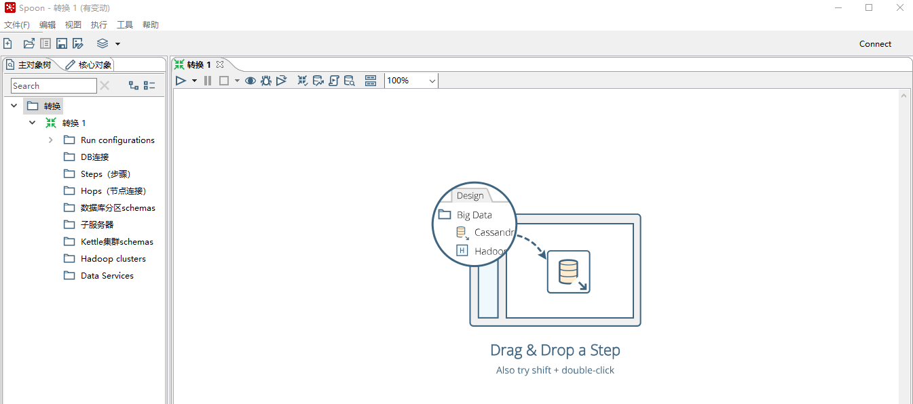

## Kettle install -centos7 and win10

>  导读：1.下载安装包，2.解压安装包，3.安装JDK，4.授权，5.验证安装，6.配置远程(Linux)服务，
>
>  7.配置本地PC机连接

#### 1.下载安装包

安装包大概有1G左右，我下的是最新8.2版本的，因此做好用脚本在后台自己下，以下为脚本内容：

```shell
[root@hadoop1]/opt/kettle# cat download.sh
#!/bin/bash

nohup wget https://nchc.dl.sourceforge.net/project/pentaho/Pentaho%208.2/client-tools/pdi-ce-8.2.0.0-342.zip 2>&1 &
```

> 如果该链接下不了，那可能已经过期了，需要查阅新的下载链接替换旧的链接。

#### 2.解压安装包

```shell
[root@hadoop1]/opt/kettle# unzip pdi-ce-8.2.0.0-342.zip
[root@hadoop1]/opt/kettle# ll
total 1162240
drwxrwxrwx 15 root root       4096 Nov 14 19:01 data-integration
-rw-r--r--  1 root root        129 Mar  6 19:25 download.sh
-rw-------  1 root root    1820201 Mar  6 19:30 nohup.out
-rw-r--r--  1 root root 1188297913 Nov 15 09:26 pdi-ce-8.2.0.0-342.zip
[root@hadoop1]/opt/kettle#
```

`data-integration`为解压出来的安装包，

#### 3.JDK安装

略，最好安装1.8以上的版本

#### 4.授权

给`data-integration`下的脚本赋予执行权限

```shell
[root@hadoop1]/opt/kettle/data-integration# chmod +x *.sh
[root@hadoop1]/opt/kettle/data-integration# ll *.sh
-rwxr-xr-x 1 root root 1470 Nov 14 17:21 carte.sh
-rwxr-xr-x 1 root root 1031 Nov 14 17:21 encr.sh
-rwxr-xr-x 1 root root 1166 Nov 14 17:21 import.sh
-rwxr-xr-x 1 root root 1245 Nov 14 17:21 kitchen.sh
-rwxr-xr-x 1 root root 1211 Nov 14 17:21 pan.sh
-rwxr-xr-x 1 root root 1241 Nov 14 17:21 purge-utility.sh
-rwxr-xr-x 1 root root 1196 Nov 14 17:21 runSamples.sh
-rwxr-xr-x 1 root root 4602 Nov 14 17:21 set-pentaho-env.sh
-rwxr-xr-x 1 root root 1202 Nov 14 17:21 spark-app-builder.sh
-rwxr-xr-x 1 root root 1942 Nov 14 17:21 SpoonDebug.sh
-rwxr-xr-x 1 root root 7295 Nov 14 17:21 spoon.sh
-rwxr-xr-x 1 root root 1642 Nov 14 17:21 yarn.sh
[root@hadoop1]/opt/kettle/data-integration#
```

#### 5.验证安装

如果执行`kitchen.sh`出现以下信息

```shell
[root@hadoop1]/opt/kettle/data-integration# ./kitchen.sh
#######################################################################
WARNING:  no libwebkitgtk-1.0 detected, some features will be unavailable
    Consider installing the package with apt-get or yum.
    e.g. 'sudo apt-get install libwebkitgtk-1.0-0'
#######################################################################
...
```

则安装以下依赖

```shell
#1.下载nux-dextop-release
[root@hadoop1]/opt/kettle/data-integration# wget http://li.nux.ro/download/nux/dextop/el7/x86_64/nux-dextop-release-0-5.el7.nux.noarch.rpm
#2.安装nux-dextop-release
[root@hadoop1]/opt/kettle/data-integration# rpm -Uvh nux-dextop-release-0-5.el7.nux.noarch.rpm
#3.安装webkitgtk
[root@hadoop1]/opt/kettle/data-integration# yum install webkitgtk
...
Installed:
  webkitgtk.x86_64 0:2.4.9-3.el7.nux
Complete!
```

> Centos 6 需要下载另外的[nux-dextop](http://li.nux.ro/download/nux/dextop/el6/x86_64/nux-dextop-release-0-2.el6.nux.noarch.rpm) rpm安装包，否则执行`yum install webkitgtk`会出错。

再次验证

```shell
[root@hadoop1]/opt/kettle/data-integration# ./kitchen.sh
Java HotSpot(TM) 64-Bit Server VM warning: ignoring option MaxPermSize=256m; support was removed in 8.0
Options:
  -rep            = Repository name
  -user           = Repository username
  -trustuser      = !Kitchen.ComdLine.RepUsername!
  -pass           = Repository password
  -job            = The name of the job to launch
  -dir            = The directory (dont forget the leading /)
  -file           = The filename (Job XML) to launch
  -level          = The logging level (Basic, Detailed, Debug, Rowlevel, Error, Minimal, Nothing)
  -logfile        = The logging file to write to
  -listdir        = List the directories in the repository
  -listjobs       = List the jobs in the specified directory
  -listrep        = List the available repositories
  -norep          = Do not log into the repository
  -version        = show the version, revision and build date
  -param          = Set a named parameter <NAME>=<VALUE>. For example -param:FILE=customers.csv
  -listparam      = List information concerning the defined parameters in the specified job.
  -export         = Exports all linked resources of the specified job. The argument is the name of a ZIP file.
  -custom         = Set a custom plugin specific option as a String value in the job using <NAME>=<Value>, for example: -custom:COLOR=Red
  -maxloglines    = The maximum number of log lines that are kept internally by Kettle. Set to 0 to keep all rows (default)
  -maxlogtimeout  = The maximum age (in minutes) of a log line while being kept internally by Kettle. Set to 0 to keep all rows indefinitely (default)
[root@hadoop1]/opt/kettle/data-integration#
```

出现以上信息则算是安装成功。

#### 6.配置Kettle远程服务（Linux）

编辑`${KETTLE_HOME}/data-integration/plugins/pentaho-big-data-plugin/plugin.properties`文件，设置hadoop版本（我使用的cdh5.7）：`active.hadoop.configuration=cdh57`，如下所示：

```shell
# including HDFS, Hive, HBase, and Sqoop.
# For more configuration options specific to the Hadoop configuration choosen
# here see the config.properties file in that configuration's directory.
active.hadoop.configuration=cdh57

# Path to the directory that contains the available Hadoop configurations
hadoop.configurations.path=hadoop-configurations
...
```

进入`${KETTLE_HOME}/data-integration/plugins/pentaho-big-data-plugin/hadoop-configurations/cdh57`目录，将hadoop的配置文件`core-site.xml`、`mapred-site.xml`、`yarn-site.xml`复制过来，一般CDH的这些文件在`/etc/hadoop`目录下。如下：

```shell
[root@hadoop2 cdh57]# ll
total 440
-rw-r--r-- 1 wuguozhu develop-hadoop   3862 Mar  7 19:15 core-site.xml
-rw-r--r-- 1 wuguozhu develop-hadoop   1748 Mar  7 19:15 hdfs-site.xml
-rw-r--r-- 1 wuguozhu develop-hadoop   5452 Mar  7 19:15 hive-site.xml
drwxr-xr-x 4 root     root             4096 Mar  7 19:24 lib
-rw-r--r-- 1 wuguozhu develop-hadoop   4571 Mar  7 19:15 mapred-site.xml
-rwxr-xr-x 1 root     root           401055 Mar  7 19:24 pentaho-hadoop-shims-cdh514-8.2.2018.11.00-342.jar
-rwxr-xr-x 1 root     root             8621 Mar  7 19:24 pentaho-hadoop-shims-cdh514-hbase-comparators-8.2.2018.11.00-342.jar
-rw-r--r-- 1 wuguozhu develop-hadoop    315 Mar  7 19:15 ssl-client.xml
-rw-r--r-- 1 wuguozhu develop-hadoop   3811 Mar  7 19:15 yarn-site.xml
[root@hadoop2 cdh57]#
```

后续在使用时可能不止这些文件，到时候再看根据实际情况添加相应文件即可。

在Kettle远程服务器上（Linux）：
进入`data-integration`目录，设置远程服务连接密码：
`sh encr.sh -carte yourpassword`
结果会输出加密后的密码：OBF:1hvy1i271vny1zej1zer1vn41hzj1hrk

编辑密码文件：`vi pwd/kettle.pwd`
cluster: OBF:1hvy1i271vny1zej1zer1vn41hzj1hrk
其中，cluster为默认的用户名。

启动远程服务：

`nohup ./carte.sh localhost 9888 >> carte.log &`

端口号9888可以自己定义。

#### 7.配置本地PC机的连接

本地windows解压Kettle之后，执行Spoon.bat启动Kettle(如果出错可能是JDK版本的问题，需检查JDK版本及JAVA_HOME等信息)。执行SpoonConsole.bat打开图形界面，如下图所示：



本文参考：

[开源ETL工具Kettle初试–远程执行任务](http://lxw1234.com/archives/2017/02/834.htm)

