## Use Kettle

> 导读：1.从数据库(mysql)中读取数据写入HDFS并建hive表；

#### 从数据库(Mysql)中读取数据写入HDFS并建Hive表

在该转换中，需要配置2个DB链接（Mysql和HiveServer2），配置Hadoop集群（HDFS），配置子服务器（远程执行服务器）。

#####  1.数据库配置

主对象树》DB连接》新建》一般》Mysql》设置(填写数据库信息)

注意：在执行测试连接之前先把驱动jar放入`${KETTLE_HOME}/data-integration\lib`下，否则会报无法找到Driver的错误。

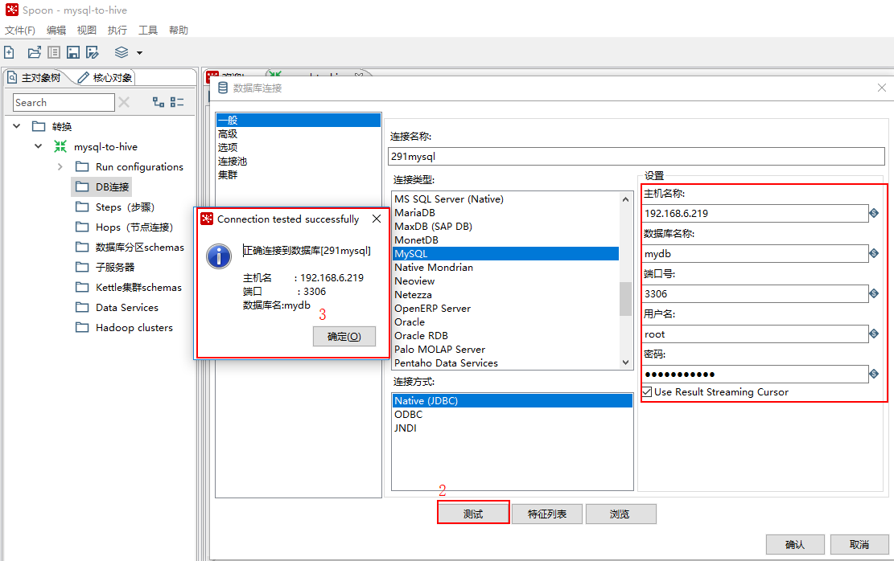

##### 2.远程Kettle连接配置

主对象树》子服务器》新建》服务(填写远程kettle服务端相关信息)

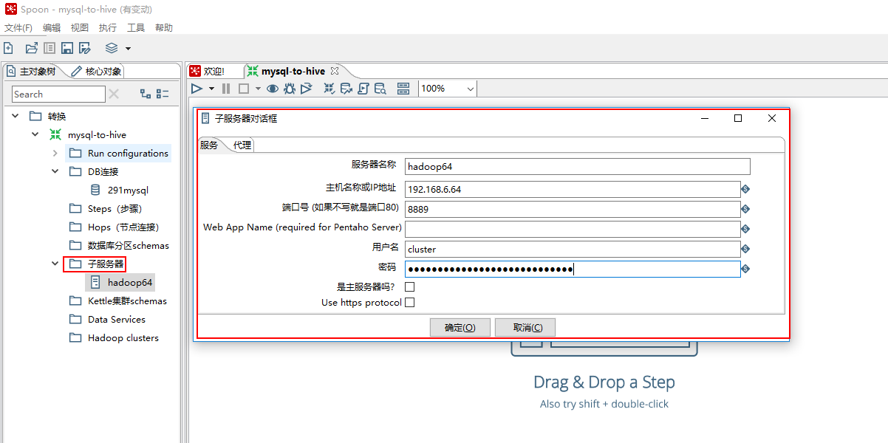

##### 3.Hadoop集群配置

注意，如果不使用MapReduce和ZK，那么只需要配置HDFS即可，Hostname为主NameNode的IP.

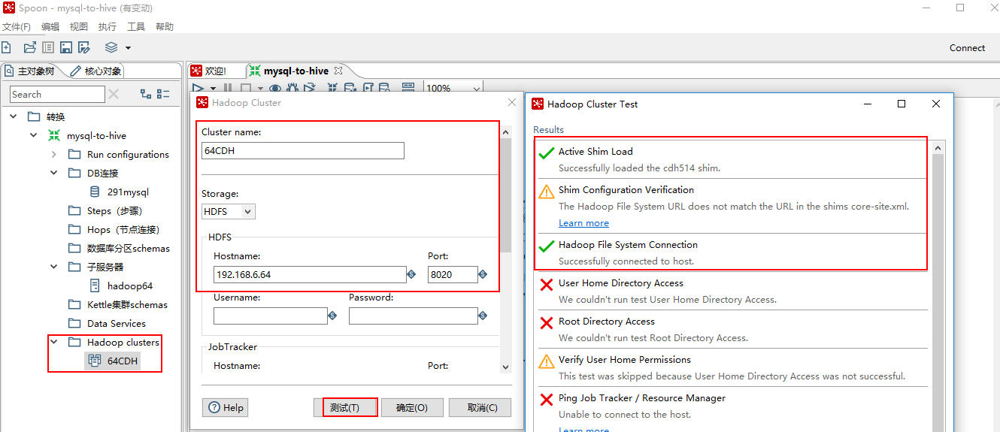

##### 4.配置HiveServer2

1.查看Hadoop版本，本次实例用的是CDH5.7.0

```shell
[root@hadoop2 ~]# hadoop version
Hadoop 2.6.0-cdh5.7.0
Subversion http://github.com/cloudera/hadoop -r c00978c67b0d3fe9f3b896b5030741bd40bf541a
Compiled by jenkins on 2016-03-23T18:36Z
Compiled with protoc 2.5.0
From source with checksum b2eabfa328e763c88cb14168f9b372
This command was run using /opt/cloudera/parcels/CDH-5.7.0-1.cdh5.7.0.p0.45/jars/hadoop-common-2.6.0-cdh5.7.0.jar
[root@hadoop2 ~]#
```


2.修改Kettle的`${HOME_KETTLE}/data-integration\plugins\pentaho-big-data-plugin\plugin.properties`文件中属性 `active.hadoop.configuration=cdh57` 如下所示：

```shell
# The Hadoop Configuration to use when communicating with a Hadoop cluster. This is used for all Hadoop client tools
# including HDFS, Hive, HBase, and Sqoop.
# For more configuration options specific to the Hadoop configuration choosen
# here see the config.properties file in that configuration's directory.
active.hadoop.configuration=cdh57

# Path to the directory that contains the available Hadoop configurations
hadoop.configurations.path=hadoop-configurations
```


3.查看Kettle的`${KETTLE_HOME}\data-integration\plugins\pentaho-big-data-plugin\hadoop-configurations`是否有对应Hadoop版本的目录，如果没有则复制其他目录重命名，例如`hadoop-configurations`没有cdh57这个目录，则复制cdh514重命名为cdh57，如下图所示：

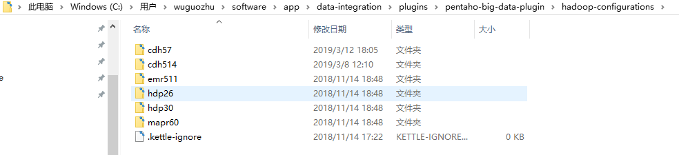

4.下载Hive客户端配置。 
在集群管理界面`Cloudera Management`中，找到Cluster 1 (CDH 5.7.0, Parcel)下面的`Hive`，点击进入`Hive（Cluster 1）`–>`操作`–>`下载客户端配置`，下载出配置文件：`hive-clientconfig.zip`

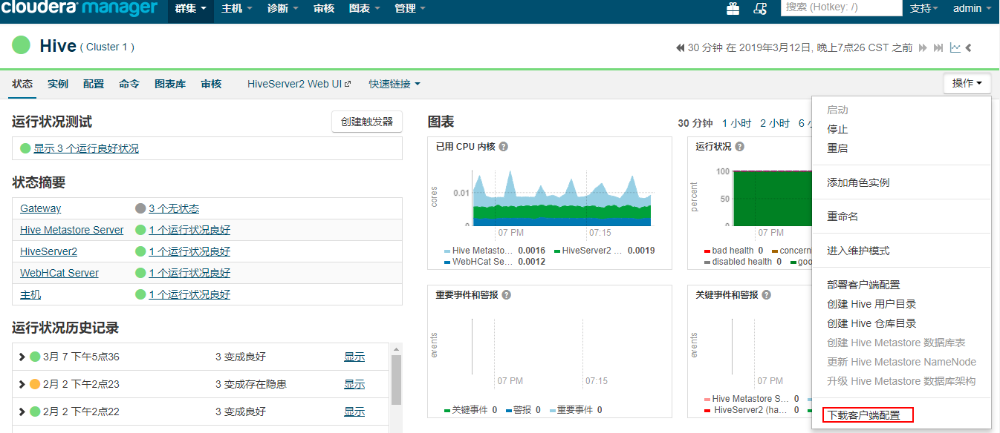


解压后

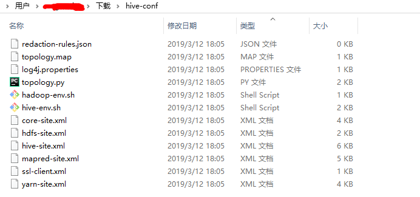

5.替换(添加)配置文件。 
将第3步下载的文件解压，将里面的`*.xml`文件，拷贝替换到Kettle目录中：`${KETTLE_HOME}\data-integration\plugins\pentaho-big-data-plugin\hadoop-configurations\cdh57`如下图所示：

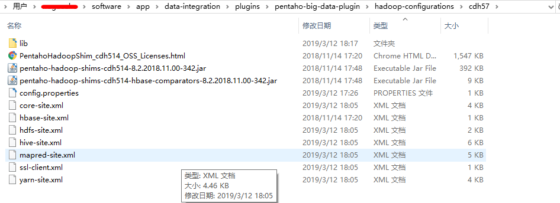

6.下载jar包。 
先删除Kettle内已有与hive相关的jar包，**<u>否则会出现因版本不一致导致报错</u>**。删除`${KETTLE_HOME}\data-integration\plugins\pentaho-big-data-plugin\hadoop-configurations\cdh57\lib`目录中所有hive-*开头的jar包。然后到安装Hive的服务器中，下载Hive驱动包，一般为CDH安装目录内，例：`/opt/cloudera/parcels/CDH/lib `
将所有hive开头的jar包下载出来，复制到`${KETTLE_HOME}\data-integration\plugins\pentaho-big-data-plugin\hadoop-configurations\cdh57\lib`文件夹中。 

7.配置完成，重启Kettle。

```java
配置Hive的数据库连接：
在转换的主对象树-->DB连接，右击新建。连接类型选择：Hadoop Hive 2
主机名：Hive服务器IP地址。
数据库名称：默认填写default，如果指定数据库，填写对应数据库名。
端口号：10000
用户名：hdfs （这里也可以不填，最好填hdfs）
测试是否正确连接。
```


实例所需的基本信息配置如下

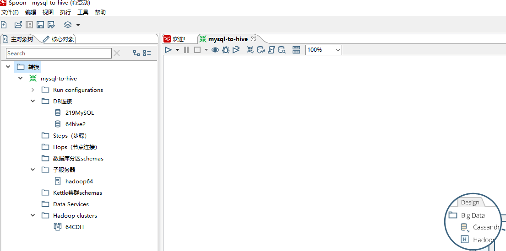

#### 5.数据抽取过程开发

> 看了一些文章，说是直接MySQL表直接到Hive表，性能比较差，因此本实例的步骤是MySQL到HDFS再到HIVE

1.配置mysql

核心对象->输入->表输入->拖入工作台->填写相关信息(步骤名称，数据库连接，获取SQL查询语句，预览等)->确定

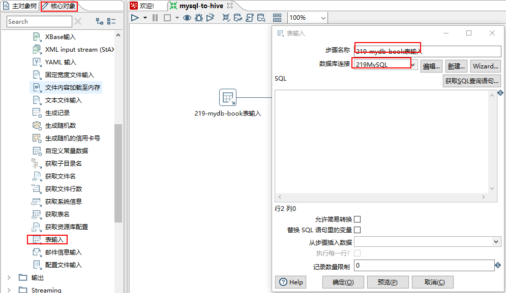

2.配置HDFS

`核心对象`->`Big Data`->`Hadoop file output`->`拖入工作台`->`按住Shift将表输入连接到hadoop file output`->`填写相关信息(步骤名称，数据库连接，获取SQL查询语句，预览等)`->`确定`

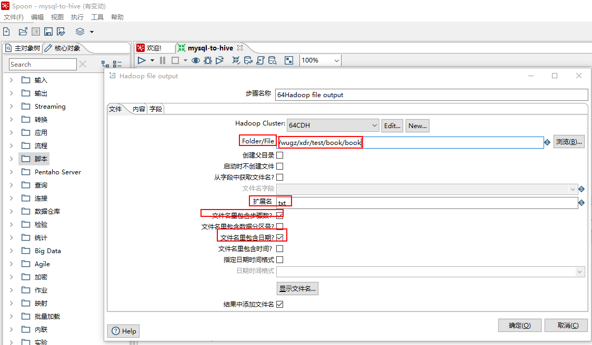

> 注意：选择目录时，目录的格式是`目录名+文件名`、`扩展名`、`是否包含日期时间`等

填写相应的信息

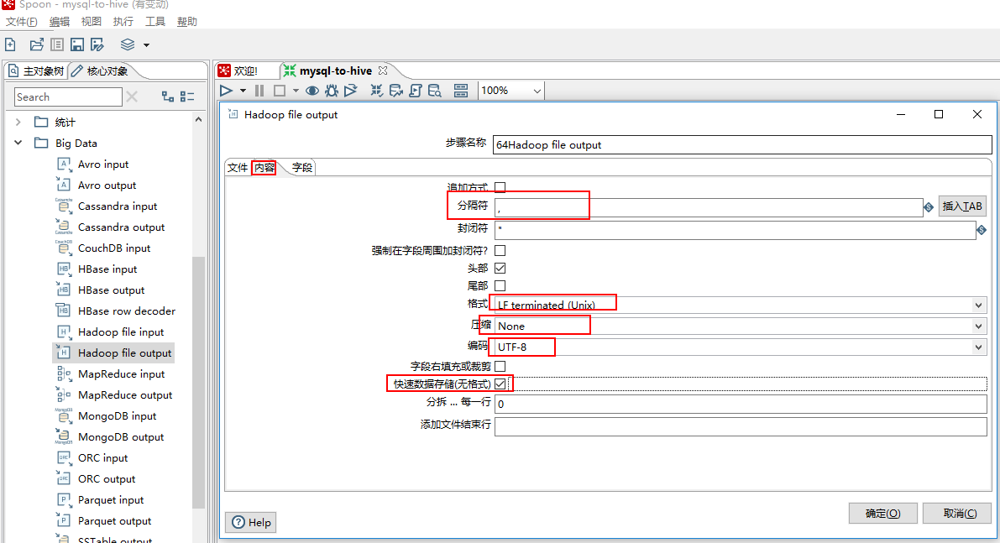

点击`获取字段`自动获取表中对应的字段，数据类型和长度，然后`确定`

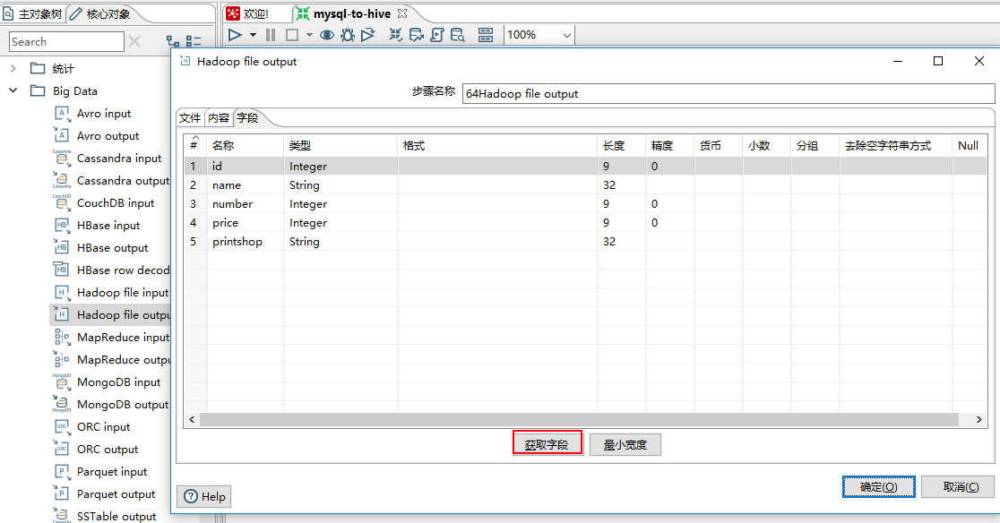

3.配置SQL执行脚本

`核心对象`->`脚本`->`执行SQL脚本`->`拖入工作台`->`按住Shift将hadoop file output连接到执行SQL脚本`->`填写相关信息：修改步骤名称，数据库连接，创建Hive表脚本`->`确定`

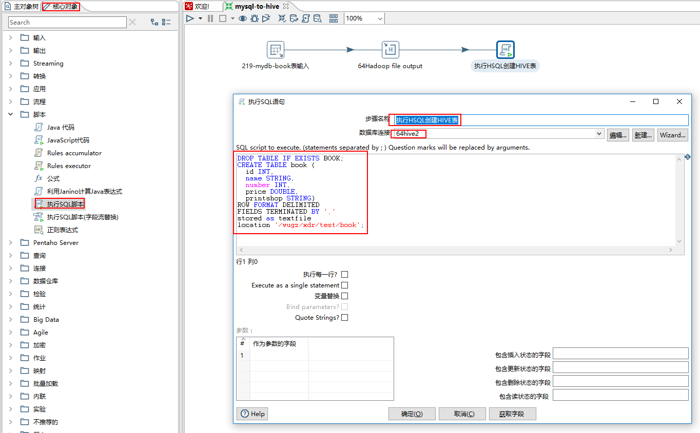

4.执行任务

前面1-3步配置完成后，任务流如下图所示：

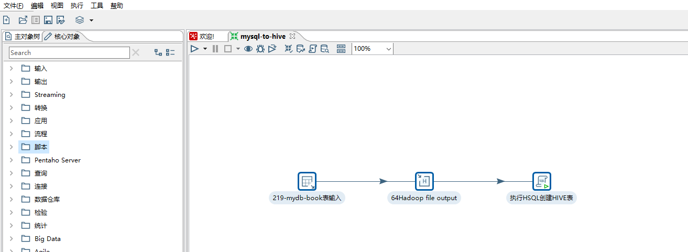

点击`三角形图标：选择Run`即可执行该工作流，如下图所示

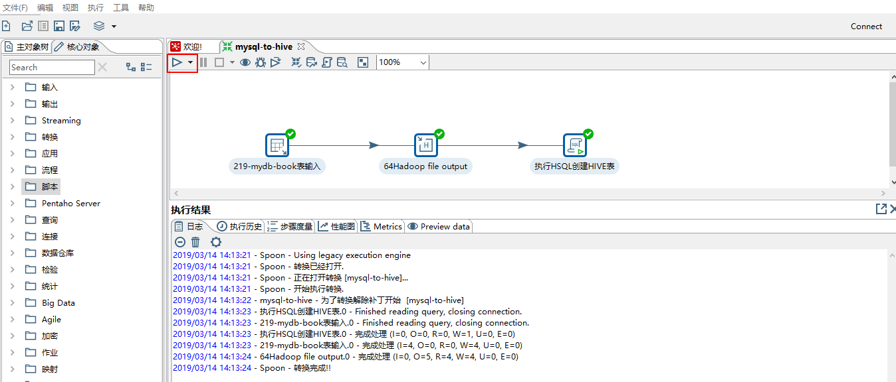

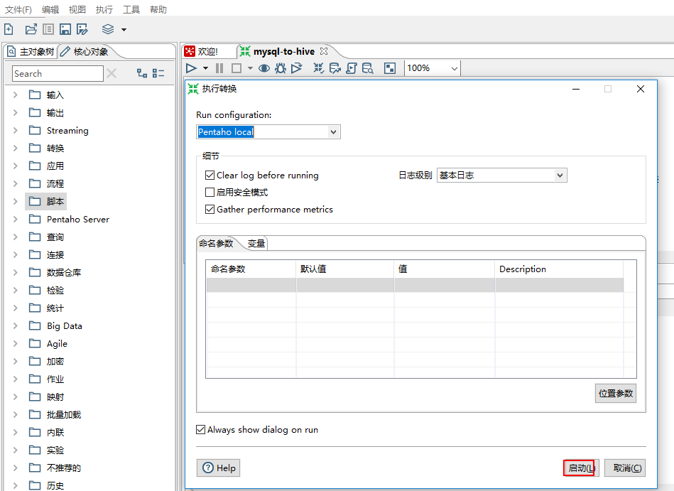


到此为止，我们利用Kettle完成了从MySQL将数据导入HDFS再创建HIVE表。

本文参考：

[开源ETL工具Kettle初试–远程执行任务](http://lxw1234.com/archives/2017/02/834.htm)

[关于kettle连接cdh集群hive的相关报错。](https://www.cnblogs.com/gxgd/p/10220818.html)

[Kettle连接MySQL数据库出现问题，连接不上](https://blog.csdn.net/qq_34531925/article/details/80425053)

[使用Kettle向CDH集群中Hive导入数据表](https://blog.csdn.net/u010758605/article/details/81215844)

感谢以上作者的分享