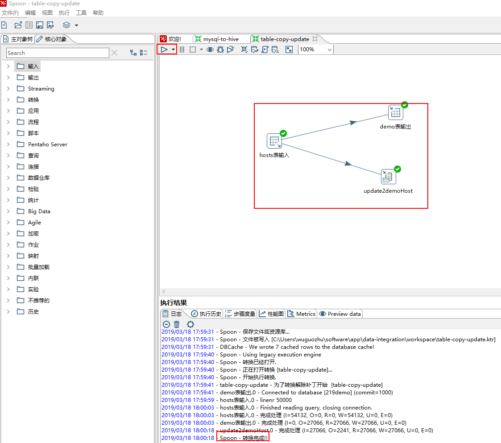

## 数据表间同步与更新

> 导读：本案例实践表输入输出与更新操作，一个是直接从数据源表同步数据到目标表，一个是检查原表的插入和更新，同步到目标表

### 1.建立DB连接

略，不知道怎么配置的去查阅kettle install那篇文章

### 2.配置表输入

`核心对象`->`输入`->`表输入`->`拖拽至工作台`->`配置表输入信息`

如下图所示：

预览数据

### 3.配置表输出

`核心对象`->`输出`->`表输出`->`拖拽至工作台`->`按住Shift从表输入将箭头指向表输出`->`配置表输入信息`

配置表信息：

1.步骤名称：这里最好写具有标示意义的名称

2.数据库连接：可以在下拉菜单处选择对应的`DB连接`

3.目标表：选择要输出的表单，可在`浏览`选择对应的表单

4.勾选`指定数据库字段`接着点击`数据库字段`接着点击`获取字段`然后点击`输入字段映射`进行字段选择，选择要用的字段后点击`确定`

5.其他选项没有特殊要求默认即可。

### 4.配置插入更新

`核心对象`->`输出`->`表输出`->`拖拽至工作台`->`按住Shift从表输入将箭头指向表输出`->`配置表输入信息`

1.步骤名称：这里最好写具有标示意义的名称

2.数据库连接：可以在下拉菜单处选择对应的`DB连接`

3.目标表：选择要输出的表单，可在`浏览`选择对应的表单

4.用来查询的关键字：点击`获取字段`

5.更新字段：点击`获取和更新字段`

### 5.执行操作

点击三角图标选择`Run`

[Kettle案例Demo](https://blog.csdn.net/m0_37213323/article/details/74202567#%E9%94%9A%E8%AE%B01)

