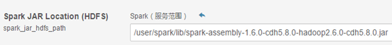
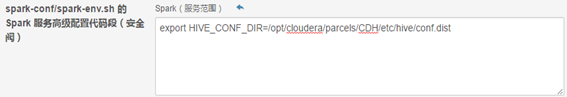
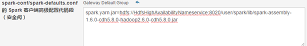
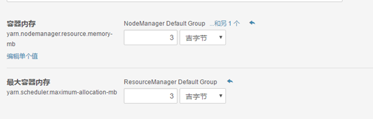
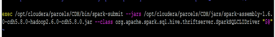
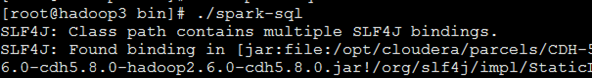
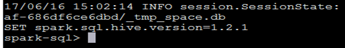

# CDH集成SparkSQL

### 概述

CDH内嵌[Spark](http://lib.csdn.net/base/spark)版本不支持spark-sql,因为cloudera在推自己的impala，但是有些场景需要用到SparkSQL时，就显得对CDH无可奈何，谁叫你用人家的产品呢，因此只有自己想办法了。

大概的思路就是换jar包，很多资料，千篇一律是要加入hive&hivethriftserver重新编译源码再打成jar才能支持，其实并不需要。我们只需要到官网去把编译好的spark包下下来，经过研究直接拿jar包来用就行了。

### Spark安装包下载

本案例我们用到的CDH5.8集成的Spark是1.6的版本

下载地址：http://spark.apache.org/downloads.html

下载操作系统对应的版本：

1．spark-1.6.0-bin-hadoop2.6.tgz

### 替换Jar包

1.找到Spark集群的某节点解压spark-1.6.0-bin-hadoop2.6.tgz包

执行命令：`tar –zxvf spark-1.6.0-bin-hadoop2.6.tgz`

```sh
[root@hadoop1 ~]# mv spark-1.6.0-bin-hadoop2.6 spark           
```

2.备份原有的jar包。在CDH存放jar的目录(默认的位置在`/opt/cloudera/parcels/CDH/jars`)

找到`spark-assembly-1.6.0-cdh5.8.0-hadoop2.6.0-cdh5.8.0.jar`进行备份。

执行命令：

```sh
[root@hadoop1 ~]# mv spark-assembly-1.6.0-cdh5.8.0-hadoop2.6.0-cdh5.8.0.jar spark-assembly-1.6.0-cdh5.8.0-hadoop2.6.0-cdh5.8.0.jar.bak
```

3.在解压好的spark安装包的lib目录（`spark/lib`）下找到`spark-assembly-1.6.0-hadoop2.6.0.jar`

执行命令：

```sh
[root@hadoop1 ~]# cp /opt/spark/lib/spark-assembly-1.6.0-hadoop2.6.0.jar /opt/cloudera/parcels/CDH/jars/spark-assembly-1.6.0-cdh5.8.0-hadoop2.6.0-cdh5.8.0.jar
```

### 拷贝jar到HDFS

首先需要将assembly jar拷贝到HDFS的/user/spark/lib目录下，修改文件权限为755

执行命令：(有权限拒绝时切到hdfs用户)

```sh
[root@hadoop1 ~]# Hadoop fs –put /opt/cloudera/parcels/CDH/jars/spark-assembly-1.6.0-cdh5.8.0-hadoop2.6.0-cdh5.8.0.jar /user/spark/lib
```

### CM配置

1.登陆CM,修改spark的服务范围为assembly jar在HDFS中的路径, 如下图所示：



2.修改spark的高级配置

编辑spark-env.sh：`export HIVE_CONF_DIR=/opt/cloudera/parcels/CDH/etc/hive/conf.dist`如下图所示：



编辑spark-defaults.conf:`spark.yarn.jar=hdfs://HdfsHighAvailabilityNameservice:8020/user/spark/lib/spark-assembly-1.6.0-cdh5.8.0-hadoop2.6.0-cdh5.8.0.jar`



### 配置YARN

建议配置yarn容器内存大一点，否则可能导致启动失败。



### 编辑SparkSQL启动脚本

找到CDH各种启动脚本的存放目录(默认为`/opt/cloudera/parcels/CDH/bin`)

执行命令：

```sh
[root@hadoop1 ~]# cat spark-sql
#!/usr/bin/env bash
exec /opt/cloudera/parcels/CDH/bin/spark-submit --jars /opt/cloudera/parcels/CDH/jars/spark-assembly-1.6.0-cdh5.8.0-hadoop2.6.0-cdh5.8.0.jar --class org.apache.spark.sql.hive.thriftserver.SparkSQLCLIDriver "$@"
```



编辑完成后并为`spark-sql`赋予执行权限

### 重启Spark服务

登录CM界面，重启spark服务，然后到后台去执行spark-sql即可使用sparkSQL





如果本文对您有所帮助，请支持一个`start`，不胜感激，谢谢！

参考：


