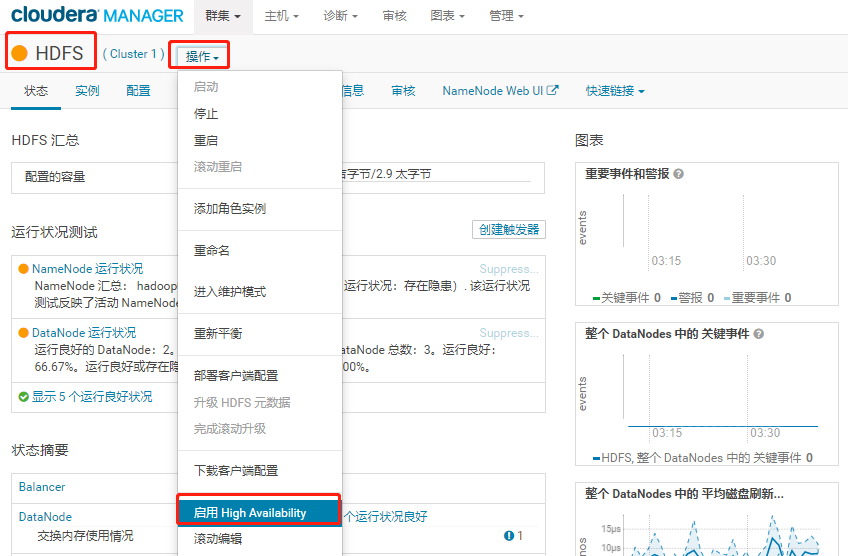
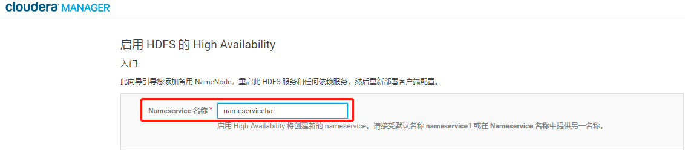
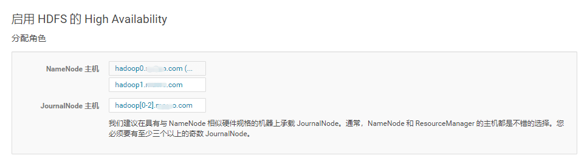
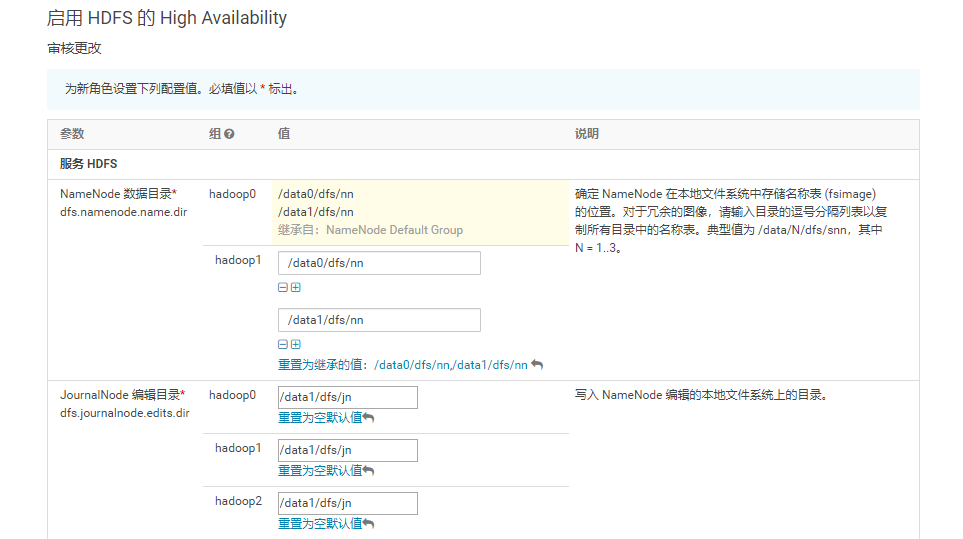
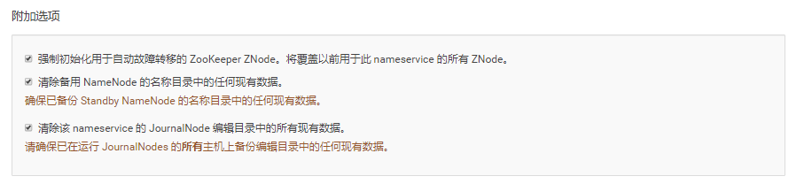
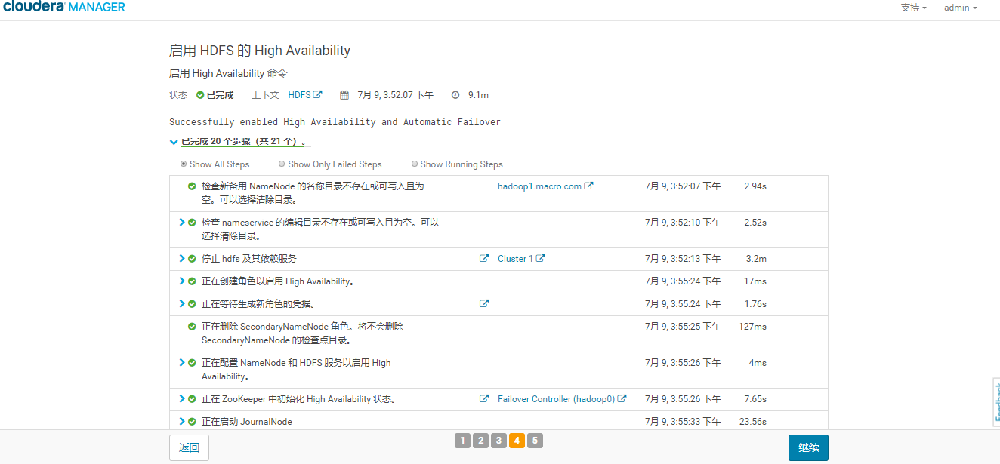
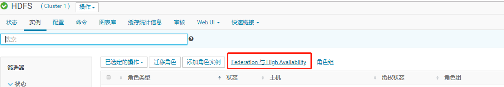
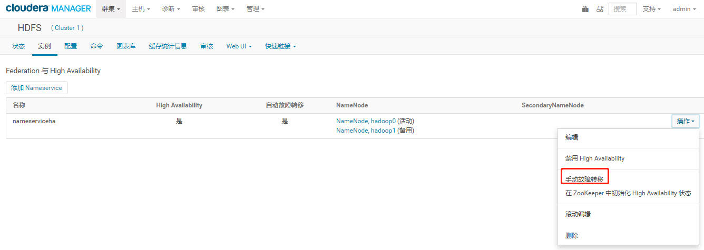
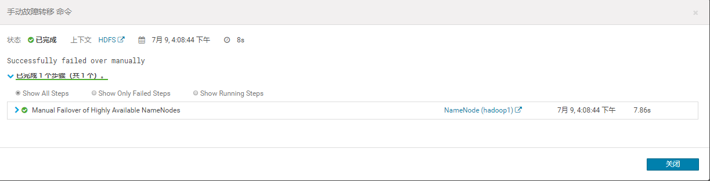

# 开启HDFS 高可用

## 文档编写目的

在HDFS集群中NameNode存在单点故障（SPOF），对于只有一个NameNode的集群，如果NameNode机器出现意外，将导致整个集群无法使用。为了解决NameNode单点故障的问题，Hadoop给出了HDFS的高可用HA方案，HDFS集群由两个NameNode组成，一个处于Active状态，另一个处于Standby状态。

Active NameNode可对外提供服务，而Standby NameNode则不对外提供服务，仅同步Active NameNode的状态，以便在Active NameNode失败时快速的进行切换。本篇文章主要讲述如何使用Cloudera Manager启用HDFS的HA。

### 内容概述

1.HDFS HA启用

2.更新Hive Metastore NameNode

3.HDFS HA功能可用性测试

4.Hive及Impala测试

### 测试环境

1.CM和CDH版本为5.16.1

### 前置条件

1.拥有Cloudera Manager的管理员账号

2.CDH集群已安装成功并正常使用

## 启用HDFS HA

1.使用管理员用户登录Cloudera Manager的Web管理界面，进入HDFS服务

2.点击“启用High Avaiability”，设置NameService名称

3.点击“继续”，选择NameNode主机及JouralNode主机

> JouralNode主机选择，一般与Zookeeper节点一致即可（至少3个且为奇数）

4.点击“继续”，设置NameNode的数据目录和JouralNode的编辑目录

>  NameNode的数据目录默认继承已有NameNode数据目录。

5.点击“继续”，启用HDFS的High Availability，如果集群已有数据，格式化NameNode会报错，不用理。

6.点击“继续”，完成HDFS的High Availability 

通过实例列表可以看到启用HDFS HA后增加了NameNode、Failover Controller及JouralNode服务并且服务都正常启动，至此已完成了HDFS HA的启用，接下来进行HDFS HA功能的可用性测试。

CM上HDFS HA的使用，可以通过界面进行手动切换

点击“Federation与High Availability”进入

可以进行手动故障转移

## 更新Hive MetaStore NameNode

