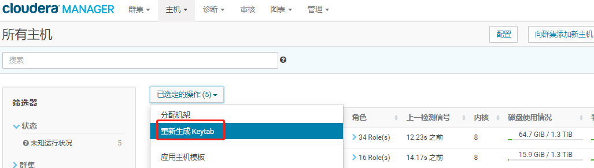

# 修改启用Kerberos的CDH集群的HOSTNAME

在集群安装初期由于未规范集群HOSTNAME，带来集群管理的不便，现需要将CDH集群的HOSTNAME统一规范化，在修改HOSTNAME的过程中需要注意什么？本篇文章Fayson主要介绍如何修改Kerberos环境下的CDH集群的HOSTNAME。修改集群所有主机的hostname的步骤如下：

**内容概述**

1.环境说明及停止集群服务

2.修改集群HOSTNAME及集群服务配置

3.功能验证

**测试环境**

1.CM和CDH版本为5.12.1

2.采用root用户操作

3.操作系统Redhat7.4

**前置条件**

1.集群已启用Kerberos


## 环境说明

修改前HOST表

```shell
192.168.0.190 hadoop0.xxx.com
192.168.0.191 hadoop1.xxx.com
192.168.0.192 hadoop2.xxx.com
```

修改后HOST表

```shell
192.168.0.190 cdh01.hadoop.com
192.168.0.191 cdh02.hadoop.com
192.168.0.192 cdh03.hadoop.com
```


## 停止集群所有服务

1.停止CDH服务


停止成功

2.停止Cloudera Management Service服务


3.停止Cloudera Manager Server服务

登录CM服务所在节点执行如下命令停止服务

```shell
[root@hadoop0 ~]# systemctl  stop cloudera-scm-server
[root@hadoop0 ~]# systemctl  status cloudera-scm-server
```


CM端口（已修改为7183）无法访问则表示停止成功


4.停止集群**所有节点**的cloudera-scm-agent服务

```
[root@hadoop0 ~]# systemctl stop cloudera-scm-agent
```


## 修改集群HOSTNAME

1.执行如下命令修改集群的HOSTNAME，以192.168.0.190为例

```shell
[root@hadoop0 ~]# hostnamectl set-hostname cdh01.hadoop.com
[root@hadoop0 ~]# hostname
```


注意：按照需求将集群所有节点的HOSTNAME修改为指定的名称

2.修改/etc/hosts文件

```shell
[root@hadoop0 ~]# vim /etc/hosts
127.0.0.1   localhost localhost.localdomain localhost4 localhost4.localdomain4
::1         localhost localhost.localdomain localhost6 localhost6.localdomain6
192.168.0.190 cdh01.hadoop.com
192.168.0.191 cdh02.hadoop.com
192.168.0.192 cdh03.hadoop.com
192.168.0.188 master.hadoop.com
192.168.0.200 slave1.hadoop.com
```


3.将修改后的hosts文件同步至集群**所有节点**的/etc目录下

4.检查**所有节点**的HOSTNAME是否配置正确

## 修改krb5.conf配置文件

1.修改了KDC服务所在服务器的HOSTNAME，需要将相应的客户端配置修改/etc/krb5.conf文件，内容如下；

```shell
[root@cdh01 ~]# vim /etc/krb5.conf
[logging]
 default = FILE:/var/log/krb5libs.log
 kdc = FILE:/var/log/krb5kdc.log
 admin_server = FILE:/var/log/kadmind.log

[libdefaults]
 default_realm = HADOOP.COM
 dns_lookup_realm = false
 dns_lookup_kdc = false
 ticket_lifetime = 24h
 renew_lifetime = 7d
 forwardable = true

[realms]
 HADOOP.COM = {
  kdc = cdh01.hadoop.com
  admin_server = cdh01.hadoop.com:749
 }

[domain_realm]
 .cdh01.hadoop.com = HADOOP.COM
 cdh01.hadoop.com = HADOOP.COM
```


2.修改kadm5.acl

```
vim /etc/krberos/krb5kdc/kadm5.acl
```


3.重新初始化数据库，需要先删除principal文件，再执行create命令

```shell
[root@cdh01 krb5kdc]# kdb5_util create -s -r HADOOP.COM
Loading random data
Initializing database '/var/kerberos/krb5kdc/principal' for realm 'HADOOP.COM',
master key name 'K/M@HADOOP.COM'
You will be prompted for the database Master Password.
It is important that you NOT FORGET this password.
Enter KDC database master key:admin
Re-enter KDC database master key to verify:admin
[root@cdh01 krb5kdc]#
```


> 注意：这个密码一定要记住，否则就GG，我这里是admin

4.添加管理账号

```shell
[root@cdh01 krb5kdc]# kadmin.local
Authenticating as principal root/admin@HADOOP.COM with password.
kadmin.local:  admin/admin@HADOOP.COM
kadmin.local: Unknown request "admin/admin@HADOOP.COM".  Type "?" for a request list.
kadmin.local:  addprinc admin/admin@HADOOP.COM
WARNING: no policy specified for admin/admin@HADOOP.COM; defaulting to no policy
Enter password for principal "admin/admin@HADOOP.COM": admin
Re-enter password for principal "admin/admin@HADOOP.COM":admin
Principal "admin/admin@HADOOP.COM" created.
kadmin.local:  
```


> 注意：这个密码一定要记住，否则就GG，我这里是admin

5.重启krb5kdc和kadmin服务

```
[root@cdh01 krb5kdc]# systemctl restart krb5kdc
[root@cdh01 krb5kdc]# systemctl status krb5kdc
```


```
[root@cdh01 krb5kdc]# systemctl restart kadmin
[root@cdh01 krb5kdc]# systemctl status kadmin
```


6.测试Kerberos的管理员账号

```shell
[root@cdh01 krb5kdc]# kinit admin/admin@HADOOP.COM
```


7.添加cm管理账号

```shell
[root@cdh01 krb5kdc]# kadmin.local
Authenticating as principal admin/admin@HADOOP.COM with password.
kadmin.local:  addprinc cloudera-scm/admin@HADOOP.COM
WARNING: no policy specified for cloudera-scm/admin@HADOOP.COM; defaulting to no policy
Enter password for principal "cloudera-scm/admin@HADOOP.COM":
Re-enter password for principal "cloudera-scm/admin@HADOOP.COM":
Principal "cloudera-scm/admin@HADOOP.COM" created.
kadmin.local:
```

> 注意：这个密码一定要记住，否则就GG，我这里是admin

8.将/etc/krb5.conf文件同步至集群所有节点的/etc目录替换原来的krb5.conf文件

9.在所有节点上验证

```shell
[root@master ~]# kinit admin/admin@HADOOP.COM
Password for admin/admin@HADOOP.COM:
[root@master ~]# klist
Ticket cache: FILE:/tmp/krb5cc_0
Default principal: admin/admin@HADOOP.COM

Valid starting       Expires              Service principal
07/12/2019 15:10:22  07/13/2019 15:10:22  krbtgt/HADOOP.COM@HADOOP.COM
[root@master ~]#
```


## 修改CM服务配置并启动

1.修改Cloudera Manager Server服务的数据库配置，配置文件/etc/cloudera-scm-server/db.properties


将com.cloudera.cmf.db.host地址修改为新的HOSTNAME，我这里使用的默认的localhost所以不用修改了。

2.修改cloudera-scm-agent服务的配置，配置文件/etc/cloudera-scm-agent/config.ini


> 这里如果你用的是hostname，则需要修改为新的主机名
>
> 注意：需要修改集群所有节点上的配置。

3.启动cloudera-scm-server服务

```shell
[root@cdh01 krb5kdc]# systemctl start cloudera-scm-server
[root@cdh01 krb5kdc]# systemctl status cloudera-scm-server
```


> 我用的是7183端口，默认7180

4.启动集群所有节点的cloudera-scm-agent服务

```shell
[root@cdh02 ~]# systemctl start cloudera-scm-agent
[root@cdh02 ~]# systemctl status  cloudera-scm-agent
```


## 修改集群服务配置

1.登录Cloudera Manager管理界面


2.修改集群所有服务的数据库配置信息


> 修改为新的主机名

3.修改Hive的数据库配置信息


修改sentry的数据库配置信息


保存配置。

3.修改CM中Kerberos配置信息


将KDC和KADMIN指向的主机host更改为最新的HOSTNAME，并保存配置。

4.填写cm管理账号


5.执行重新生成Keytab




生成成功

6.进入“管理”->“安全”界面查看集群所有服务的prinicipal账号信息


>  注意：重新生成Keytab时需要确保所有服务都是停止状态，这里旧的prinicipal信息也存在，但不影响集群服务使用，如果你有强迫症就是不想看到这些，可以在数据库中将cm库下的CREDENTIALS表数据删除，然后再重新生成

5.启动Cloudera Management Service服务

