# Windows Kerberos客户端配置并访问CDH

本文档描述Windows Server2008 R2（windows的内核版本是6.1，与windows 7相同）下安装Kerberos Client及FireFox下HTTP访问HDFS、Yarn、Hive、HBase等Hadoop服务的Web UI(如Namenode的50070，Yarn的8088)的过程。安装文档主要分为以下几步：

1.在Windows Server2008 R2 64位上安装Kerberos Client。

2.在Windows下使用kinit测试。

3.通过keytab在Windows下进行kinit操作。

4.配置FireFox。

5.验证服务是否正常访问。

这篇文档将着重介绍Winodws Server R2下安装及使用Kerberos，并基于以下假设：

1.CDH环境已搭建并正常运行

2.HDFS、Yarn、HBase、Hive等组件已安装部署

3.集群已完成Kerberos的配置，并正常使用

以下是对本次测试环境，但不是本操作手册的硬限制：

1.操作系统：Redhat7.2

2.CM版本：CM5.16.1

3.CDH版本：CDH5.16.1

# Kerberos安装

## Kerberos安装包准备

在Kerberos官网下载Kerberos安装包（http://web.mit.edu/kerberos/dist/），如下截图：

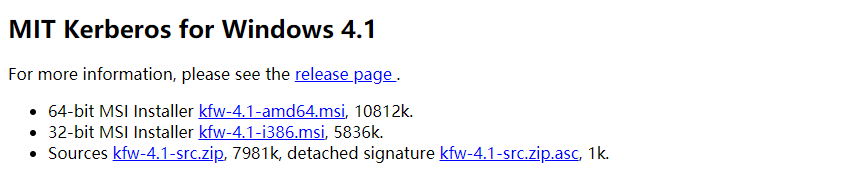

根据自己Windows操作系统下载不同的Client，32位或者64位。

## 安装Kerberos

1.将下载下来的客户端双击打开

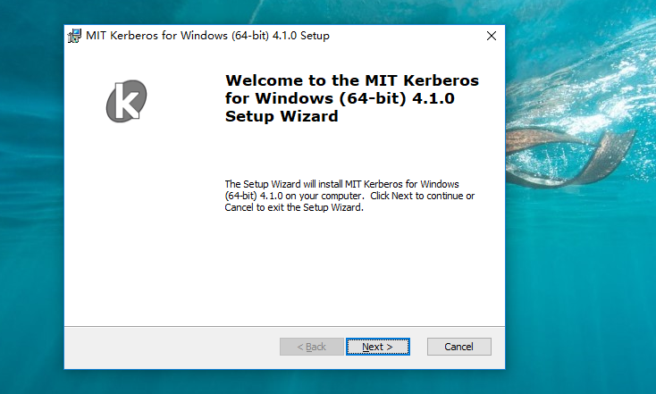

2.点击下一步，如下图所示

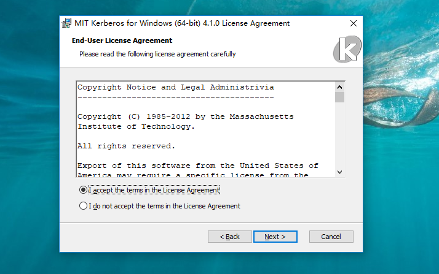

3.选择“Typical”进入下一步

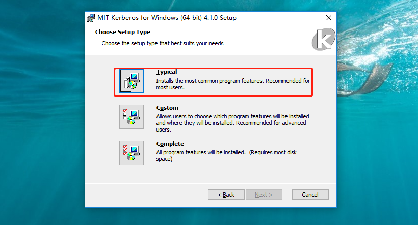

点击“finish”安装完成

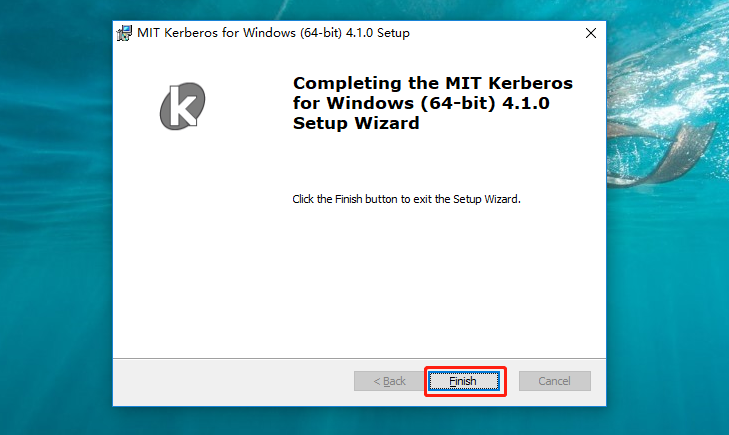

4.配置C:\ProgramData\MIT\Kerberos5\krb5.ini文件

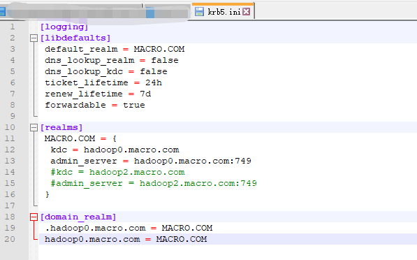

5.配置环境变量，包括krb5.ini文件以及Kerberos Credential Cache File的路径

变量名：KRB5_CONFIG，变量值：C:\ProgramData\MIT\Kerberos5\krb5.ini

变量名：KRB5CCNAME，变量值：C:\temp\krb5cache

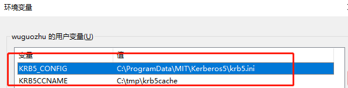

6.配置完成后，启动MIT Kerberos客户端，如下图所示：

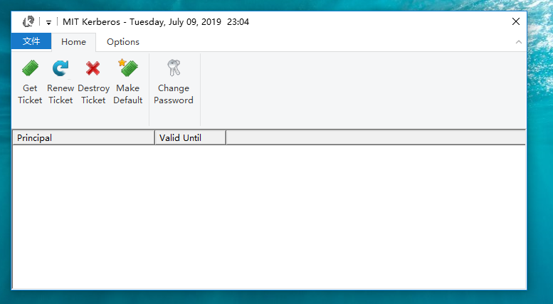

# 在Window下使用kinit测试

## 使用密码登录Kerberos

1.KDC Server上通过admin创建一个用户

测试正常

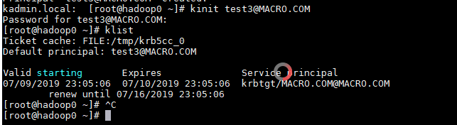

2.在Winodw端，通过MIT Kerberos客户Get Ticket

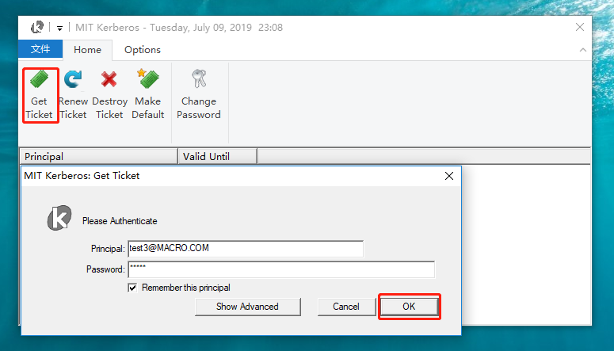

在如下列表中可以看到获取到的Ticket

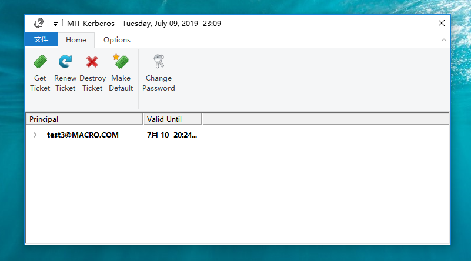

3.销毁获取到的Ticket

选中列表中需要销毁的Ticket，点击Destroy Ticket

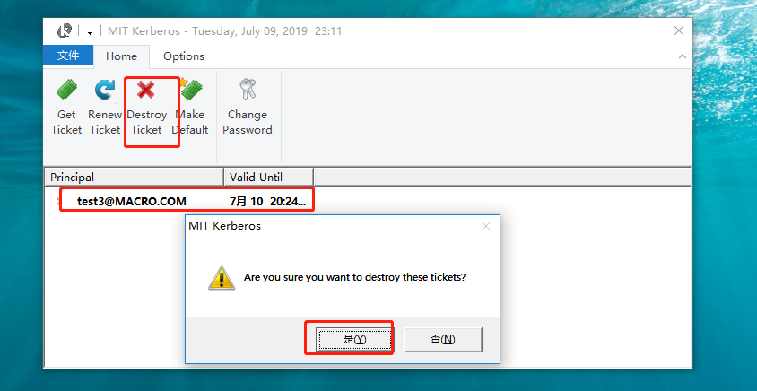

4.命令行下初始化

