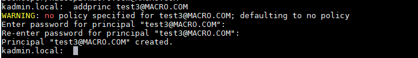

# Windows Kerberos客户端配置并访问CDH

本文档描述Windows Server2008 R2（windows的内核版本是6.1，与windows 7相同）下安装Kerberos Client及FireFox下HTTP访问HDFS、Yarn、Hive、HBase等Hadoop服务的Web UI(如Namenode的50070，Yarn的8088)的过程。安装文档主要分为以下几步：

1.在Windows Server2008 R2 64位上安装Kerberos Client。

2.在Windows下使用kinit测试。

**以下是对本次测试环境，但不是本操作手册的硬限制：**

1.操作系统：Redhat7.2

2.CM版本：CM5.16.1

3.CDH版本：CDH5.16.1

# Kerberos安装

## Kerberos安装包准备

在Kerberos官网下载Kerberos安装包（http://web.mit.edu/kerberos/dist/），如下截图：

根据自己Windows操作系统下载不同的Client，32位或者64位。

## 安装Kerberos

1.将下载下来的客户端双击打开

2.点击下一步，如下图所示

3.选择“Typical”进入下一步

点击“finish”安装完成

4.配置C:\ProgramData\MIT\Kerberos5\krb5.ini文件

5.配置环境变量，包括krb5.ini文件以及Kerberos Credential Cache File的路径

变量名：KRB5_CONFIG，变量值：C:\ProgramData\MIT\Kerberos5\krb5.ini

变量名：KRB5CCNAME，变量值：C:\temp\krb5cache

6.配置完成后，启动MIT Kerberos客户端，如下图所示：

# 在Window下使用kinit测试

## 使用密码登录Kerberos

1.KDC Server上通过admin创建一个用户

测试正常

2.在Winodw端，通过MIT Kerberos客户Get Ticket

在如下列表中可以看到获取到的Ticket

3.销毁获取到的Ticket

选中列表中需要销毁的Ticket，点击Destroy Ticket

4.命令行下初始化

1. 如果发生以下的错误

解决：提示无法定位到默认域，因此需要使用全`kinit wuguozhu@MACRO.COM`

2.如果发生如下错误

分析：因为我的环境装java，而且java也有`kinit`等命令，因此如果你的java环境变量再kerberos前面时，当你执行`kinit`时会默认先找到java的`kinit`

解决：将kerberos的环境变量加到java环境变量的前面

再执行`kinit wuguozhu@MACRO.com`

5.执行`kdestroy`

在控制台执行`kdestroy`发现kerberos UI的Ticket也被清除了

到此kerberos在win上安装结束了，安装这个 东西的用途是当你的hdfs，yarn等hadoop相关的服务开启了Kerberos时需要Kerberos认证才能使用web访问时，就需要安装这个东西才能访问

> 注意：
>
> 1.Windows本地的krb5.ini文件不能直接使用krb5.conf文件更名替换，否则会出现文件格式的问题导致MIT Kerberos客户端无法正常启动。
>
> 2.在生成keytab文件时需要加上”-norandkey”参数，否则会导致kinit时密码错误。

如果有疑问，可以到主页找到邮箱给我邮件，欢迎一起讨论学习