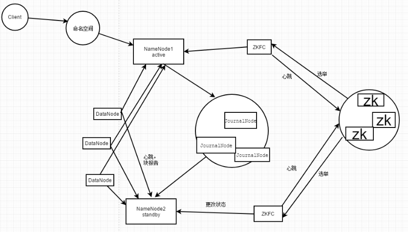

# HDFS HA 原理

转载自：https://www.jianshu.com/p/c4cabde76fce

更详细：[Hadoop NameNode 高可用 (High Availability) 实现解析](https://www.ibm.com/developerworks/cn/opensource/os-cn-hadoop-name-node/index.html)

## 概述

在 Hadoop 2.x 版本中，Hadoop 实现了 HDFS 的 HA 功能，从而解决了 HDFS 中 NameNode 单点问题。

在 HDFS NameNode 的高可用架构中涉及到了多个部分，主要包括：Active NameNode、Standby NameNode、ZKFailoverController、ZooKeeper集群和共享存储系统。其中，Active NameNode 和 Standby NameNode 互为主备，通过共享存储系统共享同一份元数据，由 ZooKeeper 集群负责选取主 NameNode。ZKFailoverController 负责监控 NameNode 的状态，当主 NameNode 出现故障后，进行主备切换。

原理图如下：

## 共享存储系统

共享存储系统可以说是 HDFS HA 中最重要的一个部分，因为主备 NameNode 需要通过共享存储系统进行元数据的实时同步，这样才能保证在进行主备切换的时候，备 NameNode 上的元数据和主 NameNode 上的是一致的，确保切换之后不会丢失数据。

在 Hadoop 社区中曾经出现过多种 NameNode 共享存储解决方案，但现在 Hadoop 中默认的实现是基于 QJM（Quorum Journal Manager），因此我们这里只对 QJM 的实现方式进行介绍。

### NameNode 元数据

在介绍具体的 QJM 实现之前，先对 NameNode 的元数据文件做一个简单的介绍。

NameNode 的元数据文件中最主要的是两类文件：Fsimage 和 EditLog，这两种文件一起构成了 NameNode 内存中的文件系统镜像。

#### FSImage

FSImage 是 NameNode 内存中文件系统镜像的一个快照，在 NameNode 启动的时候，会先把 FSImage 加载到内存中形成文件系统镜像。FSImage 是由 NameNode 生成，保存在本地磁盘上，文件名形如 fsimage_${end_txid}，其中 ${end_txid} 表示这个 fsimage 文件的结束事务 id。

#### EditLog

EditLog 中保存了客户端对 HDFS 系统的所有更新操作，记录在 EditLog 中的每个操作称为一个事务，每个事务都有一个整数形式的事务 id 作为编号。

EditLog 文件会被分割为很多段，每一段称为一个 Segment，而 Segment 可以分为两种：一种是处于正在写入状态的，文件名形如 `edits_inprogress_${start_txid}`,其中 `${start_txid}` 表示这个 Segment 的起始事务 id；另一种是处于写入完成状态的，文件名形如 `edits_${start_txid}-${end_txid}`，其中 `${start_txid}` 表示起始事务 id，`${end_txid}` 表示结束事务 id。

在介绍完了 NameNode 的元数据文件之后，现在来介绍 NameNode 是如何通过 QJM 实现元数据共享的。

### 元数据共享

HDFS 是通过 QJM 来实现的 NameNode 元数据的共享，但需要注意的是，QJM 上只保存了 EditLog 文件，FSImage 文件还是保存在 NameNode 的本地磁盘上。

QJM 系统的基本思想是来源于 Paxos 算法，由多个被称为 Journal Node 的节点组成，每个 Journal Node 上都保存了相同的数据。当向 QJM 中写入数据时，只有向超过半数的 Journal Node 上都写入成功时才认为写入成功。

每当客户端通过 Active NameNode 对 HDFS 进行更新操作时，Active NameNode 都会将此次操作同时写入本地磁盘和 QJM 上的 EditLog 文件。而 Standby NameNode 则会定时从 QJM 上获取 EditLog 文件，然后把同步的 EditLog 放到内存中的文件系统镜像中，以保持自身内存中的元数据跟 Active NameNode 同步。

如果 Active NameNode 向 QJM 写入 EditLog 失败（也就是没有满足超过半数的 Journal Node 返回成功），那么 Active NameNode 会退出进程，然后等待 Standby NameNode 接管后进行数据恢复。

Standby NameNode 除了定时从 QJM 同步 EditLog 之外，还会定期对内存中的文件系统镜像做 checkpoint，然后将生成的 FSImage 文件传给 Active NameNode。Active NameNode 收到 Standby NameNode 发送的 FSImage 之后，会将本地旧的 FSImage 文件删除。

这样，通过 QJM，主备 NameNode 实现了元数据的同步，那么当主备进行切换的时候，他们之间又是如何进行交互的呢？

### 主备切换

当 Active NameNode 出现故障异常退出的时候，需要保证在 Standby NameNode 切换成 Active 状态后元数据与 Active NameNode 保持一致。但是从之前的介绍中可以得知，Standby NameNode 是定时从 QJM 上获取 EditLog 文件，那么当 Active NameNode 出现故障时，Standby NameNode 上的数据并不是严格同步的。

同时，当 Active NameNode 出现故障时，也无法保证 QJM 上的数据是一致的。考虑这样一种情况，假设 QJM 中有 3 个节点，Active NameNode 在分别向这三个节点发送完写入命令后崩溃退出了，此时只有一个 Journal Node 写入成功，而其他两个 Journal Node 写入失败。那么此时 QJM 就处于一个数据不一致的状态，在这种情况下就需要对 QJM 上的数据进行恢复，使其达到一致性状态。

综上所述，在发生主备切换 Standby NameNode 切换为 Active 状态后，需要先对 QJM 进行数据恢复，然后进行数据同步，只有执行完这两个操作之后，Standby NameNode 才能对外提供服务。

下面对这两个过程做一个简单的介绍。

#### QJM 的数据恢复

首先，需要明确的是，数据恢复肯定是发生在 Standby NameNode 成为 Active 之后。那么在新的 Active NameNode 被选举出来之后，需要更新所有 Journal Node 上的 Epoch（可以将 Epoch 理解成每一次主备切换的标识符，是一个全局唯一的顺序递增的整数）。

其次，需要进行数据恢复的肯定是 QJM 上最后一个 EditLog Segment 文件，因为 Active NameNode 在异常退出前写入的肯定是最新的 EditLog 文件。每个 Journal Node 上最后的 EditLog Segment 的起始事务 id 会在更新完 Epoch 后返回给 Active NameNode，而 Active NameNode 则是从所有 Journal Node 返回的 Epoch 中选取最大的一个作为数据恢复的基准数据源。

Active NameNode 将数据恢复的基准数据源所在的 Journal Node 信息发送给其他所有 Journal Node 之后，其他的节点会从该数据源所在节点上下载 EditLog Segment 文件，将本地的文件替换掉。

#### 数据同步

在完成了数据恢复的过程后，此时 QJM 上的数据已经达到了一致状态，而且与 Active NameNode 退出前的数据一致。此时新的 Active NameNode 只需要将 QJM 上未同步的 EditLog 文件同步到本地，加载到内存中后就可以达到与旧的 Active NameNode 完全一致的元数据状态。

而新的 Active NameNode 从 QJM 上同步数据的过程和 Standby NameNode 定时从 QJM 上同步 EditLog 的实现是一样的。

## 主备切换实现

在介绍了共享存储系统之后，下面就可以来介绍主备 NameNode 在发生故障切换时的具体过程。

NameNode 的主备切换主要由 ZKFailoverController、HealthMonitor 和 ActiveStandbyElector 这三个组件协同实现。

首先简单介绍下这三个组件的作用。

### ZKFailoverController

ZKFailoverController 作为 NameNode 上的一个独立进程启动（zkfc 进程），启动的时候会创建 HealthMonitor 和 ActiveStandbyElector 这两个线程。ZKFailoverController 在创建了这两个线程的时候，同时也向 HealthMonitor 和 ActiveStandbyElector 注册了相应的回调方法。

### HeathMonitor

HealthMonitor 主要负责监测 NameNode 的健康状态，如果发现 NameNode 的状态发生了变化，那么会调用 ZKFailoverController 的回调方法进行自动的主备选举。

### ActiveStandbyElector

ActiveStandbyElector 主要负责进行自动的主备选举，内部封装了 ZooKeeper 的处理逻辑。一旦 ZooKeeper 上对 NameNode 的主备选举完成，ActiveStandbyElector 会调用 ZKFailoverController 的回调方法来进行 NameNode 的主备切换。

在介绍完了这三个组件之后，就可以来介绍具体的主备切换过程了。

## 具体过程

NameNode 的主备切换过程大体过程如下：

- HealthMonitor 在初始化完成后，会启动内部的线程来定时监测 NameNode 的健康状态。
- HealthMonitor 如果发现 NameNode 的状态发生了改变，则会回调 ZKFailoverController 注册的方法进行处理。
- 如果 ZKFailoverController 判断需要进行主备切换，则会使用 ActiveStandbyElector 来进行自动的主备选举。
- ActiveStandbyElector 与 ZooKeeper 进行交互，完成自动的主备选举。
- ActiveStandbyElector 在完成主备选举后，会回调 ZKFailoverController 注册的方法，通知 ZKFailoverController 当前的 NameNode 成为主或备。
- ZKFailoverController 在接收到 ActiveStandbyElector 的通知后调用对应 NameNode 的接口，将 NameNode 转换为 Active 或 Standby 状态。