## 1.HDP概述

Hortonworks开发、销售和支持 HDP,HDP(Hortonworks Data Platform) 是一种面向企业的完全开源 Apache Hadoop 数据平台。Hortonworks sandbox需安装virtualbox 或 vmware，下面我们以virtualbox为例。

## 2.安装包下载

为了方便大家不用再去网上下载安装包，我已经把我环境中的安装包打包上传到百度云盘上

地址为：<https://pan.baidu.com/s/1zHGvW2OezDSLWW2siN5tgg>

密码为：kem9

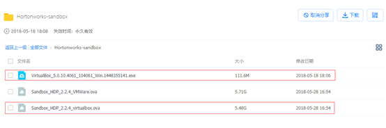

>  如果不想用我的安装包，向安装其他新版本的hadoop可以参考去下载最新的安装包

其他Hortonworks版本下载地址为：<http://zh.hortonworks.com/products/hortonworks-sandbox/>

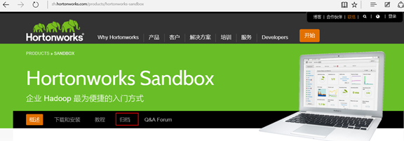

选择需要的版本，我们选择HDP 2.2.4 for VirtualBox的版本。

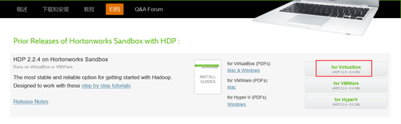

## 3.环境要求

## 4.安装VirtualBox

virtualBox下载地址：<https://www.virtualbox.org/wiki/Downloads>，可以根据自己的电脑操作系统下载不同的版本，这里以windows版本为例。

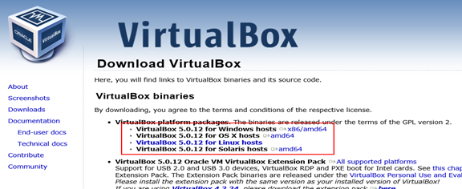

双击[VirtualBox_5.0.10.4061_104061_Win.1448355141.exe](javascript:void(0);)安装即可(跟平常安装其windows应用软件一样)

## 5.Hortonworks导入到VirtualBox中

**1.准备导入hdp sandbox文件**

打开安装好的virtualbox,点击`管理`，点击`导入虚拟机`：

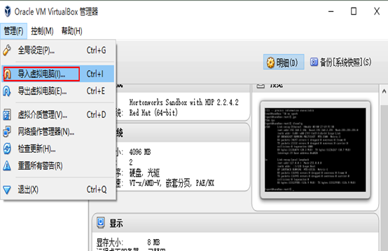

**2.选择导入hdp sandbox文件**

选择我们下载好的Sandbox_HDP_*_VirtualBox.ova点击`打开`

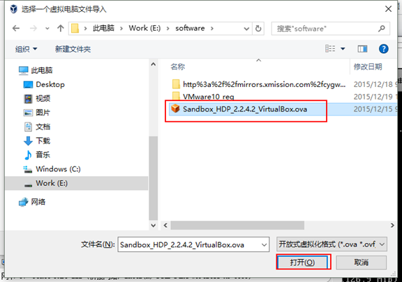

**3.导入hdp sandbox文件**

点击`导入`

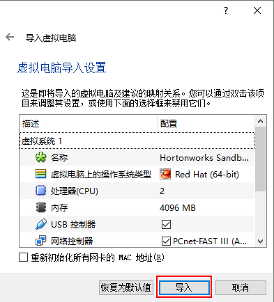

**4.等待加载**

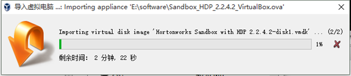

**5.修改网卡模式**

安装完毕，修改网卡的模式为`桥接模式`

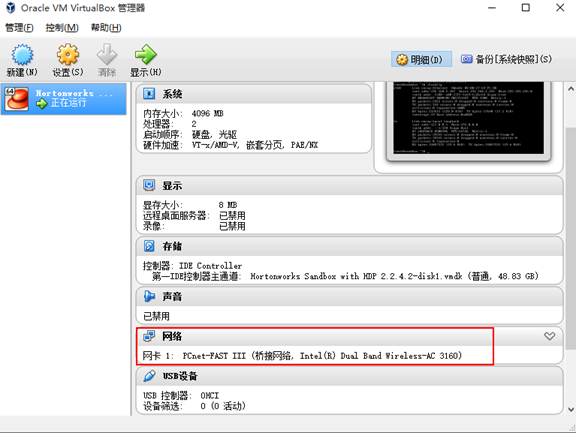

**6.启动VirtualBox**

点击`启动`

**7.进入sandbox**

按住`Alt+F5`进入sandbox

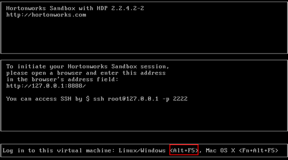

**8.设置用户名密码**

例如用户名密码为：root/hadoop

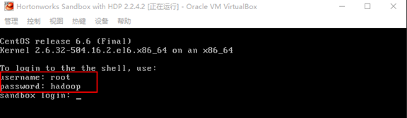

完整界面如下图所示

**10.验证**

将windows的防火墙和sandbox的防火墙关闭，sandbox的防火墙默认是关闭的，如果sandbox的防火墙是开的，可通过`service iptables  stop`命令将其关闭，并保证windows和sandbox能相互ping得通。

**11.获取IP**

在sandbox中输入`ifconfig`，获得sandbox虚拟机的ip地址,如下图所示：

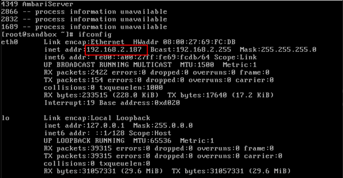

**12.启动Ambari**

访问`192.168.2.187:8000`，将Ambari启动，点击Ambari右边的Button，当Button变成`Disable`，上面的字体变成`Ambari enabled successfully`，Ambari 就启动成功了。

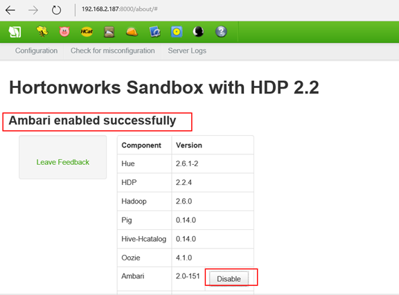

**13.访问Ambari**

访问`192.168.2.187:8080`，username和password都是`admin`

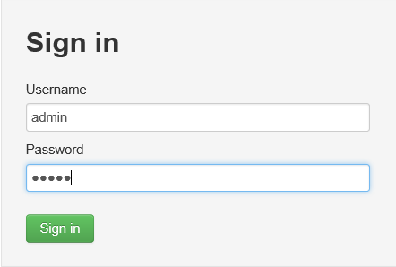

**14.启动hadoop服务**

从Ambari的web管理端看到HDFS、MapReduce2、YARN等都启动成功了。

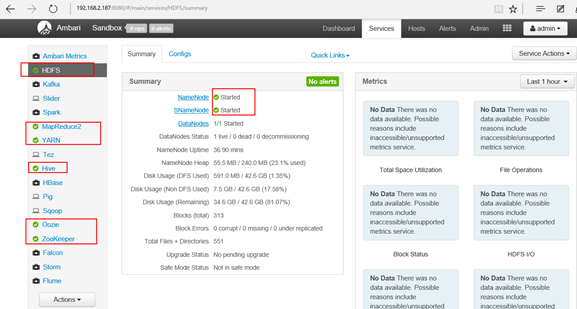

**15.关闭维护模式**

由于资源占用的原因有些组件是处于维护模式状态的，但是如果我们需要用到这个组件我们就要将维护模式关闭才能使用该组件，下图框中的组件处于维护模式。

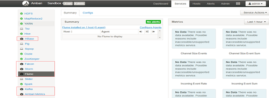

启动即可使用该组件

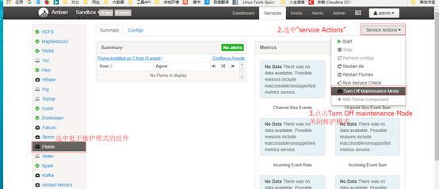

