## HDP2.6.3 install for without internet

导读：

1. 安装包下载，

2. 基础配置：安装JDK，修改主机名，配置SSH免密，配置hosts，关闭防火墙，句柄配置，时钟同步，安装数据库，编辑网络配置文件 ，禁用SELinux

3. 制作本地源：安装http服务，制作本地源

4. 安装ambari-server：

5. 安装HDP：
6. 问题解决：安装过程中遇到的问题记录与解决方案，仅供参考

### 环境

```shell
[root@hadoop1]~# lsb_release -a
LSB Version:    :core-4.1-amd64:core-4.1-noarch:cxx-4.1-amd64:cxx-4.1-noarch:desktop-4.1-amd64:desktop-4.1-noarch:languages-4.1-amd64:languages-4.1-noarch:printing-4.1-amd64:printing-4.1-noarch
Distributor ID: CentOS
Description:    CentOS Linux release 7.4.1708 (Core)
Release:        7.4.1708
Codename:       Core
[root@hadoop1]~#
```

### 安装包下载

三个安装包加起来大概有9G左右，可以执行以下脚本在后台下载，如果需要其他版本可以去官网查阅后将链接替换脚本中的链接即可。

```shell
[root@hadoop1]/data/hdp# cat downloadHDPInstallPakeage.sh
#!/bin/bash
nohup wget http://public-repo-1.hortonworks.com/HDP/centos7/2.x/updates/2.6.3.0/HDP-2.6.3.0-centos7-rpm.tar.gz 2>&1 &

nohup wget http://public-repo-1.hortonworks.com/ambari/centos7/2.x/updates/2.6.2.0/ambari-2.6.2.0-centos7.tar.gz 2>&1 &

nohup wget http://public-repo-1.hortonworks.com/HDP-UTILS-1.1.0.21/repos/centos7/HDP-UTILS-1.1.0.21-centos7.tar.gz 2>&1 &
[root@hadoop1]/data/hdp#
```

### 基础配置

#### MySQL配置

**1.安装mysql数据库**

```shell
[root@hadoop1]~# wget http://dev.mysql.com/get/mysql-community-release-el7-5.noarch.rpm
[root@hadoop1]~# rpm -ivh mysql-community-release-el7-5.noarch.rpm
[root@hadoop1]~# yum install mysql-community-serve
```

**2.启动mysql，设置开机启动**

```shell
[root@master ~]# service mysqld start
[root@master ~]# vi /etc/rc.local
#添加service mysqld start
```

**3.登录进mysql，初始化设置root密码**

```shell
[root@master ~]# mysql -uroot 
# 设置登录密码
mysql> set password for 'root'@'localhost' = password('Bigdata123');
# 添加远程登录用户
mysql> grant all privileges on *.* to 'root'@'%' identified by 'Bigdata123';
```

**4.登录mysql，执行下面的语句**

```sql
CREATE USER 'ambari'@'%' IDENTIFIED BY 'Bigdata123';  
GRANT ALL PRIVILEGES ON *.* TO 'ambari'@'%';  
CREATE USER 'ambari'@'localhost' IDENTIFIED BY 'Bigdata123';  
GRANT ALL PRIVILEGES ON *.* TO 'ambari'@'localhost';  
CREATE USER 'ambari'@'hadoop1.richstone.com' IDENTIFIED BY 'Bigdata123';  
GRANT ALL PRIVILEGES ON *.* TO 'ambari'@'hadoop1.richstone.com';  
FLUSH PRIVILEGES;  
source /var/lib/ambari-server/resources/Ambari-DDL-MySQL-CREATE.sql  
CREATE DATABASE hive;  
use hive;  
CREATE USER 'hive'@'%' IDENTIFIED BY 'hive';  
GRANT ALL PRIVILEGES ON *.* TO 'hive'@'%';  
CREATE USER 'hive'@'localhost' IDENTIFIED BY 'hive';  
GRANT ALL PRIVILEGES ON *.* TO 'hive'@'localhost';  
CREATE USER 'hive'@'master' IDENTIFIED BY 'hive';  
GRANT ALL PRIVILEGES ON *.* TO 'hive'@'master';  
FLUSH PRIVILEGES;  
CREATE DATABASE oozie;  
use oozie;  
CREATE USER 'oozie'@'%' IDENTIFIED BY 'oozie';  
GRANT ALL PRIVILEGES ON *.* TO 'oozie'@'%';  
CREATE USER 'oozie'@'localhost' IDENTIFIED BY 'oozie';  
GRANT ALL PRIVILEGES ON *.* TO 'oozie'@'localhost';  
CREATE USER 'oozie'@'master' IDENTIFIED BY 'oozie';  
GRANT ALL PRIVILEGES ON *.* TO 'oozie'@'master';  
FLUSH PRIVILEGES;  
```

> 注意：设置密码时，字母加上数字组合即可，否则在ambari-server setup时会因为有特殊字符无法通过。

**5.建立mysql与ambari-server的连接**

```shell
[root@hadoop1]~# mkdir /usr/share/java
[root@hadoop1]~# cp /root/mysql-connector-java-5.1.37.jar /usr/share/java/mysql-connector-java.jar
[root@hadoop1]~# cp /usr/share/java/mysql-connector-java.jar /var/lib/ambari-server/resources/mysql-jdbc-driver.jar
[root@hadoop1]~# vi /etc/ambari-server/conf/ambari.properties
添加server.jdbc.driver.path=/usr/share/java/mysql-connector-java.jar
```

### 制作本地源

#### 1.安装httpd服务（主服务器）

```shell
[root@hadoop1]~# yum -y install httpd
[root@hadoop1]~# systemctl restart httpd
[root@hadoop1]~# systemctl status httpd
```

#### 2.拷贝安装包到指定目录

```shell
[root@hadoop1]/var/www/html/ambari# ll
total 9496308
-rw-r--r-- 1 root root 1823815545 May 15  2018 ambari-2.6.2.0-centos7.tar.gz
-rw-r--r-- 1 root root 7020369101 Oct 31  2017 HDP-2.6.3.0-centos7-rpm.tar.gz
-rw-r--r-- 1 root root  880016614 Oct 27  2017 HDP-UTILS-1.1.0.21-centos7.tar.gz
[root@hadoop1]/var/www/html/ambari# mkdir HDP-UTILS
[root@hadoop1]/var/www/html/ambari# tar -zxvf ambari-2.6.2.0-centos7.tar.gz
[root@hadoop1]/var/www/html/ambari# tar -zxvf HDP-2.6.3.0-centos7-rpm.tar.gz
[root@hadoop1]/var/www/html/ambari# tar -zxvf HDP-UTILS-1.1.0.21-centos7.tar.gz -C HDP-UTILS
[root@hadoop1]/var/www/html/ambari# ll
total 9509824
drwxr-xr-x  3 root     root        4096 Mar 17 19:31 ambari
-rw-r--r--  1 root     root  1823815545 May 15  2018 ambari-2.6.2.0-centos7.tar.gz
drwxr-xr-x  3 yuzhijun users       4096 Oct 31  2017 HDP
-rw-r--r--  1 root     root  7020369101 Oct 31  2017 HDP-2.6.3.0-centos7-rpm.tar.gz
drwxr-xr-x 23 root     root        4096 Mar 17 19:38 HDP-UTILS
-rw-r--r--  1 root     root   880016614 Oct 27  2017 HDP-UTILS-1.1.0.21-centos7.tar.gz
[root@hadoop1]/var/www/html/ambari#
```

#### 3.验证

现在可以通过访问http://192.168.6.219/ambari/查看是否能成功访问

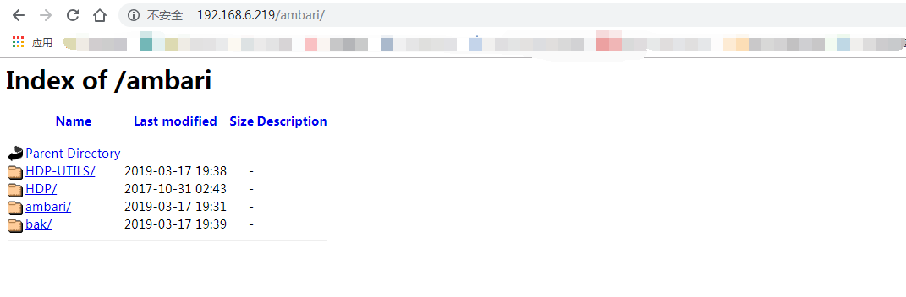

#### 制作本地源

1.安装本地源制作相关工具（主服务器）

```shell
[root@hadoop1]/var/www/html/ambari# yum install yum-utils createrepo yum-plugin-priorities -y
[root@hadoop1]/var/www/html/ambari# createrepo  ./
```

2.修改repo源地址（主服务器）

修改ambari.repo

```shell
[root@hadoop1]/var/www/html/ambari# cat ambari/centos7/2.6.2.0-155/ambari.repo
#VERSION_NUMBER=2.6.2.0-155
[ambari-2.6.2.0]
name=ambari Version - ambari-2.6.2.0
baseurl=http://192.168.6.219/ambari/ambari/centos7/2.6.2.0-155/
gpgcheck=1
gpgkey=http://192.168.6.219/ambari/ambari/centos7/2.6.2.0-155/RPM-GPG-KEY/RPM-GPG-KEY-Jenkins
enabled=1
priority=1

[root@hadoop1]/var/www/html/ambari#
```

修改hdp.repo

```shell
[root@hadoop1]/var/www/html/ambari# cat HDP/centos7/2.6.3.0-235/hdp.repo
#VERSION_NUMBER=2.6.3.0-235
[HDP-2.6.3.0]
name=HDP Version - HDP-2.6.3.0
baseurl=http://192.168.6.219/ambari/HDP/centos7/2.6.3.0-235/
gpgcheck=1
gpgkey=http://192.168.6.219/ambari/HDP/centos7/2.6.3.0-235/RPM-GPG-KEY/RPM-GPG-KEY-Jenkins
enabled=1
priority=1


[HDP-UTILS-1.1.0.21]
name=HDP-UTILS Version - HDP-UTILS-1.1.0.21
baseurl=http://192.168.6.219/ambari/HDP-UTILS/
gpgcheck=1
gpgkey=http://192.168.6.219/ambari/HDP-UTILS/RPM-GPG-KEY/RPM-GPG-KEY-Jenkins
enabled=1
priority=1
[root@hadoop1]/var/www/html/ambari#
```

将以上repo移动至相应目录

```shell
[root@hadoop1]/var/www/html/ambari# cp ambari/centos7/2.6.2.0-155/ambari.repo /etc/yum.repos.d/
[root@hadoop1]/var/www/html/ambari# cp HDP/centos7/2.6.3.0-235/hdp.repo /etc/yum.repos.d/
```

上面就创建好了主机上的文件，然后可以通过下面命令清楚一下yum的缓存就可以了

```shell
[root@hadoop1]/var/www/html/ambari# yum clean all
[root@hadoop1]/var/www/html/ambari# yum makecache
[root@hadoop1]/var/www/html/ambari# yum repolist
```

同步repo文件至从节点

```shell
[root@hadoop1]/var/www/html/ambari# scp ambari/centos7/2.6.2.0-155/ambari.repo root@hadoop2:/etc/yum.repos.d/                   
[root@hadoop1]/var/www/html/ambari# scp HDP/centos7/2.6.3.0-235/hdp.repo root@hadoop2:/etc/yum.repos.d/
[root@hadoop1]/var/www/html/ambari# scp ambari/centos7/2.6.2.0-155/ambari.repo root@hadoop3:/etc/yum.repos.d/
[root@hadoop1]/var/www/html/ambari# scp HDP/centos7/2.6.3.0-235/hdp.repo root@hadoop3:/etc/yum.repos.d/
[root@hadoop1]/var/www/html/ambari#
```

### 安装ambari-server

**1.安装和配置ambari-server**

```shell
[root@hadoop1]/var/www/html/ambari# yum -y install ambari-server
[root@hadoop1]/var/www/html/ambari# ambari-server setup
Using python  /usr/bin/python
Setup ambari-server
Checking SELinux...
SELinux status is 'disabled'
Customize user account for ambari-server daemon [y/n] (n)? n
Adjusting ambari-server permissions and ownership...
Checking firewall status...
Checking JDK...
[1] Oracle JDK 1.8 + Java Cryptography Extension (JCE) Policy Files 8
[2] Oracle JDK 1.7 + Java Cryptography Extension (JCE) Policy Files 7
[3] Custom JDK
==============================================================================
Enter choice (1): 3
WARNING: JDK must be installed on all hosts and JAVA_HOME must be valid on all hosts.
WARNING: JCE Policy files are required for configuring Kerberos security. If you plan to use Kerberos,please make sure JCE Unlimited Strength Jurisdiction Policy Files are valid on all hosts.
Path to JAVA_HOME: /usr/java/jdk1.8.0_152
Validating JDK on Ambari Server...done.
Checking GPL software agreement...
GPL License for LZO: https://www.gnu.org/licenses/old-licenses/gpl-2.0.en.html
Enable Ambari Server to download and install GPL Licensed LZO packages [y/n] (n)? y
Completing setup...
Configuring database...
Enter advanced database configuration [y/n] (n)? y
Configuring database...
==============================================================================
Choose one of the following options:
[1] - PostgreSQL (Embedded)
[2] - Oracle
[3] - MySQL / MariaDB
[4] - PostgreSQL
[5] - Microsoft SQL Server (Tech Preview)
[6] - SQL Anywhere
[7] - BDB
==============================================================================
Enter choice (1): 3
Hostname (localhost):
Port (3306):
Database name (ambari):
Username (ambari):
Enter Database Password (bigdata): Bigdata123
Re-enter password: Bigdata123
Configuring ambari database...
Configuring remote database connection properties...
WARNING: Before starting Ambari Server, you must run the following DDL against the database to create the schema: /var/lib/ambari-server/resources/Ambari-DDL-MySQL-CREATE.sql
Proceed with configuring remote database connection properties [y/n] (y)?
Extracting system views...
..........ambari-admin-2.6.2.0.155.jar
.
Adjusting ambari-server permissions and ownership...
Ambari Server 'setup' completed successfully.
[root@hadoop1]/var/www/html/ambari#
```

**2.错误处理**

如果出现错误，请注意查看日志，根据具体的错误内容进行处理，默认ambari-server的日志在/var/log/ambari-server/ambari-server.log里面。如果在处理日志的过程中或者后面安装的过程中出现一些莫名的错误，可以重置的安装。如果上面进行的默认数据库的配置，可以使用下面的代码重置ambari-server

```shell
[root@hadoop1]~# ambari-server stop
[root@hadoop1]~# ambari-server reset
[root@hadoop1]~# ambari-server setup
```

如果有必要还需要手动删除已经创建好的数据库ambari，hive，oozie等

```sql
mysql> drop database ambari;
mysql> drop database hive;
mysql> drop database oozie;
```

如果在安装的过程中出现了错误，又想重新安装，可以在ambari-server开启的情况下，执行下面的语句来移除已安装的包，然后再通过不同的情况选择上面两种方式的一种对ambari-server进行重置

```shell
[root@hadoop1]~# python /usr/lib/python2.6/site-packages/ambari_agent/HostCleanup.py --silent
```

### 安装HDP

**1.登录**

http://ip:8080

admin/admin

**2.安装向导**

点击`Launch Install Wizard`开始安装

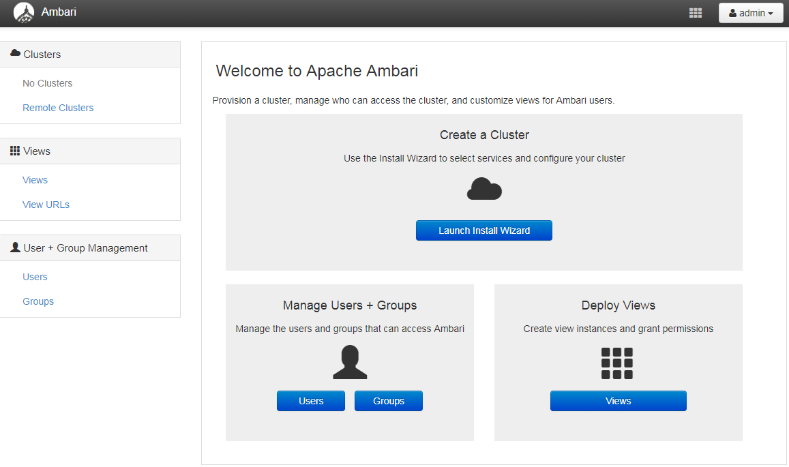

**3.配置集群名字**

例如：sandbox，然后`next`.

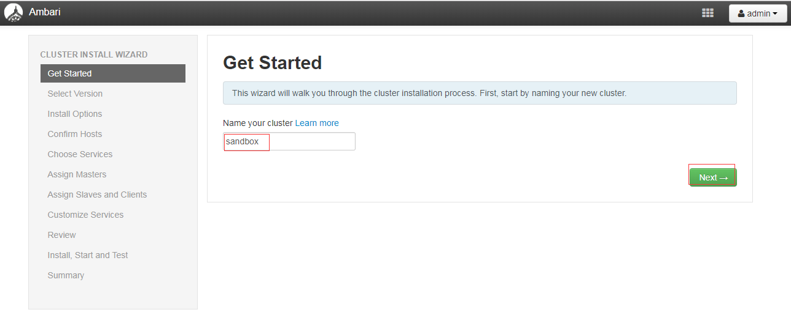

**4.选择版本并修改为本地源地址**

先选版本`2.6.3.0`接着选资源库`Use Local Repository`最后在对应的操作系统填写本地源地址.

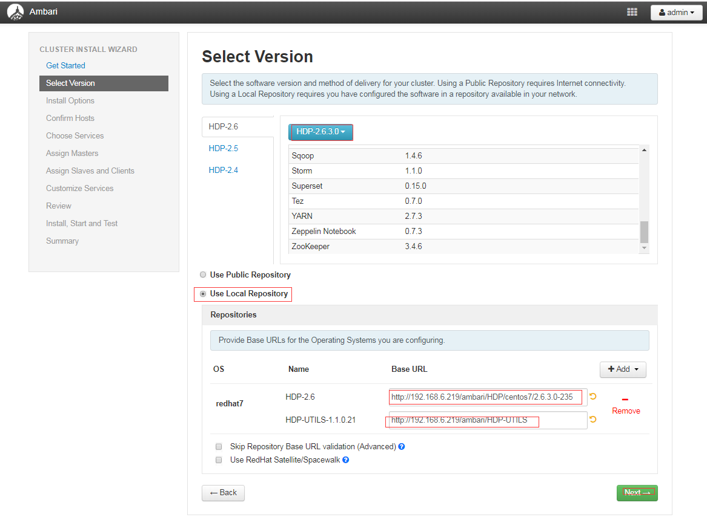

**5.安装配置**

1.在`Target Hosts`哪里填写主机名,如果主机名连续则可以这么填写`hadoop[1-5].anan.com`

2.在`Host Registration Infomation`框中填写master节点的`.ssh/id_dsa`文件中的内容.

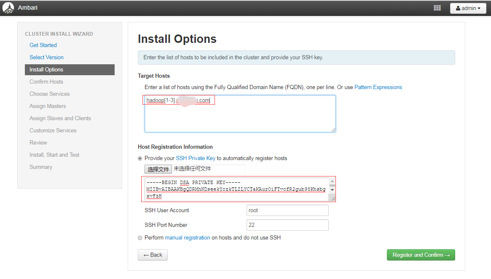

**6.安装ambari的agent，同时检查系统问题**

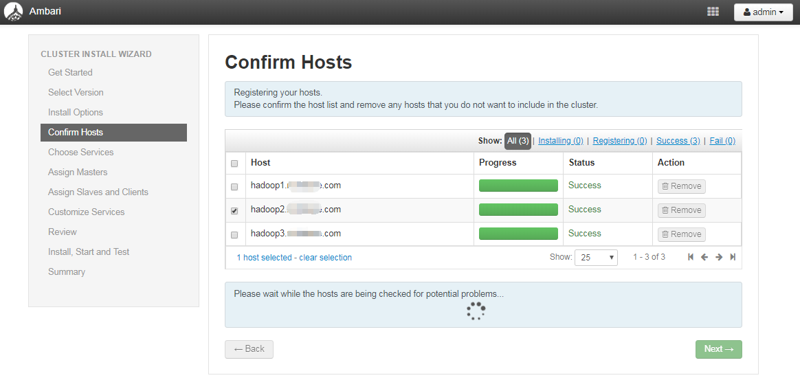

**7.选择安装的服务**

> 建议：先只安装HDFS，yarn，MR和zookeeper；因为现在安装太多的服务，只要有一步卡住那么所有步骤都无法再进行下去，建议其他服务后面再添加。

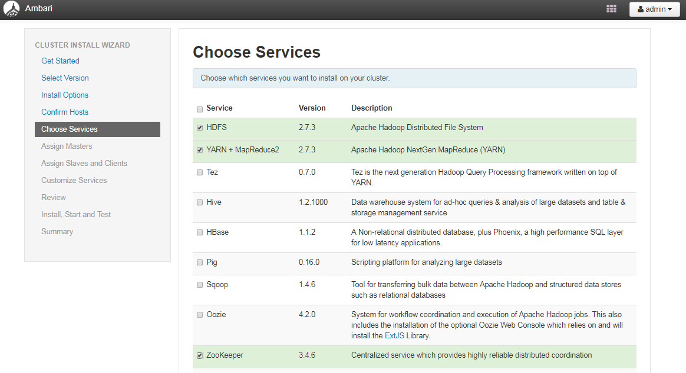

**8.确认安装的服务**

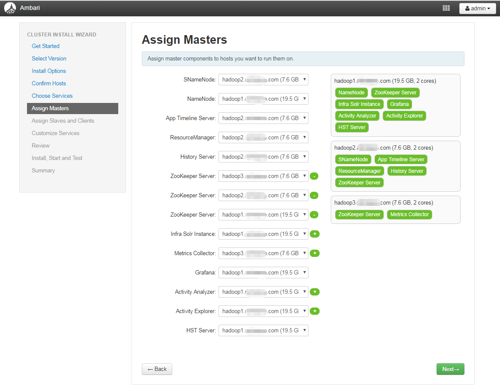

**9.角色分配**

建议nodemanager、regionserver、client全都勾选上，第一个datanode根据主机的磁盘容量选择。

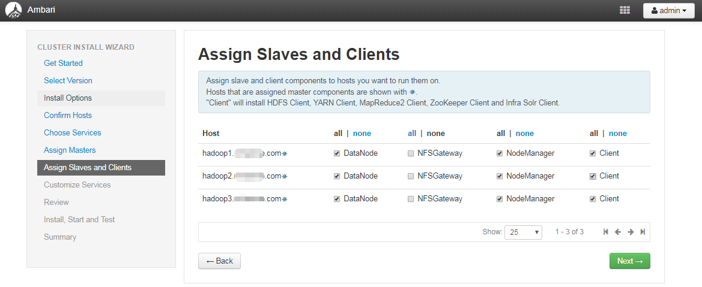

**10.自定义配置**

其中红色的必须要改，大致是设置路径，密码等，如hive要设置hive元数据的数据库信息，我用的master上的mysql

配置完成点击`next`下一步

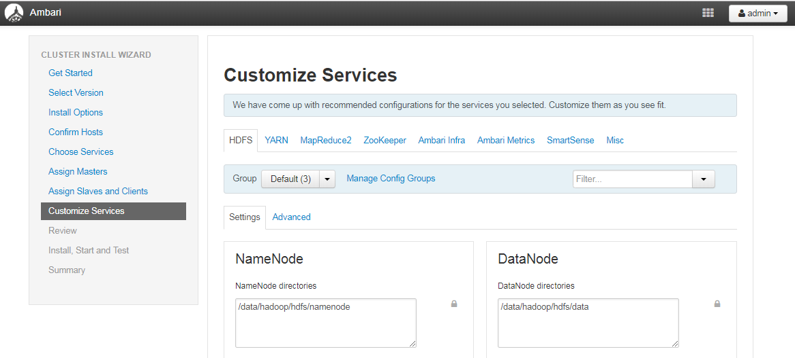

没有了红色的即可进行下一步，如遇到warn，可根据提示信息进行修改配置，也可以忽略警告，等装完以后再改。

**11.浏览前面的配置**

忘记截图了随便找的一张图，没问题的话点击`Deploy`开始安装

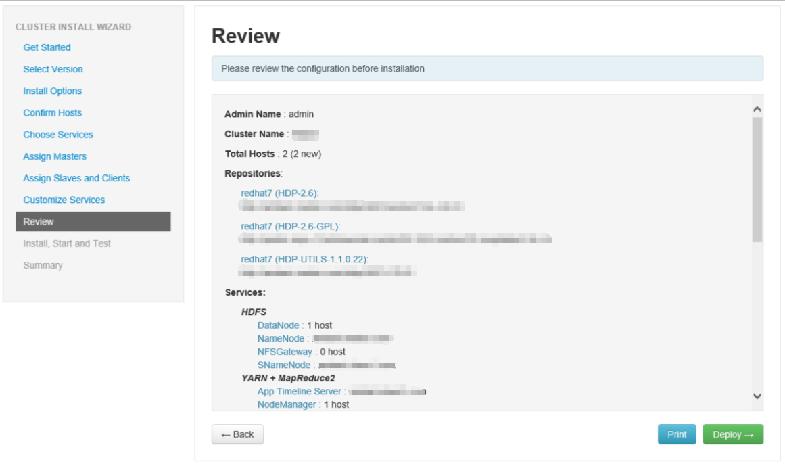

**11.安装和测试**

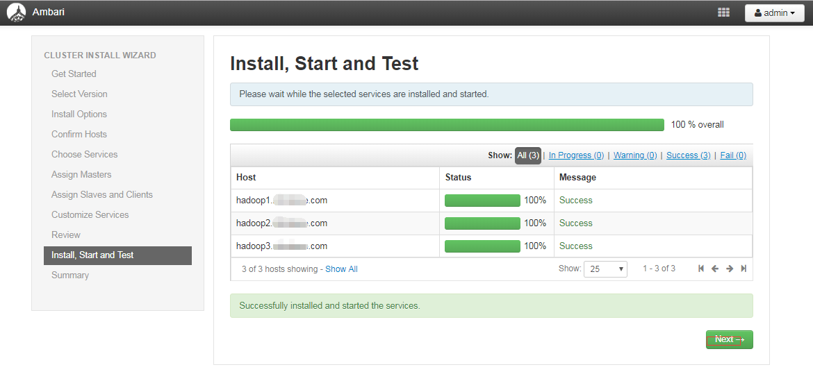

>  如果这步出问题，找到最下面的问题解决查看是否有类似的，祝你好运~

**12.喜大普奔**

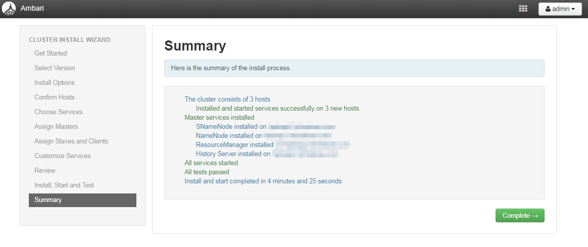

完成安装,第一次装，大概用了7个小时^_^，如果本文给您带来帮助，请给个赞，不胜感激，谢谢。

### 问题解决

问题：

```shell
File "/usr/lib/ambari-agent/lib/resource_management/libraries/script/script.py", line 811, in install_packages
    name = self.format_package_name(package['name'])
  File "/usr/lib/ambari-agent/lib/resource_management/libraries/script/script.py", line 546, in format_package_name
    raise Fail("Cannot match package for regexp name {0}. Available packages: {1}".format(name, self.available_packages_in_repos))
resource_management.core.exceptions.Fail: Cannot match package for regexp name hadoop_${stack_version}. Available packages: ['accumulo', 'tcl-rrdtool']
```

解决：

注释掉`/usr/lib/ambari-agent/lib/resource_management/libraries/script/script.py`文件中第541行`# package_version = None`每个版本行数可能不一样，版本不一样直接找到其关键字即可

如下图所示：

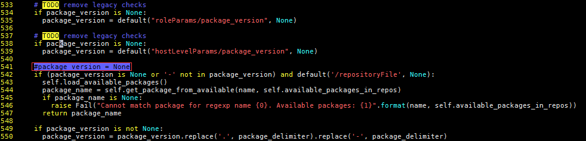

另外一个解决方案

[Ambari-HDP](https://www.cnblogs.com/xiashiwendao/p/8439932.html)

[ambari: Cannot match package for regexp name pig_${stack_version}](https://blog.csdn.net/weixin_42151684/article/details/81660851)

以上两方案只能解决局部的问题，但可以参考


本文参考了以下文章

[Apache Ambari Installation](https://docs.hortonworks.com/HDPDocuments/Ambari-2.6.1.5/bk_ambari-installation/content/ch_Getting_Ready.html)

[HDP 2.6.3.0 ambari安装 :Cannot match package for regexp name XX_${stack_version}错误](https://blog.csdn.net/u013090676/article/details/85865663)

[Ambari2.6.0 安装HDP2.6.3（离线安装）](https://www.cnblogs.com/zhang-ke/p/8944240.html)

[centos7 ambari2.6.1.5+hdp2.6.4.0 大数据集群安装部署](https://dongkelun.com/2018/04/25/ambariConf/)

感谢以上原创作者