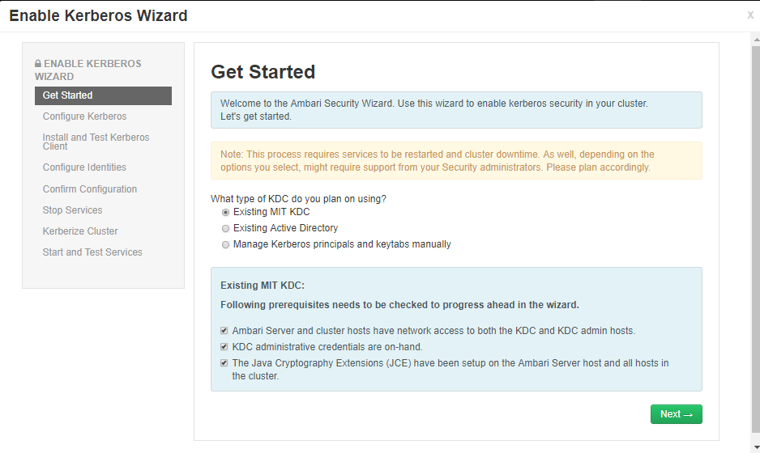
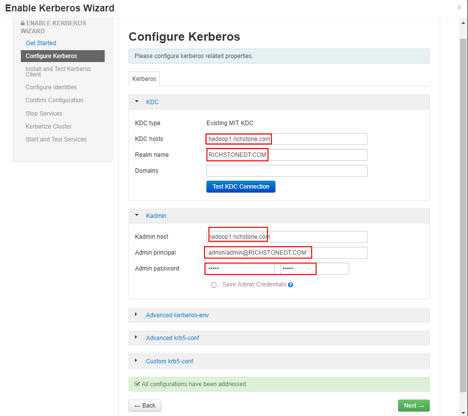
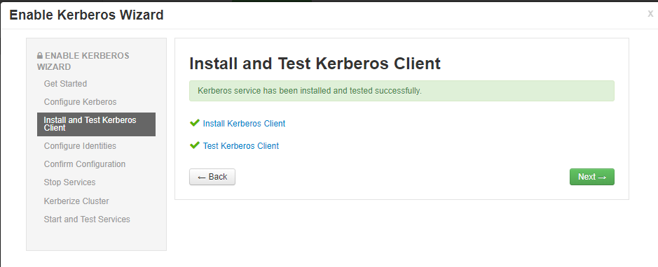
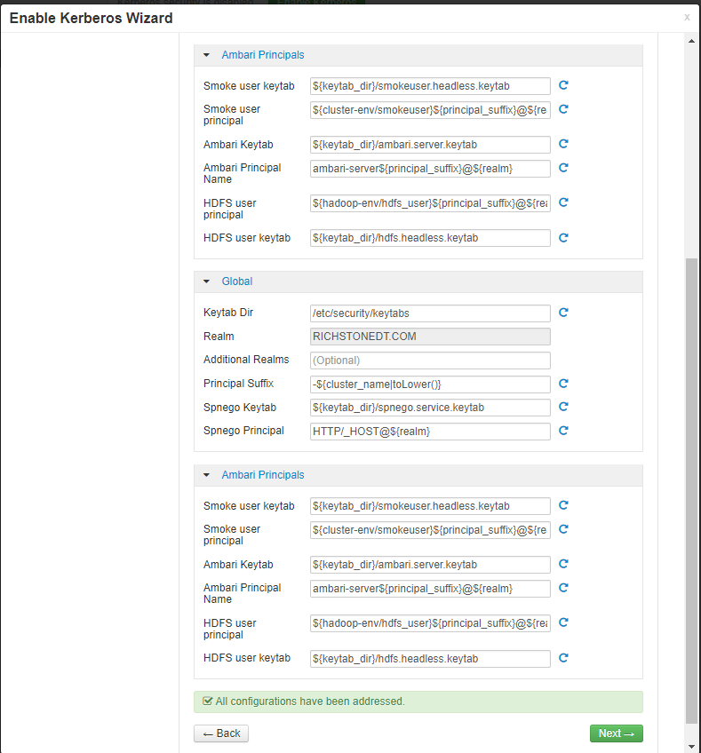
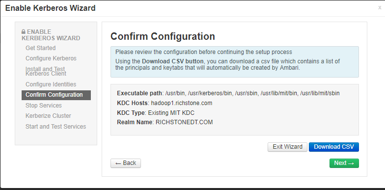
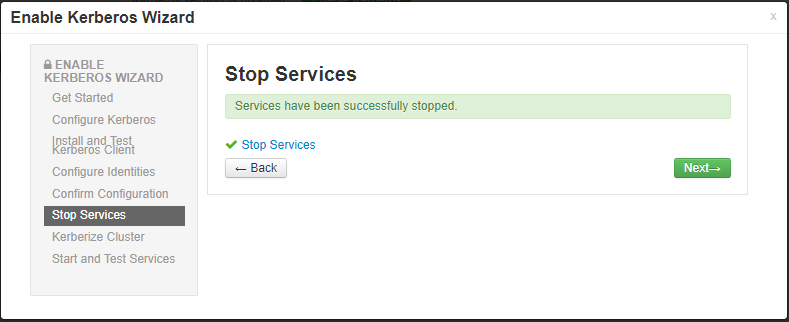
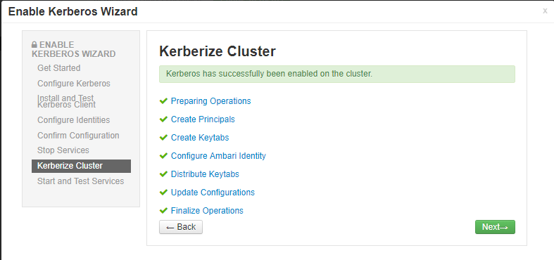

#### 在Kerberos主节点上安装KDC服务

```shell
[root@hadoop1]/etc/yum.repos.d# yum install -y krb5-server krb5-libs krb5-auth-dialog krb5-workstation
...
Installed:
  krb5-server.x86_64 0:1.15.1-37.el7_6

Updated:
  krb5-libs.x86_64 0:1.15.1-37.el7_6                                                                             krb5-workstation.x86_64 0:1.15.1-37.el7_6

Dependency Updated:
  krb5-devel.x86_64 0:1.15.1-37.el7_6                                                                                 libkadm5.x86_64 0:1.15.1-37.el7_6

Complete!
[root@hadoop1]/etc/yum.repos.d#
```

#### 编辑`/etc/krb5.conf`文件，

修改项注释为#d(modify)，请参考默认文件修改

```shell
includedir /etc/krb5.conf.d/

[logging]
 default = FILE:/var/log/krb5libs.log
 kdc = FILE:/var/log/krb5kdc.log
 admin_server = FILE:/var/log/kadmind.log

[libdefaults]
 default_realm = RICHSTONEDT.COM  					#d
 dns_lookup_realm = false
 ticket_lifetime = 24h
 renew_lifetime = 7d
 forwardable = true
 rdns = false
 pkinit_anchors = /etc/pki/tls/certs/ca-bundle.crt
 default_ccache_name = KEYRING:persistent:%{uid}

[realms]
  RICHSTONEDT.COM = {   							#d
  kdc = hadoop1.richstone.com  						#d
  admin_server = hadoop1.richstone.com				#d
  }

[domain_realm]
  .richstone.com = RICHSTONEDT.COM					#d没有加上
  richstone.com = RICHSTONEDT.COM					#d没有加上
```

**`/etc/krb5.conf`配置项说明**

```shell
[logging]：					日志输出设置
[libdefaults]：				连接的默认配置 
  default_realm：			Kerberos应用程序的默认领域，所有的principal都将带有这个领域标志
  ticket_lifetime： 			表明凭证生效的时限，一般为24小时
  renew_lifetime： 			表明凭证最长可以被延期的时限，一般为一个礼拜。当凭证过期之后，对安全认证的服务的后续访问则会失败
  clockskew：				时钟偏差是不完全符合主机系统时钟的票据时戳的容差，超过此容差将不接受此票据。通常，将时钟扭斜设置为 300 秒（5 分钟）。这意味着从服务器的角度看，票证的时间戳与它的偏差可以是在前后 5 分钟内
  udp_preference_limit= 1：	禁止使用 udp 可以防止一个 Hadoop 中的错误
[realms]：					列举使用的 realm 
  kdc：						代表要 kdc 的位置。格式是 机器:端口
  admin_server：				代表 admin 的位置。格式是 机器:端口
  default_domain：			代表默认的域名
[domain_realm]：				域名到realm的关系
```

#### `修改/var/kerberos/krb5kdc/kadm5.acl`

默认为：

```shell
*/admin@EXAMPLE.COM     *
```

修改为：

```shell
*/admin@RICHSTONEDT.COM *
```

####  修改/var/kerberos/krb5kdc/kdc.conf

```shell
[kdcdefaults]
 kdc_ports = 88
 kdc_tcp_ports = 88

[realms]
  RICHSTONEDT.COM = {				#d
  #master_key_type = aes256-cts
  max_renewable_life= 7d 0h 0m 0s	#添加
  acl_file = /var/kerberos/krb5kdc/kadm5.acl
  dict_file = /usr/share/dict/words
  admin_keytab = /var/kerberos/krb5kdc/kadm5.keytab
  supported_enctypes = aes256-cts:normal aes128-cts:normal des3-hmac-sha1:normal arcfour-hmac:normal camellia256-cts:normal camellia128-cts:normal des-hmac-sha1:normal des-cbc-md5:normal des-cbc-crc:normal
 }
```

#### 创建Kerberos数据库

```shell
[root@hadoop1]/etc/yum.repos.d# kdb5_util create -r RICHSTONEDT.COM -s
Loading random data
Initializing database '/var/kerberos/krb5kdc/principal' for realm 'RICHSTONEDT.COM',
master key name 'K/M@RICHSTONEDT.COM'
You will be prompted for the database Master Password.
It is important that you NOT FORGET this password.
Enter KDC database master key: admin   				#设置密码
Re-enter KDC database master key to verify: admin  	#重新验证密码
[root@hadoop1]/etc/yum.repos.d#
```

#### 创建Kerberos的管理账号

```shell
[root@hadoop1]~# kadmin.local
Authenticating as principal root/admin@RICHSTONEDT.COM with password.
kadmin.local:  addprinc admin/admin@RICHSTONEDT.COM
WARNING: no policy specified for admin/admin@RICHSTONEDT.COM; defaulting to no policy
Enter password for principal "admin/admin@RICHSTONEDT.COM":
Re-enter password for principal "admin/admin@RICHSTONEDT.COM":
Principal "admin/admin@RICHSTONEDT.COM" created.
kadmin.local:  exit
[root@hadoop1]~#
```

Kerberos管理员帐号：`admin/admin@RICHSTONEDT.COM`

密码：`admin`

#### 设置开机启动，并启动服务

```shell
[root@hadoop1]~# systemctl enable krb5kdc.service
[root@hadoop1]~# systemctl enable kadmin.service
[root@hadoop1]~# systemctl start krb5kdc.service
[root@hadoop1]~# systemctl start kadmin.service
[root@hadoop1]~# systemctl status krb5kdc.service
● krb5kdc.service - Kerberos 5 KDC
   Loaded: loaded (/usr/lib/systemd/system/krb5kdc.service; enabled; vendor preset: disabled)
   Active: active (running) since Thu 2019-05-30 10:57:42 CST; 1min 38s ago
 Main PID: 23603 (krb5kdc)
    Tasks: 1
   Memory: 572.0K
   CGroup: /system.slice/krb5kdc.service
           └─23603 /usr/sbin/krb5kdc -P /var/run/krb5kdc.pid

May 30 10:57:42 hadoop1.richstone.com systemd[1]: Starting Kerberos 5 KDC...
May 30 10:57:42 hadoop1.richstone.com systemd[1]: Started Kerberos 5 KDC.
[root@hadoop1]~# systemctl status kadmin.service
● kadmin.service - Kerberos 5 Password-changing and Administration
   Loaded: loaded (/usr/lib/systemd/system/kadmin.service; enabled; vendor preset: disabled)
   Active: active (running) since Thu 2019-05-30 10:59:01 CST; 33s ago
  Process: 24413 ExecStart=/usr/sbin/_kadmind -P /var/run/kadmind.pid $KADMIND_ARGS (code=exited, status=0/SUCCESS)
 Main PID: 24414 (kadmind)
    Tasks: 1
   Memory: 8.8M
   CGroup: /system.slice/kadmin.service
           └─24414 /usr/sbin/kadmind -P /var/run/kadmind.pid

May 30 10:59:01 hadoop1.richstone.com systemd[1]: Starting Kerberos 5 Password-changing and Administration...
May 30 10:59:01 hadoop1.richstone.com systemd[1]: Started Kerberos 5 Password-changing and Administration.
[root@hadoop1]~#
```


#### 测试Kerberos的管理员账号

```shell
[root@hadoop1]~# kinit admin/admin@RICHSTONEDT.COM
Password for admin/admin@RICHSTONEDT.COM:
[root@hadoop1]~# klist
Ticket cache: KEYRING:persistent:0:0
Default principal: admin/admin@RICHSTONEDT.COM

Valid starting       Expires              Service principal
05/30/2019 11:01:18  05/31/2019 11:01:18  krbtgt/RICHSTONEDT.COM@RICHSTONEDT.COM
        renew until 06/06/2019 11:01:18
[root@hadoop1]~#
```

重启kdc服务`systemctl restart kadmin.service`


#### 安装Kerberos客户端

在所有节点执行`yum install -y krb5-libs krb5-workstation`命令安装Kerberos客户端。

```shell
[root@hadoop2 ~]# yum install -y krb5-libs krb5-workstation
Loaded plugins: fastestmirror
...
Complete!
[root@hadoop2 ~]#
```


#### 分发`krb5.conf`配置文件到所有客户端

将KDC Server上的`krb5.conf`文件拷贝到所有Kerberos客户端

```shell
[root@hadoop1]~# scp /etc/krb5.conf root@hadoop2:/etc
krb5.conf                                                                                                             100%  660     1.4MB/s   00:00
[root@hadoop1]~# scp /etc/krb5.conf root@hadoop3:/etc
krb5.conf                                                                                                             100%  660   570.9KB/s   00:00
[root@hadoop1]~#
```

#### 关闭防火墙和SElinux

所有节点的防火墙和SELinux

```shell
# 关闭防火墙
[root@hadoop1]~# systemctl stop firewalld.service
# 关闭selinux
[root@hadoop1]~# setenforce 0 #临时关闭selinux
[root@hadoop1]~# vim /etc/selinux/config #永久关闭，把里边的一行改为SELINUX=disabled,重启生效
```

#### 安装JCE

```shell
# 下载安装包
[root@hadoop1]~# wget --no-check-certificate --no-cookies --header "Cookie: oraclelicense=accept-securebackup-cookie" "http://download.oracle.com/otn-pub/java/jce/8/jce_policy-8.zip"

# 解压安装包
[root@hadoop1]~# unzip jce_policy-8.zip
Archive:  jce_policy-8.zip
   creating: UnlimitedJCEPolicyJDK8/
  inflating: UnlimitedJCEPolicyJDK8/local_policy.jar
  inflating: UnlimitedJCEPolicyJDK8/README.txt
  inflating: UnlimitedJCEPolicyJDK8/US_export_policy.jar
[root@hadoop1]~#

# 查看目录情况 
[root@hadoop1]~# cd UnlimitedJCEPolicyJDK8
[root@hadoop1]~/UnlimitedJCEPolicyJDK8# ll
total 16
-rw-rw-r-- 1 root root 3035 Dec 21  2013 local_policy.jar
-rw-r--r-- 1 root root 7323 Dec 21  2013 README.txt
-rw-rw-r-- 1 root root 3023 Dec 21  2013 US_export_policy.jar
[root@hadoop1]~# echo $JAVA_HOME
/usr/java/jdk1.8.0_152
[root@hadoop1]~/UnlimitedJCEPolicyJDK8# ll /usr/java/jdk1.8.0_152/jre/lib/security/
total 180
-rw-r--r--. 1 root root   4054 Sep 14  2017 blacklist
-rw-r--r--. 1 root root   1273 Sep 14  2017 blacklisted.certs
-rw-r--r--. 1 root root 113367 Sep 14  2017 cacerts
-rw-r--r--. 1 root root   2466 Sep 14  2017 java.policy
-rw-r--r--. 1 root root  38240 Sep 14  2017 java.security
-rw-r--r--. 1 root root     98 Sep 14  2017 javaws.policy
drwxr-xr-x. 4 root root   4096 Nov 27  2017 policy
-rw-r--r--. 1 root root      0 Sep 14  2017 trusted.libraries
[root@hadoop1]~/UnlimitedJCEPolicyJDK8#

# 替换或者添加
[root@hadoop1]~/UnlimitedJCEPolicyJDK8# cp local_policy.jar US_export_policy.jar /usr/java/jdk1.8.0_152/jre/lib/security/

# 分发到所有节点
[root@hadoop1]~/UnlimitedJCEPolicyJDK8# scp local_policy.jar US_export_policy.jar  root@hadoop2:/usr/java/jdk1.8.0_152/jre/lib/security
[root@hadoop1]~/UnlimitedJCEPolicyJDK8# scp local_policy.jar US_export_policy.jar  root@hadoop3:/usr/java/jdk1.8.0_152/jre/lib/security
```


##### Ambari界面设置



②按之前配置的填好KDC和Kadmin，填好后一定要Test KDC Connection，通了之后再进行下一步 



③等它自动安装和测试通过后点next即可 



④之后的保持默认点next即可











参考：

https://blog.csdn.net/Dr_Guo/article/details/53534927

https://docs.hortonworks.com/HDPDocuments/HDP2/HDP-2.6.5/bk_security/bk_security.pdf