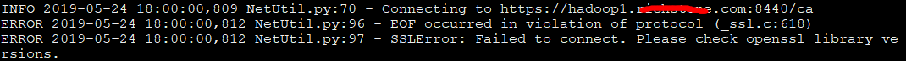

# HDP"xx is not sending heartbeats" 解决方案

问题描述：




解决方案：

从字面上看为openssl版本的问题，实际是因为python版本的问题。 
在python 2.7.5及以上版本时，增加了certificate verification，正是因为这个特性导致ambari-agent无法连接server。


1.修改`/etc/python/cert-verification.cfg`

```shell
#vi /etc/python/cert-verification.cfg
[https]
verify=disable
```

2.`/etc/ambari-agent/conf/ambari-agent.ini`

```shell
vi /etc/ambari-agent/conf/ambari-agent.ini
[security]
ssl_verify_cert=0
force_https_protocol=PROTOCOL_TLSv1_2
```

3.重启`ambari-agent`

```shell
[root@hadoop3 ~]# ambari-agent restart
```

