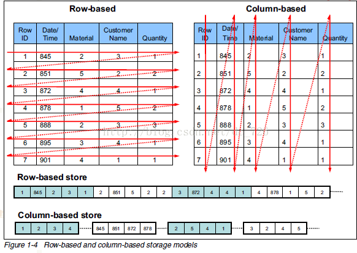
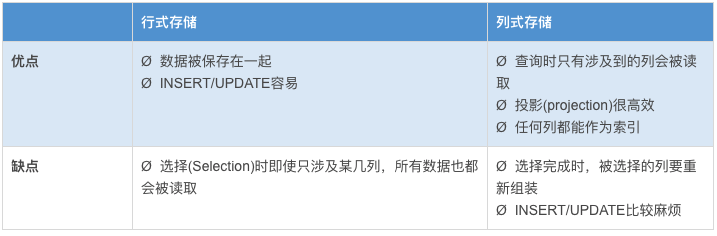

# Hive 数据存储

1、Hive中所有的数据都存储在 HDFS 中，没有专门的数据存储格式（可支持Text，SequenceFile，ParquetFile等）。

Parquet和ORC是属于列式存储。[几张图看懂列式存储](https://blog.csdn.net/dc_726/article/details/41143175)

从上图可以很清楚地看到，行式存储下一张表的数据都是放在一起的，但列式存储下都被分开保存了。所以它们就有了如下这些优缺点：

这里聊聊它们的对比，笔者做过一个测试，对同一份数据源利用不同的数据存储之后，查看它们的大小：

- TextFile(默认) 文件大小为28.1M
- 用SequenceFile存储后的文件为29.6M
- 用RcFile存储后的文件为27.9M
- 用ORCFile存储后的文件为17.7M
- 用Parquet存储后的文件为23.1M

总结：磁盘空间占用大小比较
ORCFile<Parquet<RcFile<Textfile<SequenceFile
所以可以根据业务需求，选择合适的存储格式。

2、只需要在创建表的时候告诉 Hive 数据中的列分隔符和行分隔符，Hive 就可以解析数据。

3、Hive 中包含以下数据模型：**DB、Table，External Table，Partition，Bucket**。

- db：在hdfs中表现为${hive.metastore.warehouse.dir}目录下一个文件夹

- table：在hdfs中表现所属db目录下一个文件夹

- external table：外部表, 与table类似，不过其数据存放位置可以在任意指定路径。普通表: 删除表后, hdfs上的文件都删了,External外部表删除后, hdfs上的文件没有删除, 只是把hive的表删除了。

- partition 分区：在hdfs中表现为table目录下的子目录

- bucket：桶, 在hdfs中表现为同一个表目录下根据hash散列之后的多个文件, 会根据不同的文件把数据放到不同的文件中

4、Hive读时模式：

传统数据库是写时模式（schema on write），即数据在写入数据库时对模式进行检查。

hive是读时模式（schema on read），即进行数据查询时进行检查验证。

hive在读取这些数据时，如果数据个数对不上，或者数据类型和模式类型对不上，那么将返回null；总之如果查询时返回的数据集很"奇怪"那么你需要额外留意一下了。