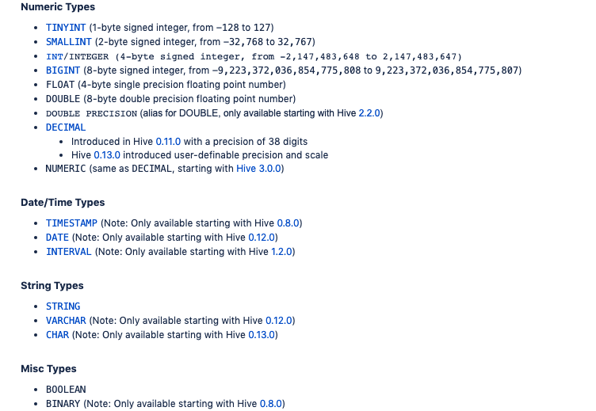
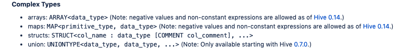
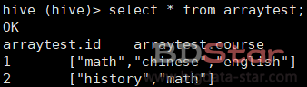
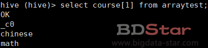
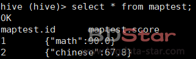
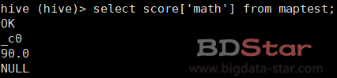
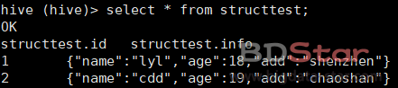

# Hive 数据类型

关系型数据库会定义字段的长度，提供这个功能是基于性能优化的考虑，定长的记录会更容易建立索引，数据扫描等。

但是在hive所在的宽松世界里，hive支持不同存储格式的文件存储数据，在不同格式文件中，根据字段间隔符实现判断列， 并且关系型数据库限制列长度的方式对于Hadoop这种强调优化磁盘读写性能而言，并不重要。

例如：用户查询中将一个float类型的列和一个double类型的列作对比或者将一个整型的的值和另一个整型的值做对比，那么hive会隐式的将类型转换为类型比较大的那一种，即 float转换为double再比较。

hive支持的数据类型可以分为两大类：基本数据类型，复杂数据类型。

## 基本数据类型

基本数据类型和关系数据库的数据类型基本大同小异，它们分别是：数字类型，日期类型，String类型，Boolean类型。



## 复杂数据类型

复杂数据类型有以下几种：Arrays类型、maps类型、structs类型和union类型；实际上是调用了内置函数。

大多数关系数据库类型都不支持这些集合数据类型，因为他们趋向于破坏标准格式。破坏后会增大数据冗余风险，从而消耗不必要的磁盘空间，或者造成数据不一致，或者当数据发生改变时冗余的拷贝数据可能无法进行相应的同步。

但是在hive对应的大数据系统中，不遵循标准格式的好处是： 提供更高吞吐量的数据。当处理数据级别在T/P时，以最少的头部寻址从磁盘上扫描数据是非常必要的，而通过hive的集合数据类型对应的数据集进行封装能够减少寻址次数。

下面将逐一演示以下它们的使用方式。



**Arrays类型**

```shell
hive (hive)> create table arraytest (id int,course array<string>)
           > row format delimited fields terminated by','
           > collection items terminated by':';
```

row format delimited fields terminated by是指定列与列之间的分隔符,此处为”,”

collection items terminated by是指定集合内元素之间的分隔符,此处为”：”

因此我们要导入到hive中的数据应该是形如：

```
1,math:chinese
2,english:history
```

查询HIVE中的数据



查询数组中指定索引



**Map类型**

```shell
hive (hive)> create table maptest(id int,score map<string,float>)
           > row format delimited fields terminated by','
           > map keys terminated by':';
```

查询HIVE中的数据



查询指定的key



**Struct类型**

与数组区别是可以不同的数据类型，上例数组都是String类型的，这里既有String又有Int。

```shell
hive (hive)> create table structtest(id int,info struct<name:string,age:int,add:varchar(30)>)
           > row format delimited fields terminated by','
```

查询HIVE中的数据



**union类型**

union数据类型是一种合并