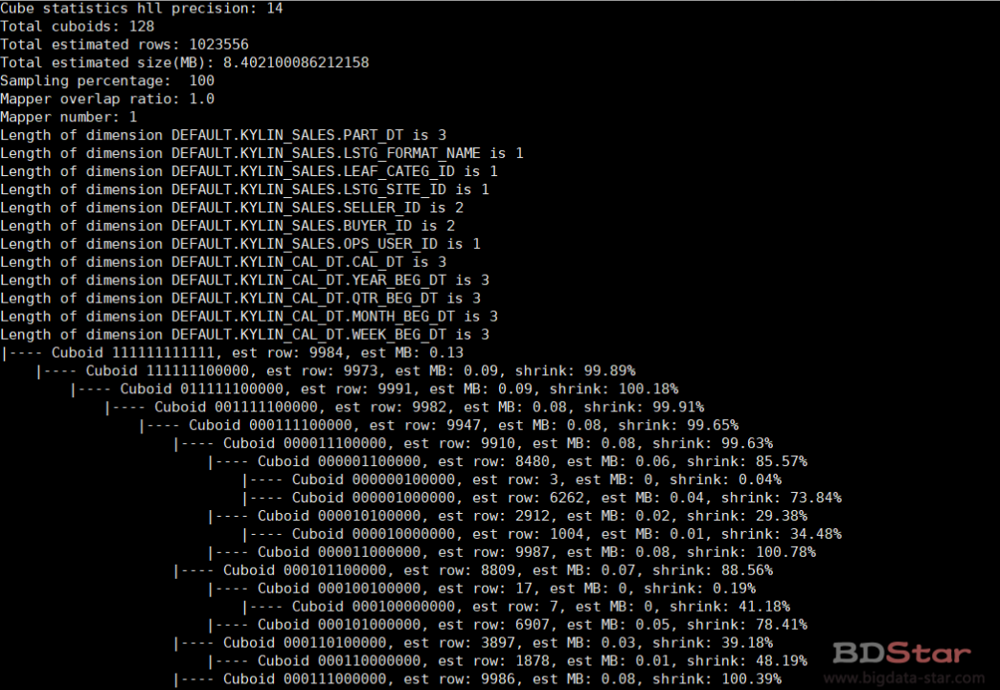
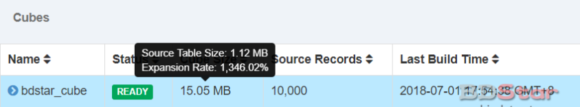
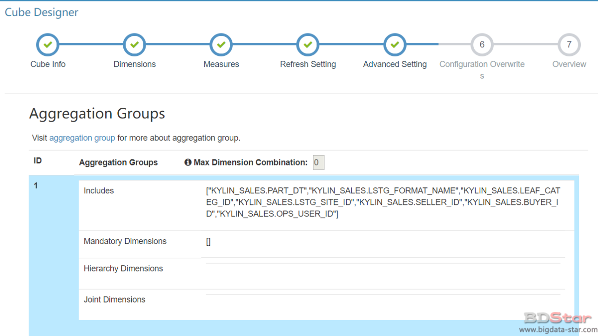

# Cube优化

> Cube优化不当，对构建引擎、存储引擎来说压力非常巨大。因此，在构建维度数量较多的Cube时，尤其要注意Cube的优化。本章从多个角度介绍了Cube优化的方法：从Cuboid剪枝的角度，从并发粒度控制的角度，从Rowkeys设计的角度，还有从度量精度选择的角度等。Cube优化需要Cube管理员对Kylin有较为深刻的理解和认识。

Kylin的核心思想是根据用户的数据模型和查询样式对数据进行预计算，并在查询时直接利用预计算结果返回查询结果。用户的数据模型包括维度、度量、分割时间列等基本信息，也包括用户通过Cube优化工具赋予的额外的模型信息。例如，层级（Hierarchy）是一种用来描述若干个维度之间存在层级关系的优化工具，提供层级信息有助于帮助预计算跳过多余的预计算，从而减少预计算的工作量，并且最终减少存储引擎所需要存储的Cube数据大小。数据模型是数据固有的属性，除此之外，查询的样式如果相对固定，也可以用来帮助Cube的优化。例如，如果我们知道客户端的查询总是会带有某个维度上的过滤（Filter）条件，或者总是会按照这个维度进行聚合（GroupBy），那么所有的不带这个维度的场景下的预计算都可以被跳过，因为即使为这些场景进行了预计算，这些预计算结果也从来不会被用到。
总的来说，在构建Cube之前，Cube的优化手段提供了更多与数据模型或查询样式相关的信息，用于指导构建出体积更小、查询速度更快的Cube。可以看到Cube的优化目的始终有两个：空间优化和查询时间优化

## Cube剪枝优化

Cube是至关重要的核心。Cube是所有Dimension 的组合，每一种Dimension 的组合称之为Cuboid，有N个Dimension的Cube就会有2^n^个Cuboid。因此，一个优化得当的Cube既能满足高速查询的需要，又可节省集群资源。在没有采取任何优化措施的情况下，假设有20个维度，那么Cube中总共会存在220 =1048576个Cuboid。虽然每个Cuboid的大小存在很大的差异，但是单单想到Cuboid的数量就足以让人想象到这样的Cube对构建引擎、存储引擎来说压力有多么巨大。因此，在构建维度数量较多的Cube时，尤其要注意Cube的剪枝优化。

### 检查Cuboid数量

Apache Kylin提供了一个简单的工具，供用户检查Cube中哪些Cuboid最终被预计算了，我们称其为被物化（Materialized）的Cuboid。同时，这种方法还能给出每个Cuboid所占空间的估计值。由于该工具需要在对数据
进行一定阶段的处理之后才能估算Cuboid的大小，因此一般来说只能在Cube构建完毕之后再使用该工具。

`bin/kylin.sh org.apache.kylin.engine.mr.common.CubeStatsReader cubeName`



### 检查Cube大小

还有一种更为简单的方法可以帮助我们判断Cube是否已经足够优化。在Web GUI的Model页面选择一个READY状态的Cube，当我们把光标移到该Cube的Cube Size列时，Web GUI会提示Cube的源数据大小，以及当前Cube的大小除以源数据大小的比例，称为膨胀率（Expansion Rate）



**一般Cube的膨胀率应该在0%－1000%之间**，如果Cube的膨胀率超过了1000%，那么就需要查询其中的原因了，导致膨胀率高的原因一般有：

- Cube中的维度数量较多，且没有进行很好的Cuboid剪枝优化，导致Cuboid数量极多。
- Cube中存在较高基数的维度，导致包含这类维度的每一个Cuboid占用的空间都很大，这些Cuboid累积造成整体Cube体积变大。
- 存在比较占用空间的度量，例如Count Distinct，因此需要在Cuboid的每一行中都为其保存一个较大的寄存器，最坏的情况将会导致Cuboid中每一行都有数十KB，从而造成整个Cube的体积变大。

从以上角度来说，Kylin的核心优势在于使用额外的空间存储预计算的结果，以换取查询时间的缩减。而Cube的剪枝优化则是一种试图减少额外空间占用的方法，这种方法的前提是不会明显影响查询时间的缩减。在做剪枝优化的时候，需要选择跳过那些“多余”的Cuboid：有的Cuboid因为查询样式的原因永远不会被查询到，因此显得多余；有的Cuboid的能力和其他Cuboid接近，因此显得多余。但是Cube管理员无法提前甄别每一个Cuboid是否多余，因此Kylin提供了一系列简单的工具来帮助他们完成Cube的剪枝优化。

## 剪枝优化的工具

### 使用衍生维度

衍生维度（Derived Dim）：当一个或者多个维度能够从主键中推断出来，那么这些维度列就称之为生“Derived” 列。Derived列不会生成Cuboid。衍生维度用于在有效维度内将维度表上的非主键维度排除掉，并使用维度表的主键（其实是事实表上相应的外键）来替代它们。
比如时间维度表，里面充斥着用途各异的时间维度，例如每个日期所处的星期、每个日期所处的月份等。但是为了这个目的一下子引入这么多个维度，导致Cube中总共的Cuboid数量呈现爆炸式的增长往往是得不偿失的，所以在维度中只放入了这个维度表的主键（在底层实现中，我们更偏向使用事实表上的外键，因为在left joint的情况下事实表外键是维度表主键的超集），也就是只物化按日聚合的Cuboid。当用户需要以更高的粒度（比如按周、按月）来聚合时，如果在查询时获取按日聚合的Cuboid数据，并在查询引擎中实时地进行上卷操作，那么就达到了使用牺牲一部分运行时性能来节省Cube空间占用的目的。

### 使用聚合组

聚合组（Aggregation Group）是一种更为强大的剪枝工具。聚合组假设一个Cube的所有维度均可以根据业务需求划分成若干组（当然也可以是一个组），由于同一个组内的维度更可能同时被同一个查询用到，因此会表现出更加紧密的内在关联。每个分组的维度集合均是Cube所有维度的一个子集，不同的分组各自拥有一套维度集合，它们可能与其他分组有相同的维度，也可能没有相同的维度。每个分组各自独立地根据自身的规则贡献出一批需要被物化的Cuboid，所有分组贡献的Cuboid的并集就成为了当前Cube中所有需要物化的Cuboid的集合。不同的分组有可能会贡献出相同的Cuboid，构建引擎会察觉到这点，并且保证每一个Cuboid无论在多少个分组中出现，它都只会被物化一次。



- 强制维度（Mandatory）

  所有Cubeid中都包含的维度称之为强制维度，不包含强制维度的Cubeid不会计算。如果根据这个分组的业务逻辑，则相关的查询一定会在过滤条件或分组条件中，因此可以在该分组中把该维度设置为强制维度。
  优化效果：只计算包含强制维度的Cubeid，Cubeid的数量会缩减一半。
  使用场景：假如有三个维度A，B，C，那么Cuboid就会有8个，分别为ABC，AB，BC，AC，A，B，C，这时将A设置为强制维度，那么就只会计算ABC，AB，AC，A这四个 Cubeid。

- 层级维度（Hierarchy）

  某些维度之间具有上下层次关联。
  优化效果：如果有三个维度A，B，C 设置为层次维度，那么Cuboid数量将由2^3减为3＋1。
  使用场景：比较适用于进行下钻分析，比如年月日，省市县这种。

- 联合维度（Joint）

  每个联合中包含两个或更多个维度，如果某些列形成一个联合，那么在该分组产生的任何Cuboid中，这些联合维度要么一起出现，要么都不出现。
  优化效果：将多个维度优化到一个维度。
  使用场景：假如有ABC三个维度，但是在查询的时候只会出现Group by A，B，C，而不会出现Group A，Group by B，Group by A、B等等这种情况，那么就可以将A，B，C设置为联合维度。

### 并发粒度优化

当Segment中某一个Cuboid的大小超出一定的阈值时，系统会将该Cuboid的数据分片到多个分区中，以实现Cuboid数据读取的并行化，从而优化Cube的查询速度。具体的实现方式如下：

构建引擎根据Segment估计的大小，以及参数“kylin.hbase.region.cut”的设置决定Segment在存储引擎中总共需要几个分区来存储，如果存储引擎是HBase，那么分区的数量就对应于HBase中的Region数量。kylin.hbase.region.cut的默认值是5.0，单位是GB，也就是说对于一个大小估计是50GB的Segment，构建引擎会给它分配10个分区。用户还可以通过设置kylin.hbase.region.count.min（默认为1）和kylin.hbase.region.count.max（默认为500）两个配置来决定每个Segment最少或最多被划分成多少个分区。

### Rowkeys优化

- 编码（Encoding）

  编码（Encoding）代表了该维度的值应使用何种方式进行编码，合适的编码能够减少维度对空间的占用，例如，我们可以把所有的日期都用三个字节进行编码，相比于字符串存储，或者是使用长整数形式存储的方法，我们的编码方式能够大大减少每行Cube数据的体积。而Cube中可能存在数以亿计的行数，使用编码节约的空间累加起来将是一个非常巨大的数字。
  目前Kylin支持的编码方式有以下几种。
  `Date编码`：将日期类型的数据使用三个字节进行编码，其支持从0000-01-01到9999-01-01中的每一个日期。

  `Time编码`：仅支持表示从1970-01-0100：00：00到2038-01-1903：14：07的时间，且Time-stamp类型的维度经过编码和反编码之后，会失去毫秒信息，所以说Time编码仅仅支持到秒。但是Time编码的优势是每个维度仅仅使用4个字节，这相比普通的长整数编码节约了一半。如果能够接受秒级的时间精度，请选择Time编码来代表时间的维度。

  `Integer编码`：Integer编码需要提供一个额外的参数“Length”来代表需要多少个字节。Length的长度为1~8。如果用来编码int32类型的整数，可以将Length设为4；如果用来编码int64类型的整数，可以将Length设为8。在更多情况下，如果知道一个整数类型维度的可能值都很小，那么就能使用Length为2甚至是1的int编码来存储，这将能够有效避免存储空间的浪费。

  `Dict编码`：对于使用该种编码的维度，每个Segment在构建的时候都会为这个维度所有可能的值创建一个字典，然后使用字典中每个值的编号来编码。Dict的优势是产生的编码非常紧凑，尤其在维度值的基数较小且长度较大的情况下，特别节约空间。由于产生的字典是在查询时加载入构建引擎和查询引擎的，所以在维度的基数大、长度也大的情况下，容易造成构建引擎或查询引擎的内存溢出。

  `Fixed_length编码`：编码需要提供一个额外的参数“Length”来代表需要多少个字节。该编码可以看作Dict编码的一种补充。对于基数大、长度也大的维度来说，使用Dict可能不能正常工作，于是可以采用一段固定长度的字节来存储代表维度值的字节数组，该数组为字符串形式的维度值的UTF-8字节。如果维度值的长度大于预设的Length，那么超出的部分将会被截断。

- 调整Rowkeys顺序

  在Cube Designer→Advanced Setting→Rowkeys部分，我们可以上下拖动每一个维度来调节维度在Rowkeys中的顺序。这种顺序对于查询非常重要，因为在目前的实现中，Kylin会把所有的维度按照顺序黏合成一个完整的Rowkeys，并且按照这个Rowkeys升序排列Cuboid中所有的行。
  不难发现，如果在一个比较靠后的维度上有过滤条件，那么这个过滤条件的执行就会非常复杂。以目前的HBase存储引擎为例，Rowkeys对应HBase中的Rowkeys，是一段字节数组。目前没有创建单独的每个维度上的倒排索引，因此对于在比较靠后的维度上的过滤条件，只能依靠HBase的FuzzyKeyFilter来执行。尽管HBase做了大量相应的优化，但是因
  为是在对靠后的字节运用FuzzyKeyFilter，因此一旦前面维度的基数很大，那么FuzzyKeyFilter的寻找代价就会很高，执行效率就会变差。所以，在调整Rowkeys的顺序时需要遵守以下几个原则：

  - 在查询中被用作过滤条件的维度有可能放在其他维度的前面。
  - 将经常出现在查询中的维度放在不经常出现的维度的前面。
  - 对于基数较高的维度，如果查询会有这个维度上的过滤条件，那么将它往前调整；如果没有，则向后调整。

## 其他优化

有一些度量具有多种可选精度，但是精度越高的度量往往越会存在一定的代价，它意味着更大的占用空间和运行时开销。以近似值的Count Distinct度量为例，Kylin提供了多种可选精度，精度最大的类型比精度最小的类型多出64倍的空间占用，而即使精度最小的Count Distinct度量也已经非常占用空间了。因此，当业务可以接受较低一些的精度时，用户应当考虑到Cube空间方面的影响，尽量选择小精度的度量。

### 降低度量精度

有一些度量具有多种可选精度，但是精度越高的度量往往越会存在一定的代价，它意味着更大的占用空间和运行时开销。以近似值的Count Distinct度量为例，Kylin提供了多种可选精度，精度最大的类型比精度最小的类型多出64倍的空间占用，而即使精度最小的Count Distinct度量也已经非常占用空间了。因此，当业务可以接受较低一些的精度时，用户应当考虑到Cube空间方面的影响，尽量选择小精度的度量。

### 及时清理无用的Segment

随着增量构建出来的Segment的慢慢累积，Cube的查询性能将会变差，因为每次跨Segment的查询都需要从存储引擎中读取每一个Segment的数据，并且在查询引擎中对不同Segment的数据做进一步的聚合，这对于查询引擎和存储引擎来说都是巨大的压力。从这个角度来说，及时地使用Segment碎片清理方法（之前的教程说过，设置Retention Threshold），有助于提高Cube的使用效率。

### 压缩

默认情况，Kylin 不支持压缩，在产品环境这不是一个推荐的设置，但对于新的 Kylin 用户是个权衡。一个合适的算法将会减少存储负载。不支持的算法会阻碍 Kylin job build。Kylin 可以使用三种类型的压缩，HBase 表压缩，Hive 输出压缩 和 MR jobs 输出压缩。

- HBase 表压缩

  压缩设置通过 kylin.hbase.default.compression.codec 定义在 kyiln.properties 中，默认值为 none。有效的值包括 none，snappy，lzo，gzip 和 lz4。在变换压缩算法前，请确保您的 Hbase 集群支持所选算法。尤其是 snappy，lzo 和 lz4，不是所有的 Hadoop 分布式都会包含。

- Hive 输出压缩

  压缩设置定义在 kylin_hive_conf.xml。默认设置为 empty 其利用了 Hive 的默认配置。如果您重写配置，请在 kylin_hive_conf.xml 中添加 (或替换) 下列属性。以 snappy 压缩为例:

  ```xml
  <property>
          <name>mapreduce.map.output.compress.codec</name>
          <value>org.apache.hadoop.io.compress.SnappyCodec</value>
          <description></description>
      </property>
      <property>
          <name>mapreduce.output.fileoutputformat.compress.codec</name>
          <value>org.apache.hadoop.io.compress.SnappyCodec</value>
          <description></description>
      </property>
  ```

- MR jobs 输出压缩

  压缩设置定义在 kylin_job_conf.xml 和 kylin_job_conf_inmem.xml中。默认设置为 empty 其利用了 MR 的默认配置。如果您重写配置，请在 kylin_job_conf.xml 和 kylin_job_conf_inmem.xml 中添加 (或替换) 下列属性。以 snappy 压缩为例:

  ```xml
  <property>
          <name>mapreduce.map.output.compress.codec</name>
          <value>org.apache.hadoop.io.compress.SnappyCodec</value>
          <description></description>
      </property>
      <property>
          <name>mapreduce.output.fileoutputformat.compress.codec</name>
          <value>org.apache.hadoop.io.compress.SnappyCodec</value>
          <description></description>
      </property>
  ```

本文转载自：http://bigdata-star.com/archives/2068

