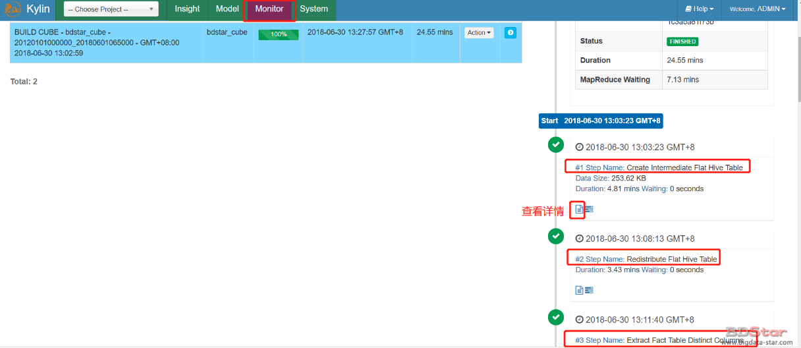
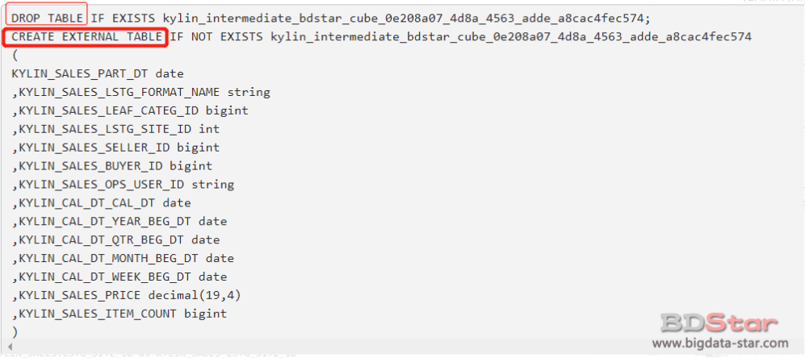
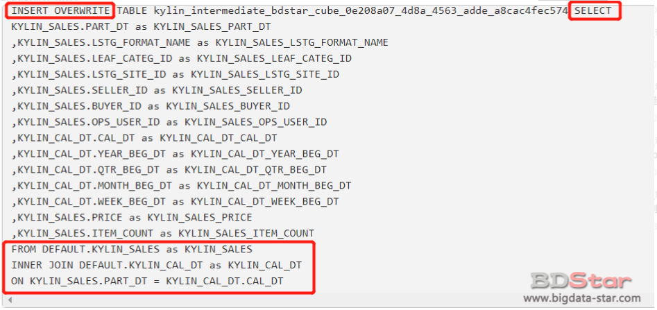
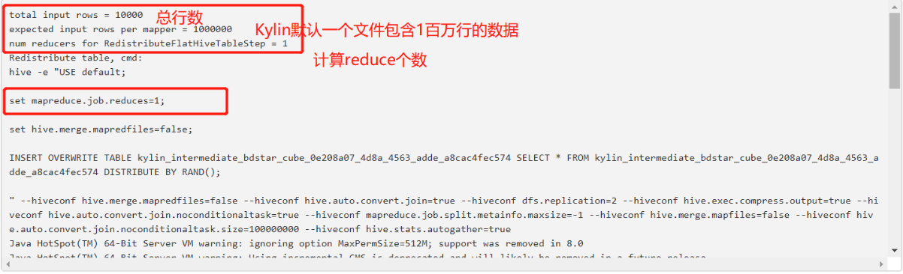
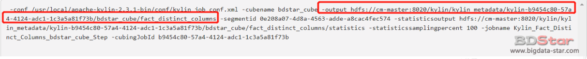
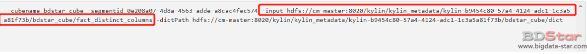
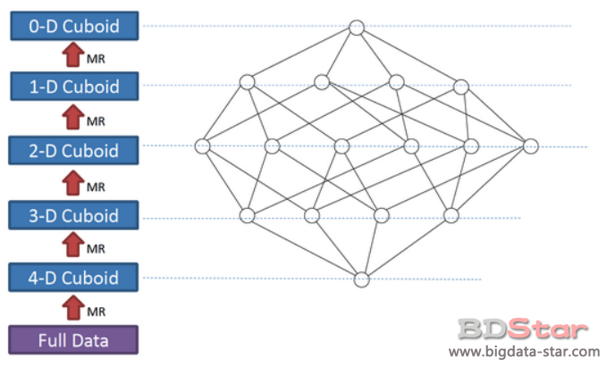

Bulid操作是构建一个Cube指定的时间区间的数据，Kylin是基于预计算获得高效的查询速度，因此需要通过Bulid，将原始数据（比如HIVE）转化为目标数据（比如HBASE）。我们选择上一节中的JOB进行整个流程分析。



### Step1:生成中间临时数据（Create Intermediate Flat Hive Table）

根据Cube定义生成的原始数据，会新创建一个HIVE外部表，然后根据Cube定义的星型模型，查询出维度（Derived类型的维度是使用的外键）和度量的值插入到新创建的表中。

- 创建外部表
  表名根据Cube名称和segment的uuid（增量cube为时间范围）生成的



- 插入数据
  此步选择出事实表和维度表按照Join方式之后出现在维度或者度量参数中的列，然后再加上用户设置的where条件和partition时间条件



### Step2:重新分配（Redistribute intermediate table）

经过上一个步骤之后，Hive会在HDFS的目录中生成一些数据文件，但是一些文件可能会很大，而另外一些文件可能会很小甚至是空的。文件大小分布的不均衡也会导致后续的MR任务执行的不平衡：一些mapper任务会执行的很快，而其他的mapper可能会执行的很慢。为了使这些数据分布的更均匀一些，Kylin增加了该步骤用来重新分配各个数据文件中的数据。



### Step3:创建事实表的Distinct Columns文件（Extract Fact Table Distinct Columns）

计算出现在表中每一个维度和度量的Distinct值，如果某一个维度列的distinct值比较大，那么可能导致MR任务OOM。所以如果此步骤不能在合理的时间内完成，请重新对cube进行设计，因为真正的build过程会花费更长的时间。



### Step4:构建维度词典（Build Dimension Dictionary）

根据上一步中已经获得了所有维度列的distinct值的文件，接着Kylin将会在内存中构建词典。词典是为了节约存储而设计的，用于将一个成员值的编码成一个整数类型并且可以通过整数值获取到原始成员的值。每一个cuboid成员是以key-value存储在hbase中，但是key一般是string,将它转为整数值可以减少内存占用。通常这一步会很快，但是如果distinct值的集合很大，Kylin可能会报错，例如，“Too high cardinality is not suitable for dictionary”。



### Step5:保存Cuboid统计信息（Save Cuboid Statistics）

### Step6:创建HTable（Create HTable）

### Step7:计算生成 base cuboid数据文件（Build Base Cuboid）

首先清楚Base Cuboid是什么：假如一个Cube有四个维度A,B,C,D 那么这四种维度的所有可能组合就是Base Cuboid，类似于在查询中select count(1) from table group by A,B,C,D 这个查询结果的个数就是Base Cuboid的成员数。也是通过MR任务完成的，输入的是第一步中的输出文件。

### Step8:计算第N层的Cuboid文件（Build N-Dimension Cuboid）

该流程是由多个步骤组成，逐层算法的处理过程，步骤的数量是根据维度组合的Cuboid总数决定的。每一步都使用前一步的输出作为输入，然后去除某个维度进行聚合，生成一个子cuboid。例如，对于cuboid ABCD，去除维度A可以获得cuboid BCD，去除维度B可以获得cuboid ACD等。



我们可以看一下该流程生成的HDFS数据文件：

```shell
[root@cm-master apache-kylin-2.3.1-bin]# hadoop fs -ls -R /kylin/kylin_metadata/kylin-b9454c80-57a4-4124-adc1-1c3a5a81f73b/bdstar_cube/cuboid/
drwxr-xr-x   - root supergroup          0 2018-06-30 13:17 /kylin/kylin_metadata/kylin-b9454c80-57a4-4124-adc1-1c3a5a81f73b/bdstar_cube/cuboid/level_1_cuboid
-rw-r--r--   2 root supergroup          0 2018-06-30 13:17 /kylin/kylin_metadata/kylin-b9454c80-57a4-4124-adc1-1c3a5a81f73b/bdstar_cube/cuboid/level_1_cuboid/_SUCCESS
-rw-r--r--   2 root supergroup     117125 2018-06-30 13:17 /kylin/kylin_metadata/kylin-b9454c80-57a4-4124-adc1-1c3a5a81f73b/bdstar_cube/cuboid/level_1_cuboid/part-r-00000
drwxr-xr-x   - root supergroup          0 2018-06-30 13:18 /kylin/kylin_metadata/kylin-b9454c80-57a4-4124-adc1-1c3a5a81f73b/bdstar_cube/cuboid/level_2_cuboid
-rw-r--r--   2 root supergroup          0 2018-06-30 13:18 /kylin/kylin_metadata/kylin-b9454c80-57a4-4124-adc1-1c3a5a81f73b/bdstar_cube/cuboid/level_2_cuboid/_SUCCESS
-rw-r--r--   2 root supergroup     727188 2018-06-30 13:18 /kylin/kylin_metadata/kylin-b9454c80-57a4-4124-adc1-1c3a5a81f73b/bdstar_cube/cuboid/level_2_cuboid/part-r-00000
drwxr-xr-x   - root supergroup          0 2018-06-30 13:19 /kylin/kylin_metadata/kylin-b9454c80-57a4-4124-adc1-1c3a5a81f73b/bdstar_cube/cuboid/level_3_cuboid
-rw-r--r--   2 root supergroup          0 2018-06-30 13:19 /kylin/kylin_metadata/kylin-b9454c80-57a4-4124-adc1-1c3a5a81f73b/bdstar_cube/cuboid/level_3_cuboid/_SUCCESS
-rw-r--r--   2 root supergroup    1927350 2018-06-30 13:19 /kylin/kylin_metadata/kylin-b9454c80-57a4-4124-adc1-1c3a5a81f73b/bdstar_cube/cuboid/level_3_cuboid/part-r-00000
drwxr-xr-x   - root supergroup          0 2018-06-30 13:21 /kylin/kylin_metadata/kylin-b9454c80-57a4-4124-adc1-1c3a5a81f73b/bdstar_cube/cuboid/level_4_cuboid
-rw-r--r--   2 root supergroup          0 2018-06-30 13:21 /kylin/kylin_metadata/kylin-b9454c80-57a4-4124-adc1-1c3a5a81f73b/bdstar_cube/cuboid/level_4_cuboid/_SUCCESS
-rw-r--r--   2 root supergroup    2752555 2018-06-30 13:21 /kylin/kylin_metadata/kylin-b9454c80-57a4-4124-adc1-1c3a5a81f73b/bdstar_cube/cuboid/level_4_cuboid/part-r-00000
drwxr-xr-x   - root supergroup          0 2018-06-30 13:22 /kylin/kylin_metadata/kylin-b9454c80-57a4-4124-adc1-1c3a5a81f73b/bdstar_cube/cuboid/level_5_cuboid
-rw-r--r--   2 root supergroup          0 2018-06-30 13:22 /kylin/kylin_metadata/kylin-b9454c80-57a4-4124-adc1-1c3a5a81f73b/bdstar_cube/cuboid/level_5_cuboid/_SUCCESS
-rw-r--r--   2 root supergroup    2115698 2018-06-30 13:22 /kylin/kylin_metadata/kylin-b9454c80-57a4-4124-adc1-1c3a5a81f73b/bdstar_cube/cuboid/level_5_cuboid/part-r-00000
drwxr-xr-x   - root supergroup          0 2018-06-30 13:23 /kylin/kylin_metadata/kylin-b9454c80-57a4-4124-adc1-1c3a5a81f73b/bdstar_cube/cuboid/level_6_cuboid
-rw-r--r--   2 root supergroup          0 2018-06-30 13:23 /kylin/kylin_metadata/kylin-b9454c80-57a4-4124-adc1-1c3a5a81f73b/bdstar_cube/cuboid/level_6_cuboid/_SUCCESS
-rw-r--r--   2 root supergroup     740767 2018-06-30 13:23 /kylin/kylin_metadata/kylin-b9454c80-57a4-4124-adc1-1c3a5a81f73b/bdstar_cube/cuboid/level_6_cuboid/part-r-00000
drwxr-xr-x   - root supergroup          0 2018-06-30 13:24 /kylin/kylin_metadata/kylin-b9454c80-57a4-4124-adc1-1c3a5a81f73b/bdstar_cube/cuboid/level_7_cuboid
-rw-r--r--   2 root supergroup          0 2018-06-30 13:24 /kylin/kylin_metadata/kylin-b9454c80-57a4-4124-adc1-1c3a5a81f73b/bdstar_cube/cuboid/level_7_cuboid/_SUCCESS
-rw-r--r--   2 root supergroup      61947 2018-06-30 13:24 /kylin/kylin_metadata/kylin-b9454c80-57a4-4124-adc1-1c3a5a81f73b/bdstar_cube/cuboid/level_7_cuboid/part-r-00000
drwxr-xr-x   - root supergroup          0 2018-06-30 13:16 /kylin/kylin_metadata/kylin-b9454c80-57a4-4124-adc1-1c3a5a81f73b/bdstar_cube/cuboid/level_base_cuboid
-rw-r--r--   2 root supergroup          0 2018-06-30 13:16 /kylin/kylin_metadata/kylin-b9454c80-57a4-4124-adc1-1c3a5a81f73b/bdstar_cube/cuboid/level_base_cuboid/_SUCCESS
-rw-r--r--   2 root supergroup     119175 2018-06-30 13:16 /kylin/kylin_metadata/kylin-b9454c80-57a4-4124-adc1-1c3a5a81f73b/bdstar_cube/cuboid/level_base_cuboid/part-r-00000
```

### Step9:基于内存构建Cube（Build Cube In-Mem）

如果聚合都在Reduce端，那么通过Shuffle传输到Reduce端会造成很大的网络压力。那么可不可以把聚合放到Map端来做呢？Reduce端再做最后的聚合。这样Reduce收到的数据就会变小，网络压力得以减轻。
该步骤在执行的时候会使用“conf/kylin_job_conf_inmem.xml”中的相关配置项，我们会发现增大了Mapper端的内存，因为部分聚合放到了Mapper端。

### Step10:将Cuboid转为HFile（Convert Cuboid Data to HFile）

将Cuboid数据转化为HFile。输入数据包括所有的cuboid文件，输出hfile文件。

```shell
-input hdfs://cm-master:8020/kylin/kylin_metadata/kylin-b9454c80-57a4-4124-adc1-1c3a5a81f73b/bdstar_cube/cuboid/* 
-output hdfs://cm-master:8020/kylin/kylin_metadata/kylin-b9454c80-57a4-4124-adc1-1c3a5a81f73b/bdstar_cube/hfile 
-htablename KYLIN_UU1M5PEI5C
```

### Step11:将HFile导入到HBASE表中（Load HFile to HBase Table）

这一步使用了HBase API将HFile导入到HBase的region中，这一步很简单，也很快。

### Step12:更新Cube信息（Update Cube Info）

将数据导入Hbase中之后，Kylin会将新生成的segment在元数据中的状态修改为ready。

### Step13:清理中间表 （Hive Cleanup）

将之前生成的临时中间表删除。