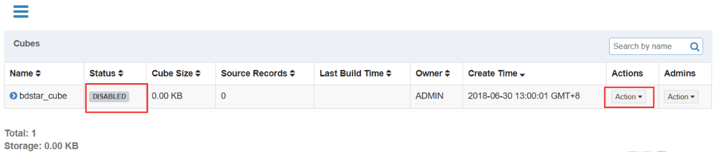
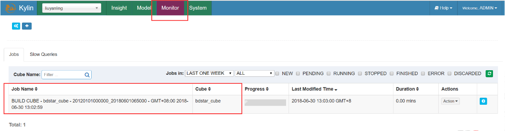
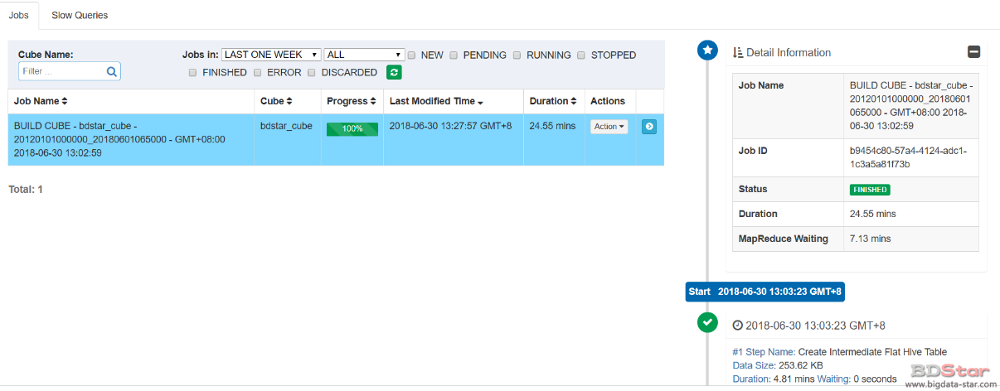
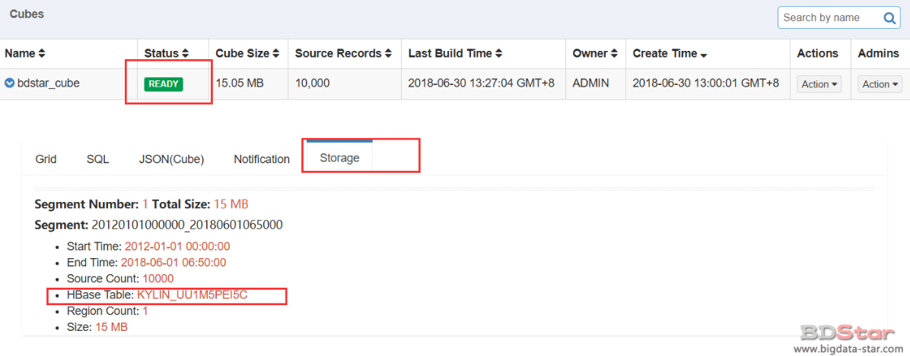
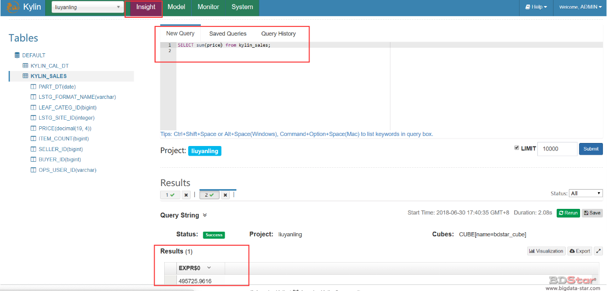

# Cube的构建

新创建的Cube只有定义，而没有计算的数据，它的状态是“DISABLED”，是不会被查询引擎挑中的。要想让Cube有数据，还需要对它进行构建。Cube的构建方式通常有两种：全量构建和增量构建；两者的构建步骤是完全一样的，区别只在于构建时读取的数据源是全集还是子集。

- 全量构建
  对数据模型中没有指定分割时间列信息的Cube，Kylin会采用全量构建，即每次从Hive中读取全部的数据来开始构建。通常它适用于以下两种情形。
  ·事实表的数据不是按时间增长的。
  ·事实表的数据比较小或更新频率很低，全量构建不会造成太大的开
  销。

- 增量构建
  增量构建的时候，Kylin每次都会从Hive中读取一个时间范围内的数据，然后进行计算，并以一个Segment的形式进行保存。下次再构建的时候，会自动以上次结束的时间为起点时间，再选择新的终止时间进行构建。经过多次构建，Cube中将会有多个Segment依次按时间顺序进行排列，如Seg-1，Seg-2，…，Seg-N。查询的时候，Kylin会查询一个或多个Segment然后再做聚合计算，以便返回正确的结果给请求者。
  使用增量构建的好处是，每次只需要对新增数据进行计算，从而避免了对历史数据进行重复计算。对于数据量很大的Cube，使用增量构建是非常有必要的。

**CUBE操作**
• BUILD – 构建：给定时间范围 将源数据通过运算而生成一个新的Cube Segment
• REFRESH – 刷新：对某个已经构建过的Cube Segment 重新从数据源抽取数据并创建 从而获得更新
• MERGE – 合并：多个CubeSegment合并为一个
• PURGE – 清空：清空所有CubeSegment
**JOB状态**
• NEW – 新任务
• PENDING – 等待被调度执行
• RUNNING – 正在运行的任务
• FINISHED – 正常完成的任务
• ERROR – 执行出错的任务
• DISCARDED – 丢弃的任务
**JOB操作**
• RESUME – 恢复 处于Error状态 用户通过排查解决了问题之后 可以重试执行
• DISCARD – 丢弃

### 步骤一：构建Cube

在 Models 页面中，点击 cube 栏右侧的 Action 下拉按钮并选择 Build 操作。选择后会出现一个弹出窗口，点击 Start Date 或者 End Date 输入框选择这个增量 cube 构建的起始日期。

### 步骤二：监控Cube的构建

Monitor页面会显示当前项目下近期的构建任务。

在 Monitor 页面，点击job详情按钮查看显示于右侧的详细信息。如果任务执行中的某一步出现报错，那么任务引擎会将任务状态置为“ERROR”并停止后续的执行，等待用户排错。在错误排除之后，用户可以单击“Resume”从上次失败的地方恢复执行。或者如果需要修改Cube或重新开始构建，那么用户需要单击“Discard”来丢弃此次构建。

### 步骤三：完成构建

成功之后cube 的状态就会变为 “Ready”, 意味着它已经准备好进行 SQL 查询。在 Model 页，找到 cube，然后点击 cube 名展开消息，在 “Storage” 标签下，列出 cube segments。每一个 segment 都有 start/end 时间；Hbase 表的信息也会列出。

# SQL查询

完成Cube构建之后，我们就可以通过sql在kylin中对其进行查询。

