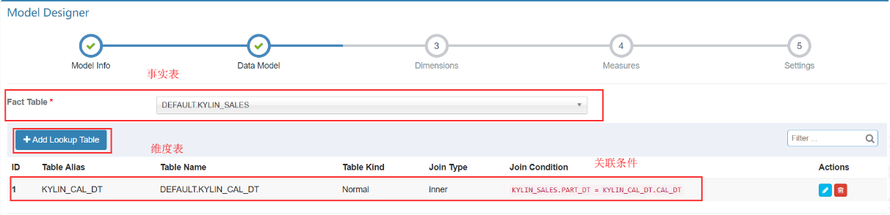
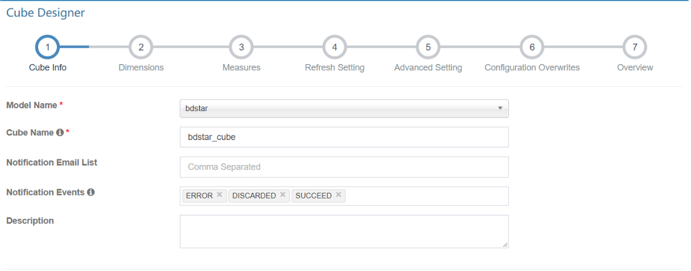

# Cube的创建和构建

## 数据源的准备

可以使用Apache Kylin自带的Sample Data。运行“${KYLIN_HOME}/bin/sample.sh”来导入Sample Data。可将Sample Data导入Hive数据库。

```shell
hive> show tables;
OK
emp_import
Time taken: 3.963 seconds, Fetched: 1 row(s)
hive> show tables;
OK
kylin_account
kylin_cal_dt
kylin_category_groupings
kylin_country
kylin_sales
```

`KYLIN_SALES是事实表`:保存了销售订单的明细信息。各列分别保存着卖家、商品分类、订单金额、商品数量等信息，每一行对应着一笔交易订单。
`KYLIN_CATEGORY_GROUPINGS是维表`:保存了商品分类的详细介绍，例如商品分类名称等。
`KYLIN_CAL_DT也是维表`:保存了时间的扩展信息。如单个日期所在的年始、月始、周始、年份、月份等。

## Kylin Cube的创建

### 步骤一：导入Hive表

单击Web界面的`Model`→`Data source`下的`Load Hive Table`图标，然后输入表的名称（可以一次导入多张表，以逗号分隔表名)


同时，Kylin会在后台触发一个MapReduce任务，计算此表每个列的基数。通常稍过几分钟之后再刷新页面，就会看到显示出来的基数信息。


需要注意的是，这里Kylin对基数的计算方法采用的是HyperLogLog的近似算法，与精确值略有误差，但作为参考值已经足够了。

### 步骤二：新建 Data Model

数据模型是Cube的基础。创建 cube 前，需定义一个数据模型。数据模型定义了一个星型（star schema）或雪花（snowflake schema）模型。一个模型可以被多个 cube 使用。

在Kylin界面的`Models`页面中，单击`New`→`New Model`，开始创建数据模型：
1、定义事实表


2、定义维度表




3、选择维度列和度量列
这里只是选择一个范围，不代表这些列将来一定要用作Cube的维度或度量，你可以把所有可能会用到的列都选进来，后续创建Cube的时候，将只能从这些列中进行选择。选择维度列时，维度可以来自事实表或维度表。选择度量列时，度量只能来自事实表


4、选择分区列和设定过滤器
如果想把一些记录忽略掉，那么这里可以设置一个过滤条件。比如我们直接排除掉金额小于等于0的记录。


有了数据模型以后，定义Cube的时候就可以直接从此模型定义的表和列中进行选择了，省去重复指定连接（join）条件的步骤。

### 步骤三：新建 CUBE

单击`New`，选择`New Cube`，开始创建CUBE:
1、设置CUBE的基本信息



2、设置维度


注意在LOOK UP Table中可以选择普通维度或者衍生维度,衍生维度上一讲中已经解释过。


3、设置度量
主要是设置度量的聚合类型，共有8种不同类型的度量：SUM、MAX、MIN、COUNT、COUNT_DISTINCT TOP_N, EXTENDED_COLUMN 和 PERCENTILE


4、设置Cube数据刷新。
这一步骤是为增量构建 cube 而设计的。在这里可以设置自动合并的阈值、数据保留的最短时间，以及第一个Segment的起点时间（如果Cube有分割时间列的话）

- Auto Merge Thresholds: 自动合并小的 segments 到中等甚至更大的 segment。如果不想自动合并，删除默认2个选项。
- Volatile Range: 默认为0，会自动合并所有可能的 cube segments，或者用 ‘Auto Merge’ 将不会合并最新的 [Volatile Range] 天的 cube segments。
- Retention Threshold: 只会保存 cube 过去几天的 segment，旧的 segment 将会自动从头部删除；0表示不启用这个功能。
- Partition Start Date: cube 的开始日期.


5、高级设置

**（1）设置聚合组**
Kylin默认会把所有维度都放在同一个聚合组中；如果维度数较多（例如>10），那么建议用户根据查询的习惯和模式，单击`New AggregationGroup+`，将维度分为多个聚合组。通过使用多个聚合组，可以大大降低Cube中的Cuboid数量。下面来举例说明，如果一个Cube有（M+N）个维度，那么默认它会有2^m+n^ 个Cuboid；如果把这些维度分为两个不相交的聚合组，那么Cuboid的数量将被减少为2^m^ +2^n^ 。
在每个聚合组内，使用 `Mandatory Dimensions`, `Hierarchy Dimensions”`和 `Joint Dimensions`来进一步优化维度组合。

- **Mandatory维度(必须维度)**
  指的是那些总是会出现在Where条件或Group By语句里的维度；通过将某个维度指定为Mandatory，Kylin就可以不用预计算那些不包含此维度的Cuboid，从而减少计算量。
- **Hierarchy维度(层级维度)**
  是一组有层级关系的维度，例如“国家”“省”“市”，这里的“国家”是高级别的维度，“省”“市”依次是低级别的维度。用户会按高级别维度进行查询，也会按低级别维度进行查询，但在查询低级别维度时，往往都会带上高级别维度的条件，而不会孤立地审视低级别维度的数据。例如，用户会单击“国家”作为维度来查询汇总数据，也可能单击“国家”＋“省”，或者“国家”＋“省”＋“市”来查询，但是不会跨越国家直接Group By“省”或“市”。通过指定Hierarchy，Kylin可以省略不满足此模式的Cuboid。
- **Joint(组合维度)**
  是将多个维度组合成一个维度，其通常适用于如下两种情形。1、总是会在一起查询的维度。2、基数很低的维度。

**（2）设置RowKey**
Kylin以Key-Value的方式将Cube存储到HBase中。HBase的key，也就是Rowkey，是由各维度的值拼接而成的；为了更高效地存储这些值，Kylin会对它们进行编码和压缩；每个维度均可以选择合适的编码（Encoding）方式，默认采用的是字典（Dictionary）编码技术；除了字典以外，还有整数（Int）和固定长度（Fixed Length）的编码。
`字典编码`是将此维度下的所有值构建成一个从string到int的映射表；
字典非常适合于非固定长度的string类型值的维度，而且用户无需指定编码后的长度；但是由于使用字典需要维护一张映射表，因此如果此维度的基数很高，那么字典的大小就非常可观，从而不适合于加载到内存中，在这种情况下就要选择其他的编码方式了。Kylin中字典编码允许的基数上限默认是500万（由参数`kylin.dictionary.max.cardinality`配置）。
`整数（int）编码`适合于对int或bigint类型的值进行编码，它无需额外存储，同时还可以支持很大的基数。用户需要根据值域选择编码的长度。例如有一个“手机号码”的维度，它是一个11位的数字，如13800138000，我们知道它大于2^31^ ，但是小于2^39-1^，那么使用int（5）即可满足要求，每个值占用5字节，比按字符存储（11字节）要少占用一半以上的空间。
各维度在Rowkeys中的顺序，对于查询的性能会产生较明显的影响。在这里用户可以根据查询的模式和习惯，**通过拖曳的方式调整各个维度在Rowkeys上的顺序**。通常的原则是，将过滤频率较高的列放置在过滤频率较低的列之前，将基数高的列放置在基数低的列之前。这样做的好处是，充分利用过滤条件来缩小在HBase中扫描的范围，从而提高查询的效率。

**（3）Mandatory Cuboids:** 维度组合白名单。确保你想要构建的 cuboid 能被构建。

**（4）Cube Engine: cube** 构建引擎。有两种：MapReduce 和 Spark。如果你的 cube 只有简单度量（SUM, MIN, MAX)，建议使用 Spark。如果 cube 中有复杂类型度量（COUNT DISTINCT, TOP_N），建议使用 MapReduce。

**（5）Advanced Dictionaries:** 

`Global Dictionary`是用于精确计算 COUNT DISTINCT 的字典, 它会将一个非 integer的值转成 integer，以便于 bitmap 进行去重。如果你要计算 COUNT DISTINCT 的列本身已经是 integer 类型，那么不需要定义 Global Dictionary。 Global Dictionary 会被所有 segment 共享，因此支持在跨 segments 之间做上卷去重操作。请注意，Global Dictionary 随着数据的加载，可能会不断变大。
`Segment Dictionary`是另一个用于精确计算 COUNT DISTINCT 的字典，与 Global Dictionary 不同的是，它是基于一个 segment 的值构建的，因此不支持跨 segments 的汇总计算。如果你的 cube 不是分区的或者能保证你的所有 SQL 按照 partition_column 进行 group by, 那么你应该使用 “Segment Dictionary” 而不是 “Global Dictionary”，这样可以避免单个字典过大的问题。

> 请注意：”Global Dictionary” 和 “Segment Dictionary” 都是单向编码的字典，仅用于 COUNT DISTINCT 计算(将非 integer 类型转成 integer 用于 bitmap计算)，他们不支持解码，因此不能为普通维度编码。

**（6）Advanced ColumnFamily:** 如果有超过一个的COUNT DISTINCT 或 TopN 度量, 你可以将它们放在更多列簇中，以优化与HBase 的I/O。

6、重写配置
Kylin 允许在 Cube 级别覆盖部分 kylin.properties 中的配置，你可以在这里定义覆盖的属性。如果你没有要配置的，点击 Next 按钮。

