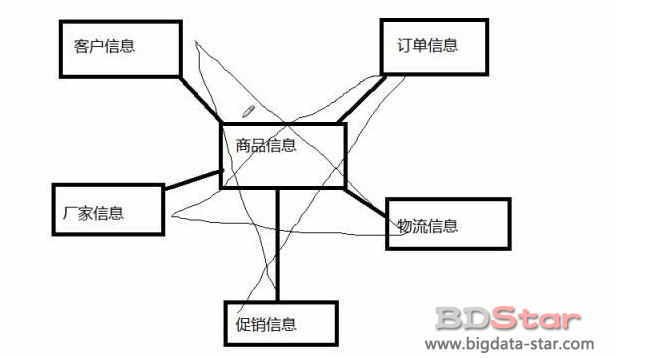
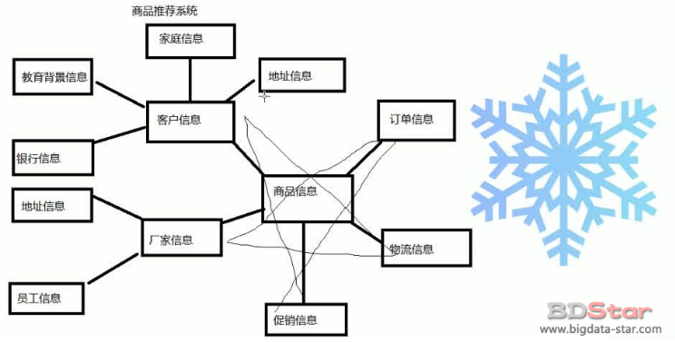
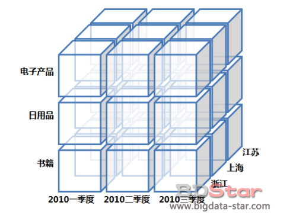
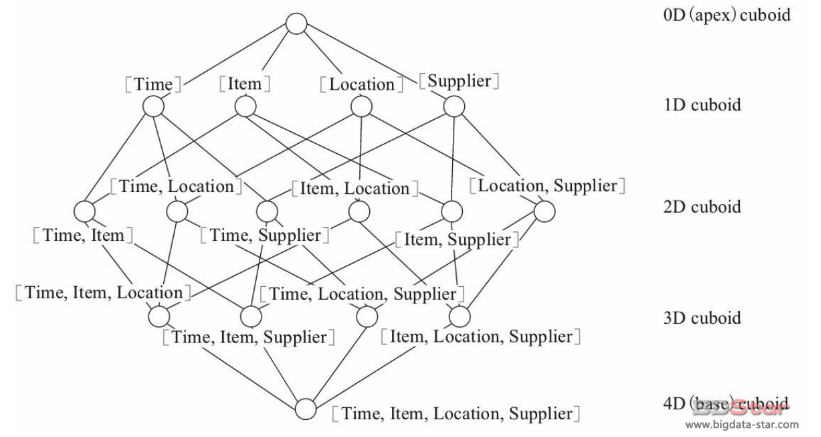
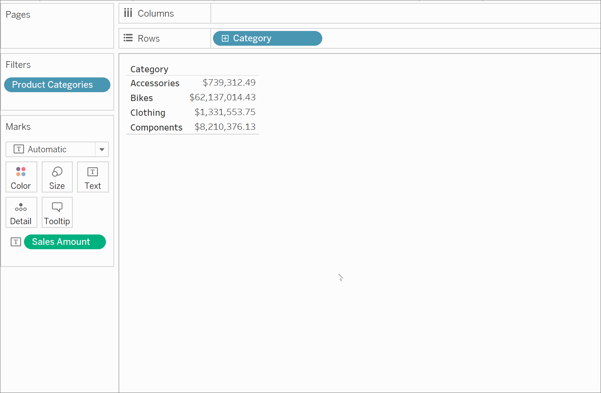
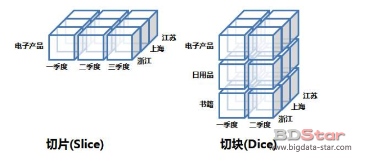

# OLAP必备基础知识

## BI分析基础术语解读

- `维度：`维度可以简单理解为是观察数据的角度，是考虑问题时的一类属性。一般是一组离散的值。比如从区域这个角度（维度），去观察总销售额（度量），或者从性别这个角度（维度），去观察总销售额（度量）。

- `度量：`度量就是被聚合的统计值，也是聚合运算的结果，一般是连续的值。比如学生成绩，销售额等。

- `维度的基数（Cardinality）:`指的是该维度在数据集中出现的不同值的个数；例如“国家”是一个维度，如果有200个不同的值，那么此维度的基数就是200。通常一个维度的基数会从几十到几万个不等，个别维度如“用户ID”的基数会超过百万甚至千万。基数超过一百万的维度通常被称为超高基数维度（Ultra High Cardinality，UHC），需要引起设计者的注意。
  Cube中所有维度的基数都可以体现出Cube的复杂度，如果一个Cube中有好几个超高基数维度，那么这个Cube膨胀的概率就会很高。在创建Cube前需要对所有维度的基数做一个了解，这样就可以帮助设计合理的Cube。计算基数有多种途径，最简单的方法就是让Hive执行一个countdistinct的SQL查询；Kylin也提供了计算基数的方法，Kylin对基数的计算方法采用的是HyperLogLog的近似算法，与精确值略有误差，但作为参考值已经足够了。

- `事实表：`每个数据仓库都包含一个或者多个事实数据表。事实表是用来记录具体事件的。包含了每个事件的具体要素以及具体发生的事情，如系统日志、销售记录等；事实表的记录在不断地动态增长，所以它的体积通常远大于其他表

- `维度表：`事实表中事件的要素的描述信息。可以看成是用户分析数据的窗口。有时也称查找表，是与事实表相对应的一种表；它保存了维度的属性值，可以跟事实表做关联；相当于将事实表上经常重复出现的属性抽取、规范出来用一张表进行管理。常见的维度表有：日期表（存储与日期对应的周、月、季度等的属性）、地点表（包含国家、省／州、城市等属性）等。使用维度表有诸多好处，具体如下。
  1.缩小了事实表的大小。
  2.便于维度的管理和维护，增加、删除和修改维度的属性，不必对事实表的大量记录进行改动。
  3.维度表可以为多个事实表重用，以减少重复工作。
  总的说来，事实表的设计是以能够正确记录历史信息为准则，维度表的设计是以能够以合适的角度来聚合主题内容为准则。
  举例：事实表的一条数据可能是时间，地点，人物和事件等，也就是记录了事件整个信息，而时间，地点等只是用关键标识号来表示，比如一串数字、字母等。而这些关键标记的具体含义，可以从维度表中获取。

  如果还是不理解可以参考[数据仓库--事实表和维度表](https://blog.csdn.net/davidwang9527/article/details/25553117)

- `星型模型：`星形模型中有一张事实表，以及零个或多个维度表；事实表与维度表通过主键外键相关联，维度表之间没有关联，就像很多星星围绕在一个恒星周围，故取名为星形模型。

- `雪花模型：`如果将星形模型中某些维度的表再做规范，抽取成更细的维度表，然后让维度表之间也进行关联，那么这种模型称为雪花模型。

## Cube相关概念

- `Data Model：`数据模型，定义了由若干张表的一个连接关系。创建 cube 前，需定义一个数据模型。数据模型定义了一个星型（star schema）或雪花（snowflake schema）模型。一个模型可以被多个 cube 使用。

- `Cube：`数据立方体，是一种多维分析的技术，通过预计算，将计算结果存储在某多个维度值所映射的空间中，在运行时通过对Cube的预处理而快速获取结果。

​	可以简单理解为是将数据存放在一个n维数组中，让用户从多个角度（维度）探索和分析数据集。

- Cuboid: Kylin中将维度任意组合成为一个Cuboid。

举例：假定有一个电商的销售数据集，其中维度包括时间（Time）、商品（Item）、地点（Location）和供应商（Supplier），度量为销售额（GMV）。那么所有维度的组合就有24 =16种（如图所示为一个四维cube的例子）。

`一维度（1D）的组合`有[Time]、[Item]、[Location]、[Supplier]4种。

`二维度（2D）的组合`有[Time，Item]、[Time，Location]、[Time、Supplier]、[Item，Location]、[Item，Supplier]、[Location，Supplier]6种。

`三维度（3D）的组合`也有4种；最后零维度（0D）。

`四维度（4D）的组合`各有1种，总共就有16种组合。

计算Cuboid，即按维度来聚合销售额。如果用SQL语句来表达计算Cuboid[Time，Loca-tion]，那么SQL语句如下：

`select time,location,sum(gmv) as gmv from sales group by time,location`
将计算的结果保存为[物化视图](https://baike.baidu.com/item/%E7%89%A9%E5%8C%96%E8%A7%86%E5%9B%BE)，所有Cuboid物化视图的总称就是Cube。

- `Partition` :分区 用户可以选择一个日期和时间列用于将数据分区，随后对Cube的构建按日期划分，分成多个Segment
- `Cube Segment `:每个CubeSegment是对特定时间范围的数据计算而成的Cube
- `Aggregation Group` :聚合组，维度的子集。将多个维度分组，降低Cube组合数。
- `Mandatory维度`：必须的维度，所有查询都会包含此维度，不包含此维度的组合Cube构建时都会被剪枝。这种维度意味着每次查询的group by中都会携带的。
- `Hierarchy维度`：层级维度，这种维度是最常见的，我们对于多维数据的操作经常会有上卷下钻之类的操作，这也就需要要求维度之间有层级关系，例如国家、省、城市，年、季度、月等。如果ABC满足层级关系且A>B>C，那么只需要计算组合A,AB,ABC。其他组合如B,C,BC,AC将不做预计算。
- `derived维度`：衍生维度。如果某张表上有多个维度，该维度表对应的一个或者多个列可以和维度表的主键一一对应，那么可以设置为衍生维度。在Kylin内部会将其统一用维度表的主键来替换，以此达到降低维度组合的数目。既然某些列可以从它的主键衍生而来，那么仅将主键加入到Cube的预计算来，在运行时通过使用维度表的快照，衍生出非主键的值，从而起到降维的效果。

## Cube常见操作

### 钻取

CUBE是多维的，有多个维度，每个维度可以看成一个树枝，上面有下一级别的枝桠，那么钻取，你可以理解为从一个树枝到他下面的树枝上去，可以层层钻取，往下即为下钻（drill down），往上可称上钻或上卷（roll up）。
例如，如果您在检查手机产品的销售总额，则可以下钻查看具体子类的销售额，比如苹果，华为分别卖了多少钱。或者，如果您在检查了所有子类销售总额后，还可以上钻查看父类的销售总额。

### 旋转(pivot)

旋转就是指改变报表或页面的展示方向。是维度的切换，换个角度看问题，譬如我将我看的一个交叉表（crosstable）几个维度换来换去来查看数据集，换个角度能够得到不同的信息的。对于使用者来说，就是个视图操作，而从SQL模拟语句的角度来说，就是改变SELECT后面字段的顺序而已。

### 切片(slice)

是在一部分维上选定值后，关心度量数据在剩余维上的分布。如果剩余的维只有两个，则是切片；如果有三个或以上，则是切块。
`切片：`选择维中特定的值进行分析，比如只选择电子产品进行分析
`切块：`选择维中特定的区间或者某批特定值进行分析，比如选择电子产品和日用品进行分析

维度一般有很多，但是查看数据的时候，通常是不会所有维度都用到的。譬如，时间、地区、商品、销售部门，这几个维度，我们做报表分析时，可能只选了时间、地区，那此时，商品和部门维度会自动为默认成员（通常为ALL，或你自设的DEFAULT），

如果我们选取部门维度这个树枝上的某一个节点，即维度成员，如销售一部，商品选一品类，如食品，就看销售一部的食品类的各时间、地区数据了，只有2个维度了，可以想象为一个平面了，这就是切片。
如果我只做一个维度选择，只选时间，查看某个时间，部门、商品、地区的销售，那这就是3个维度了，3维的，切出来的自然就是块了。

最后说一句，理解这一切的源头，是需要理解维度、度量、立方体，最终脑海里能出现一个立方体，转来转去，切来切去，就OK了。

本文转载自：http://bigdata-star.com/archives/1972

