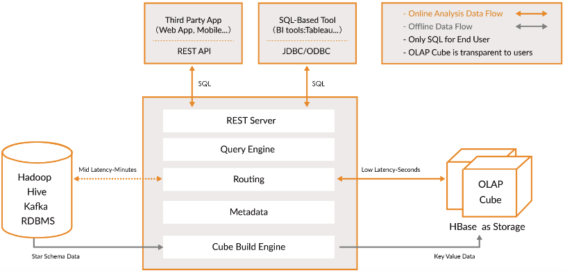
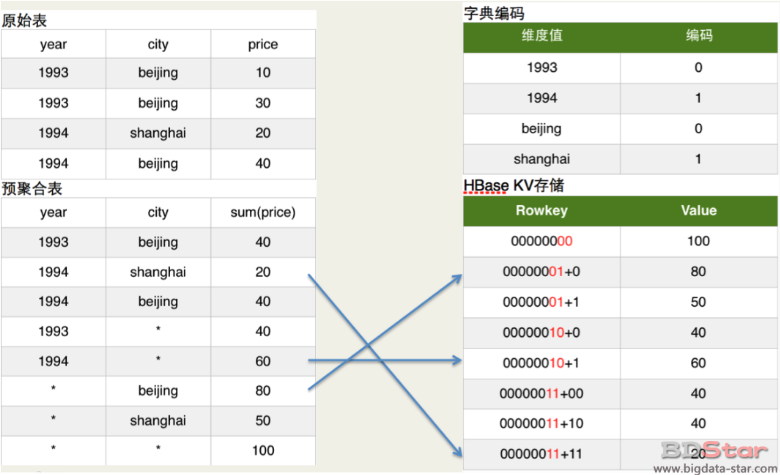
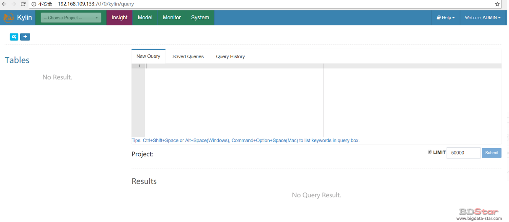

# Kylin概述、优势、架构及安装

## Kylin概述

Apache Kylin™是一个开源的**分布式分析**引擎，为基于Hadoop的数据仓库，商务智能而生。提供**Hadoop/Spark之上的SQL查询接口及多维分析（OLAP）**能力以支持超大规模数据。它能在**亚秒内查询巨大的Hive表**。

以下是Kylin官网的对Kylin的介绍：

- **加速查询亚秒级响应**

  Kylin是为减少在Hadoop/Spark上百亿规模数据查询延迟而设计；Apache Kylin 以**预计算聚合数据和存储**为关键技术，加速 ANSI SQL 分析，并在 Hadoop 上提供了大数据的交互体验。

- **支持标准SQL接口**

  Kylin使用的查询模型是数据源中的关系模型表，一般而言，也就是指Hive表。终端用户只需要像原来查询Hive表一样编写SQL，就可以无缝地切换到Kylin，几乎不需要额外的学习，甚至原本的Hive查询也因为与SQL同源，大多都无须修改就能直接在Kylin上运行

- **交互式查询能力**

  通过Kylin，用户可以与Hadoop数据进行亚秒级交互，在同样的数据集上提供比Hive更好的性能

- **可伸缩性和高吞吐率**

  在保持高速响应的同时，Kylin有着良好的可伸缩性和很高的吞吐率。随着服务器的增加，吞吐率也呈线性增加。

- **无缝集成大部分BI产品**

  Kylin提供与BI工具的整合能力，如Tableau，PowerBI/Excel，MSTR，QlikSense，Hue和SuperSet


## Kylin架构

如果想要知道Kylin是如何实现超大数据集的秒级多维分析查询，那么就得了解Kylin的架构原理。
Kylin实现秒级查询的关键点是预计算，对于超大数据集的复杂查询，既然现场计算需要花费较长时间，那么根据空间换时间的原理，我们就可以提前将所有可能的计算结果计算并存储下来，把高复杂度的聚合运算、多表连接等操作转换成对预计算结果的查询，比如把本该进行的Join、Sum、CountDistinct等操作改写成Cube的查询操作。从而实现超大数据集的秒级多维分析查询。那么Kylin的预计算是如何实现的？下图是Kylin官网提供的架构图



由以下组件组成：

- **REST API Server**

  REST Server是一套面向应用程序开发的入口点，旨在实现针对Kylin平台的应用开发工作。 此类应用程序可以提供查询、获取结果、触发cube构建任务、获取元数据以及获取用户权限等等。 另外可以通过Restful接口实现SQL查询。

- **查询引擎（Query Engine）**

  当cube准备就绪后，查询引擎就能够获取并解析用户查询。它随后会与系统中的其它组件进行交互，从而向用户返回对应的结果。
  在Kylin当中，我们使用一套名为Apache Calcite的开源动态数据管理框架对代码内的SQL以及其它插入内容进行解析。（Calcite最初被命名为Optiq，由Julian Hyde所编写，但如今已经成为Apache孵化器项目之一。）

- **Routing**

  负责将解析的SQL生成的执行计划转换成cube缓存的查询，cube是通过预计算缓存在hbase中，这部分查询可以在秒级设置毫秒级完成，而且还有一些操作使用过的查询原始数据（存储在Hadoop的hdfs中通过hive查询）。这部分查询延迟较高。

- **元数据管理工具（Metadata Manager）**

  Kylin是一款元数据驱动型应用程序。元数据管理工具是一大关键性组件，用于对保存在Kylin当中的所有元数据进行管理，其中包括最为重要的cube元数据。其它全部组件的正常运作都需以元数据管理工具为基础。 Kylin的元数据存储在hbase中。

- **任务引擎（Cube Build Engine）**

  这套引擎的设计目的在于处理所有离线任务，其中包括shell脚本、Java API以及Map Reduce任务等等。任务引擎对Kylin当中的全部任务加以管理与协调，从而确保每一项任务都能得到切实执行并解决其间出现的故障。

- **存储引擎（Storage Engine）**

  这套引擎负责管理底层存储——特别是cuboid，其以键-值对的形式进行保存。存储引擎使用的是HBase——这是目前Hadoop生态系统当中最理想的键-值系统使用方案。Kylin还能够通过扩展实现对其它键-值系统的支持，例如Redis。
  

预计算大概流程就是：将数据源中的数据按照指定的维度和指标，由计算引擎MapReduce离线计算出所有可能的查询结果(即Cube)存储到HBase中。HBase中每行记录的Rowkey由维度组成，度量会保存在 column family中。为了减小存储代价，这里会对维度和度量进行编码。查询阶段，利用HBase列存储的特性就可以保证Kylin有良好的快速响应和高并发。



 需要注意的是：Kylin的三大依赖模块分别是数据源、构建引擎和存储引擎。默认这三者分别是Hive、MapReduce和HBase。但随着推广和使用的深入，渐渐有用户发现它们均存在不足之处。比如，实时分析可能会希望从Kafka导入数据而不是从Hive；而Spark的迅速崛起，又使我们不得不考虑将MapReduce替换为Spark，以期大幅提高Cube的构建速度；至于HBase，它的读性能可能还不如Cassandra或Kudu等。因此Kylin1.5版本的系统架构进行了重构，将数据源、构建引擎、存储引擎三大依赖抽象为接口，而Hive、MapReduce、HBase只是默认实现。深度用户可以根据自己的需要做二次开发，将其中的一个或多个替换为更适合的技术。

## 安装Kylin

Kylin的安裝分为三种方式：单节点部署、集群部署、读写分离部署。

### 单节点部署

- 上传软件包并解压

  ```shell
  tar -zxvf apache-kylin-2.3.1-cdh57-bin.tar.gz
  ```

- 配置环境变量

  在`/etc/profile`中添加Kylin的环境变量

  ```shell
  export KYLIN_HOME=/usr/local/apache-kylin-2.3.1-bin
  export PATH=$JAVA_HOME/bin:$KYLIN_HOME/bin:$ZOOKEEPER_HOME/bin:$HADOOP_HOME/bin:$HBASE_HOME/bin:$HIVE_HOME/bin:$PATH
  ```

  执行`source /etc/profile`刷新环境变量

- 检查环境可用性

  执行`sh ${KYLIN_HOME}/bin/check-env.sh`检查kylin所需的环境是否准备完毕，如果有问题，会给出对应的提示

  > 注意:启动Kylin的时候先把Hadoop、HBase等Kylin相关的服务启动 不然会报错

- 启动Kylin

  执行`sh ${KYLIN_HOME}/bin/kylin.sh start`启动kylin

- 成功启动后，登录WEB UI

  访问：http://ip:7070/kylin
  默认用户名密码：ADMIN/KYLIN



### 集群模式部署

1.每一个 Kylin 实例在 `conf/kylin.properties` 中都有一个 “kylin.server.mode” entry，指定了运行时的模式，有 3 个选项:

`job : `在实例中运行 job engine; Kylin job engine 管理集群 的 jobs;

`query : `只运行 query engine; Kylin query engine 接收和回应你的 SQL 查询;

`all : `在实例中既运行 job engine 也运行 query engines。

2.请确保您为每一个实例在 `conf/kylin.properties` 中正确的配置了以下属性:

`kylin.rest.servers=host1:7070,host2:7070` :使用中的服务器列表, 当事件变化时，让一个实例去通知其他服务器

`kylin.server.mode=all` :只有一个实例为 “all” 或 “job”, 其余的应该为 “query”

另外，其运行时状态存于存储在 HBase (由 `conf/kylin.properties` 中的 `kylin.metadata.url` 指定) 中的 metadata 中。出于负载均衡的考虑，建议运行多个共享一个 metadata 存储的 Kylin 实例，因此他们在表结构中共享同一个状态，job 状态, Cube 状态等等。

本文转载自：http://bigdata-star.com/archives/1093