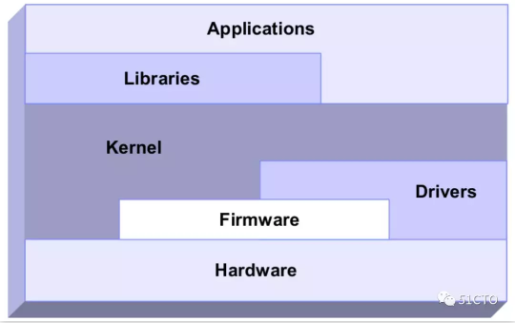

## 为什么性能调优？ 

说到底就俩原因：一是获得更好的系统性能；二是满足不断增加的业务需求。

通过性能调优，可以用更少的硬件资源，支撑更大量的业务发展，从而达到节省硬件投资的目的。

同时，可以在资源有限，不能扩容的情况下，提升系统的响应能力，从而为用户带来更好的使用体验。

## 性能调优三大系统

我们重点说一下在进行性能优化时，硬件、操作系统、应用程序这三大系统，需要关注的一些细节和具体的优化思路。

1.硬件优化。主要是对硬件选型，例如CPU、内存、磁盘、网卡等。

2.操作系统优化。主要包含了操作系统的系统参数、内核参数、进程参数、文件系统、磁盘IO等。

3.应用程序优化。主要包含对应用软件，例如：apache、nginx、redis、Mysql、keepalived、kafka等。

下面展开介绍这三大系统优化。

### 1.硬件优化 

在上线一个业务系统之前，首先需要进硬件采购。硬件采购的标准是业务系统的运行特点和对资源的占用情况。

举例一：如果我们要上线一套redis集群。

redis是内存数据库，特点是占用内存会非常大。采购的时候要重点考虑的硬件资源就是内存，第一内存要大，第二内存资源要可扩展。

redis对磁盘读、写并不会很频繁，同时，占用的磁盘空间也不会太大。对磁盘的采购，可以不需要太大的磁盘空间，普通的SAS磁盘即可。

举例二：如果我们要上线的是一套数据库系统？

数据库系统的特点是比较耗费CPU，也比较耗费内存，对数据安全性要求很高。

无论你使用的是MySQL、SQLServer还是Oralce，都需要配置足够快的CPU，足够大的内存，足够稳定可靠的硬盘，同时硬盘需要做RAID，RAID10最好。

### 2.操作系统优化

操作系统介于硬件和应用之间，起到一个承上启下的作用。

相关的系统参数设置关系到内存、IO的调用机制、文件系统的使用效率、进程调度的优先级。

我会在专栏《Linux性能调优攻略》重点介绍基于Linux操作系统的性能优化，具体的优化包含如下几个方面：

操作系统安装优化
进程管理调优
内存资源调优
IO调度调优
文件系统调优
网络传输调优

下图展示了Linux的内部结构以及与硬件的协助机制，非常重要。

最底层，是硬件设备(Hardware)；往上是固化到硬件中的程序(Firmware)；接着是设备驱动程序(driver)，是一种特定形式的软件程序，实现与硬件设备的交互。

操作系统层面的组成部分，首先是系统内核(kernel)，在内核基础之上是系统库、共享库等系统运行必须的库文件(Libraries)。

最上层是系统中运行的应用程序(Applications)，就是我们在系统中安装的各种应用软件，例如MySQL、Samba、FTP等。

由此可知，操作系统优化是一个从底层硬件到上层软件应用，逐级优化的过程。

### 3.应用程序优化 

最直观的表现是从日志中发现异常，然后根据日志中的异样进行综合判断得出优化结论。

最容易忽略的是代码优化，有些性能问题完全是代码不合理。比如，for循环次数过多、作了很多无谓的条件判断、相同逻辑重复多次等。

在排除代码层面的问题后，就需要考虑架构层面、参数配置层面等方面的问题。

架构层面的调优包括读写分离、多从库负载均衡、水平和垂直分库分表，还需要的调优手段有连接池调优、数据库参数调优等。

最后，通过一个对MySQL数据库进行调优，简单总结一下需要关注的方面有哪些，

MySQL安装编译优化
MySQL配置文件优化
MySQL存储引擎优化
优化表类型（MyISAM或InnoDB）
查询缓存优化
SQL语句优化
锁机制优化
MySQL服务器优化（操作系统参数、存储盘换SSD等）