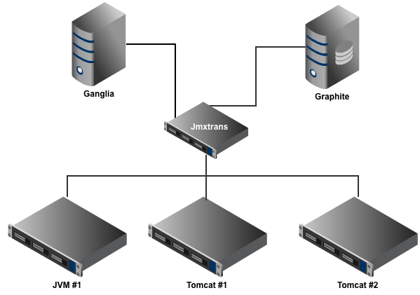
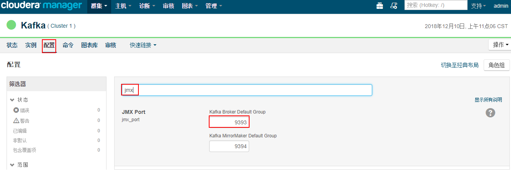
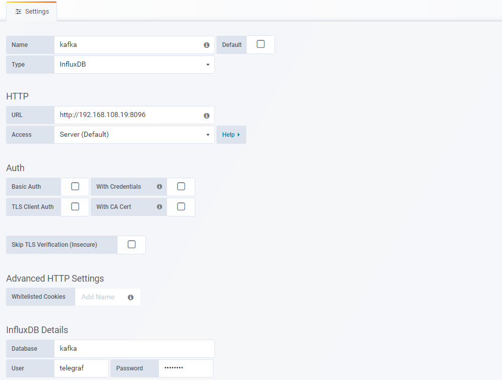
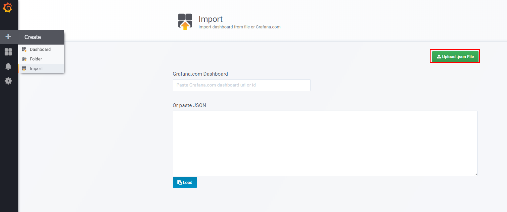

# Jmxtrans 是简介
<p align="datasource">
  
</p>
jmxtrans是一个工具，它允许您连接到任意数量的Java虚拟机(jvm)并查询它们的属性，而无需编写任何一行Java代码。属性通过Java管理扩展(JMX)从JVM导出。大多数Java应用程序都通过这个协议提供了它们的统计信息，并且可以将其添加到任何代码基中，而不需要做很多工作。如果您对代码使用SpringFramework，那么只需向Java类文件中添加一些注释即可。
[官方网站](https://github.com/jmxtrans/jmxtrans/wiki)

## 程序包下载
```
# wget http://central.maven.org/maven2/org/jmxtrans/jmxtrans/270/jmxtrans-270-all.jar
# wget -q https://raw.githubusercontent.com/jmxtrans/jmxtrans/master/jmxtrans/jmxtrans.sh
# chmod +x jmxtrans.sh
```
[最新版本](http://central.maven.org/maven2/org/jmxtrans/jmxtrans/)
| 安装包太大需要自己下载

## Kafka的启动参数
```
-Dcom.sun.management.jmxremote.port=44444 -Dcom.sun.management.jmxremote.ssl=false -Dcom.sun.management.jmxremote.authenticate=false
```
如果监控的集群是CDH集成的Kafka，那么只需要到CM上查找Kafka的端口即可。
查找步骤为：【CM主页】-->【Kafka】-->【配置】-->【搜索：jmx】
如下图所示：
<p align="datasource">
  
</p>
默认情况下，Kafka的JMX的端口是9393

## 修改启动脚本
```
[root@hadoop2 wugoto]# cat start.sh
#!/bin/bash
CURR_DIR=`pwd`
JMXTRANS_OPTS="-Dport1=9393 -Durl1=localhost -DinfluxUrl=http://192.168.108.19:8096/ -DinfluxDb=kafka -DinfluxUser=telegraf -DinfluxPwd=telegraf"  SECONDS_BETWEEN_RUNS=15 JAR_FILE=${CURR_DIR}/jmxtrans-270-all.jar ${CURR_DIR}/jmxtrans.sh start ${CURR_DIR}/kafka.json &

```
`-Dport1：kafkaJMX的端口`

`-Durl1：监控的kafka服务所在的主机`

`-DinfluxUrl：influxdb服务的url和端口`

`-DinfluxDb：JMX数据插入influxdb的数据库`

`-DinfluxUser：influxdb的访问用户名`

`-DinfluxPwd：influxdb的访问密码`

执行`start.sh`脚本即可将`kafka.json`中定义的属性load到指定的influxdb中

> 注意：
> 1.jmxtrans.sh、jmxtrans-270-all.jar、kafka.json、start.sh需要在同一个目录下
> 2.这里忽略了influxdb和grafana的安装，influxdb和grafana需要提前安装好
> [influxdb安装](https://docs.influxdata.com/influxdb/v1.7/introduction/installation/)
> [grafana安装](http://docs.grafana.org/installation/)

## 导入grafana图表文件
- 新建数据库连接
<p align="datasource">
  
</p>

- 导入dashborad 
| 各个grafana的版本按钮位置不一样,`grafana 5.2.2`版本如下图所示
将`Apache-Kafka-Broker-Metrics.json`导入grafana中
<p align="datasource">
  
</p>

[参考文档](https://softwaremill.com/monitoring-apache-kafka-with-influxdb-grafana/)


