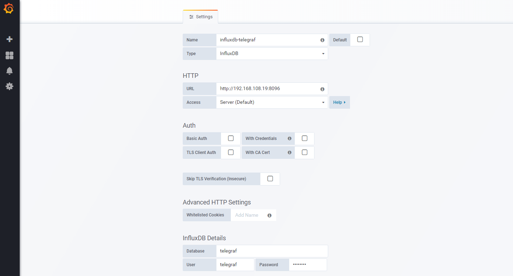

# Telegraf 插件集成

[official website](https://docs.influxdata.com/telegraf/v1.9/) 

**实例版本**

- PostgreSQL:`9.6.0`
- Telegraf:`1.9.0`
- Influxdb:`1.7.0`
- Grafana:`5.2.2`

**监控插件**

[自定义标准输出数据监控](exec/README.md)

[主机性能指标数据监控](hardware/README.md)

[英伟达GPU指标数据监控](nvidia-smi/README.md)

[PostgresSQL指标数据监控](postgres/README.md)

[MySQL指标数据监控](mysql/README.md)

**配置telegraf输出配置**

编辑`/etc/telegraf/telegraf.conf`

```
[[outputs.influxdb]]
  ## The full HTTP or UDP URL for your InfluxDB instance.
  urls = ["http://10.0.0.12:8096"]

  ## The target database for metrics; will be created as needed.
  database = "telegraf"

  ## Timeout for HTTP messages.
  timeout = "5s"

  ## HTTP Basic Auth
  username = "telegraf"
  password = "telegraf"

```
**设置数据源**

登录grafana，然后作为管理用户登录。从菜单中选择Data Sources。然后，单击顶部栏上的Add new。

填写influxdb数据源的配置细节:

<p align="datasource">
  
</p>
如果本文对您有所帮助，请给个`start`，您的支持是我创作的最大动力，谢谢！