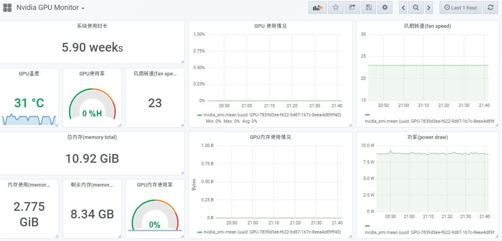

# Nvidia GPU 监控
Telegraf 集成Influxdb 和Grafana 监控 Nvidia GPU

## Telegraf 配置
```
# Read metrics about system load & uptime
[[inputs.system]]
  # no configuration
 
#statistics from nvidia GPUs attached to the host
[[inputs.net]]
#   ## By default, telegraf gathers stats from any up interface (excluding loopback)
#   ## Setting interfaces will tell it to gather these explicit interfaces,
#   ## regardless of status.
#   ##
#   # interfaces = ["eth0"]
#   ##
#   ## On linux systems telegraf also collects protocol stats.
#   ## Setting ignore_protocol_stats to true will skip reporting of protocol metrics.
#   ##
#    #ignore_protocol_stats = false
#   ##

[[inputs.nvidia_smi]]
#   ## Optional: path to nvidia-smi binary, defaults to $PATH via exec.LookPath
    bin_path = "/usr/bin/nvidia-smi"
#
#   ## Optional: timeout for GPU polling
    timeout = "5s"

```

## 导入 Dashborad 

将`Nvidia-GPU-Monitor.json` 导入grafana，并与配置好的数据源连接即可。

效果图
<p align="datasource">
  
</p>
如果本文对您有所帮助，请给个`start`，您的支持是我创作的最大动力，谢谢！

参考：

