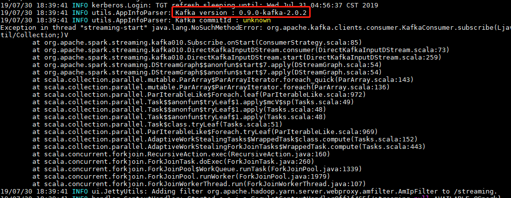
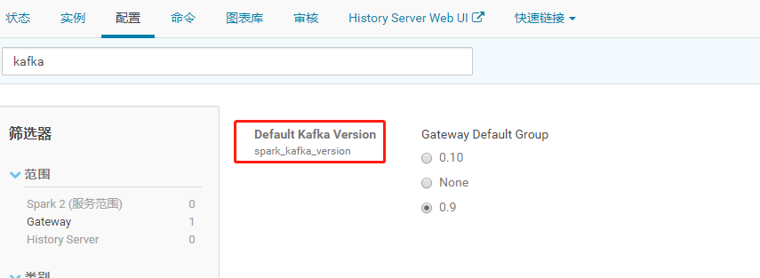

# Spark 异常排查 

**Exception in thread "streaming-start" java.lang.NoSuchMethodError**

异常信息：

```shell
Exception in thread "streaming-start" java.lang.NoSuchMethodError: org.apache.kafka.clients.consumer.KafkaConsumer.subscribe(Ljava/util/Collection;)V
```



异常分析：

从上图红框中可以看出，这个程序使用的kafka0.9.0的版本，这是为什么呢？因为CDH的Gateway默认的版本是0.9造成的



解决方案：

因为我集群的kafka为0.10版本的，即修改成0.10就可以了

