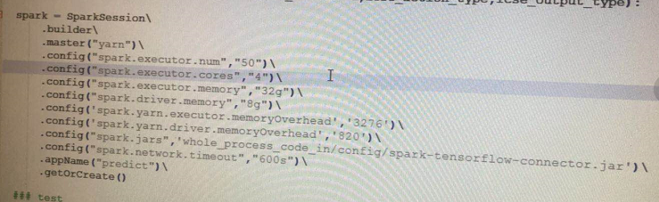

# 异常描述

使用CDSW（Cloudera Data Science Workbench）界面/API提交的相同的代码的Spark作业有时运行成功，有时运行失败。


# 场景说明

现业务部门需要通过使用PySpark从Hive数据仓库中将数据加载出来然后使用数据挖掘模型计算，数据挖掘模型并没有调用SparkMLlib


# 业务流程


# 异常分析

1.异常日志1

```shell
19/06/25 19:40:30 ERROR server.TransportRequestHandler: Error sending result RpcResponse{requestId=7377437291650096177, body=NioManagedBuffer{buf=java.nio.HeapByteBuffer[pos=0 lim=81 cap=156]}} to /localhost:57738; closing connection
```

分析：


2.异常日志2

```shell
19/06/25 19:41:10 ERROR client.TransportClient: Failed to send RPC 8228252825027374361 to /localhost:58402: java.nio.channels.ClosedChannelException
```

分析：

有可能是因为executor被kill掉或者通信超时导致IO被关掉导致的异常


3.异常日志3

```shell
19/06/25 19:44:34 ERROR cluster.YarnScheduler: Lost executor 46 on a-dsj-cdh17.bigdata.cgbchina.com.cn: Container marked as failed: container_e18_1545406256114_110501_01_000051 on host: a-dsj-cdh17.bigdata.xxx.com.cn. Exit status: 56. Diagnostics: Exception from container-launch.
```

分析：

