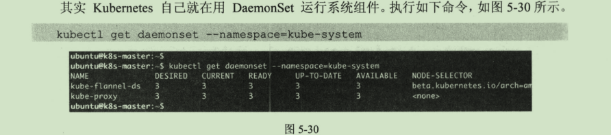

## DaemonSet 

DaemonSet确保集群中每个（部分）node运行一份pod副本，当node加入集群时创建pod，当node离开集群时回收pod。如果删除DaemonSet，其创建的所有pod也被删除，DaemonSet中的pod覆盖整个集群。

当需要在集群内每个node运行同一个pod，使用DaemonSet是有价值的，以下是典型使用场景：

运行集群存储守护进程，如glusterd、ceph。
运行集群日志收集守护进程，如fluentd、logstash。

运行节点监控守护进程，如Prometheus Node Exporter, collectd, Datadog agent, New Relic agent, or Ganglia gmond

可以使用` kubectl get daemonset --namespace=kube-system`命令查看当前集群的daemonset的情况

