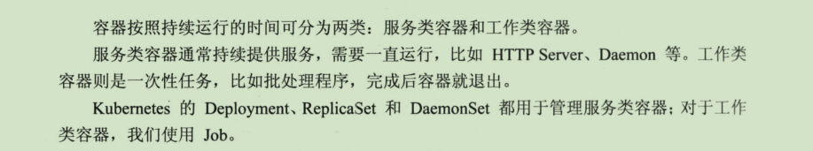
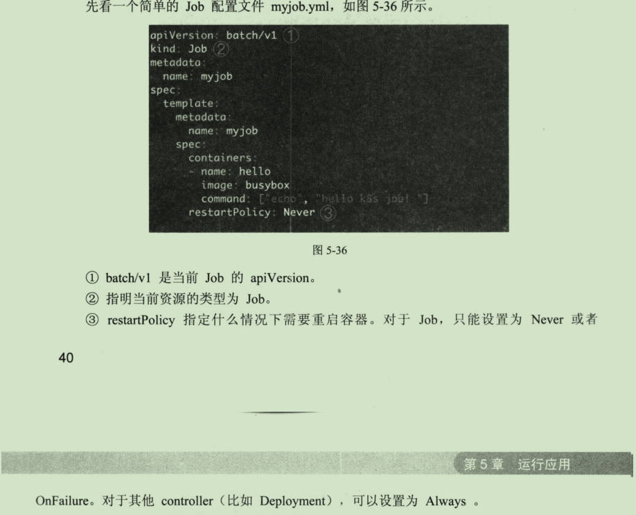
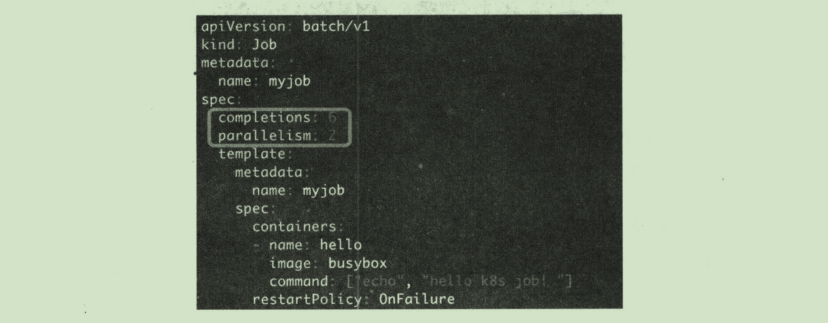
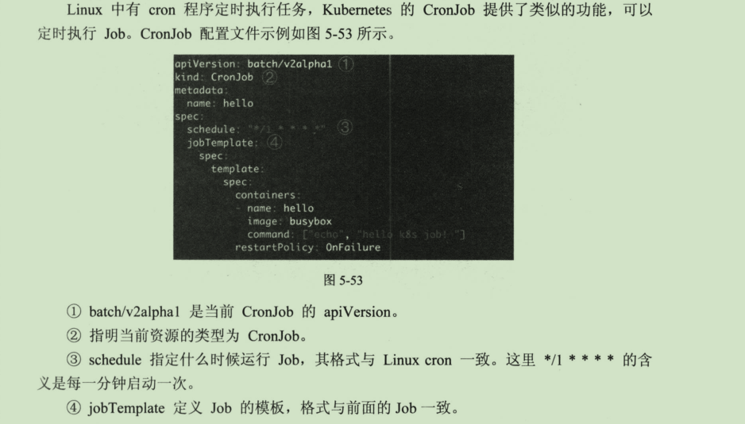
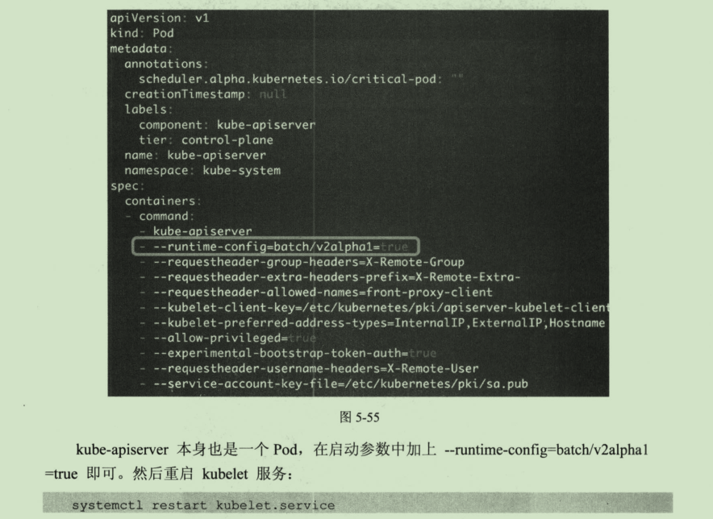

## Job

关于kubernetes Job这里有一篇文章写的较好。[Kubernetes之Job](https://blog.csdn.net/dkfajsldfsdfsd/article/details/81133822)

1.Job类型的Pod的Kind类型为Job

2.注意restartPolicy的参数

### Job并行

1.Job的实现是通过parallelism参数设置job的并行度。

2.通过completions设置Job成功完成Pod的总数。

### 定时Job

1.apiVersion为batch/v2alpha1

2.指定当前的资源类型Kind为CronJob

3.schedule指定Job的运行时间，与linux cron设置方式一致。

> 注意：Kubernetes默认没有enable CronJob的功能，需要在kube-apiVersion中加入这个功能，方法为修改kube-apiserver的配置文件/etc/kubernetes/manifests/kube-apiserver.yaml

