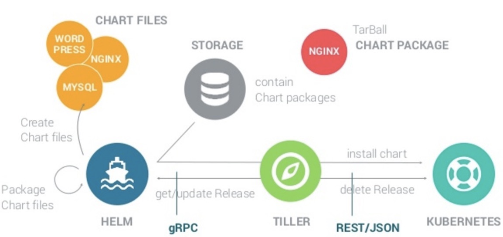

# 1.Helm简介

## 前言

有成千上万的人和公司将他们的应用程序打包在Kubernetes上进行部署。这通常涉及制定一些配置应用程序运行时的不同Kubernetes资源定义，以及定义用户和其他应用程序利用与应用程序通信的机制。有一些非常常见的应用程序，用户经常寻找有关部署的指导，例如数据库，CI工具和内容管理系统。这些类型的应用程序通常不是最终用户开发和迭代的应用程序，而是根据特定用例自定义其配置。部署该应用程序后，用户可以将其链接到现有系统或利用其功能来解决他们的痛点。

有关如何配置这些应用程序的最佳实践，用户可以查看许多可用资源，例如：Kubernetes存储库中的[examples文件夹](https://github.com/kubernetes/kubernetes/tree/master/examples)，Kubernetes [contrib存储库](https://github.com/kubernetes/contrib)，[Helm Charts存储库](https://github.com/helm/charts)和[Bitnami Charts存储库](https://github.com/bitnami/charts)。虽然这些不同的位置提供了指导，但并不总是正式化或一致，因此用户可以在不同的应用程序中利用类似的安装过程。

在这种情况下，我们不是创建另一个应用程序的地方，而是将现有的地方作为规范地点。作为[Kubernetes 1.4版本](https://kubernetes.io/blog/2016/09/kubernetes-1.4-making-it-easy-to-run-on-kuberentes-anywhere)的特别兴趣小组应用程序（[SIG应用程序](https://github.com/kubernetes/community/tree/master/sig-apps)）工作的[一部分](https://kubernetes.io/blog/2016/09/kubernetes-1.4-making-it-easy-to-run-on-kuberentes-anywhere)，我们开始为这些Kubernetes可部署应用程序提供一个家，该应用程序提供记录良好且用户友好的软件包的连续版本。这些包正在创建为Helm [**Charts**](https://github.com/kubernetes/helm/blob/master/docs/charts.md)，可以使用Helm工具进行安装。**Helm**允许用户轻松地模板化他们的Kubernetes清单并提供一组配置参数，允许用户自定义他们的部署。

翻译自[Helm Charts: making it simple to package and deploy common applications on Kubernetes](https://kubernetes.io/blog/2016/10/helm-charts-making-it-simple-to-package-and-deploy-apps-on-kubernetes/)

## Helm原理

helm架构图

图片来源[Helm一：简介](https://www.cnblogs.com/breezey/p/9398918.html)

## Helm组件

Helm是一种简化Kubernetes应用程序安装和管理的工具。类似于Linux的apt或者yum等包管理工具。

Helm包括部分：client（`helm`）和server（`tiller`）

`Helm` 是终端用户使用的命令行工具，用户可以：

- 在本地开发 chart。

- 管理 chart 仓库。

- 与 Tiller 服务器交互。

- 在远程 Kubernetes 集群上安装 chart。

- 查看 release 信息。

- 升级或卸载已有的 release

`Tiller` 服务器运行在 Kubernetes 集群中，它会处理 Helm 客户端的请求，与 Kubernetes API Server 交互。Tiller 服务器负责：

- 监听来自 Helm 客户端的请求。

- 通过 chart 构建 release。

- 在 Kubernetes 中安装 chart，并跟踪 release 的状态。

- 通过 API Server 升级或卸载已有的 release。

## Helm概念

Helm 有两个重要的概念：chart 和 release.

`chart `是创建一个应用的信息集合，包括各种 Kubernetes 对象的配置模板、参数定义、依赖关系、文档说明等。chart 是应用部署的自包含逻辑单元。可以将 chart 想象成 apt或yum 的软件安装包。Chart可以`*.tgz`格式存储于磁盘上，也可以从远程Chart存储库(`git`)中获取

Chart是包含至少两件事的Helm包：

- Kubernetes安装包的描述（`Chart.yaml`）
- 一个或多个模板，包含Kubernetes应用的必要文件

`release` 是 chart 的运行实例，代表了一个正在运行的应用。当 chart 被安装到 Kubernetes 集群，就生成一个 release。chart 能够多次安装到同一个集群，每次安装都是一个 release。

## Helm功能

作为Kubernetes的一个包管理工具，Helm具有如下功能：

- 创建新的chart
- chart打包成tgz格式
- 上传chart到chart仓库或从仓库中下载chart
- 在Kubernetes集群中安装或卸载chart
- 管理用Helm安装的chart的发布周期

## Helm实现

Helm的客户端和

- Helm client采用go语言编写，采用gRPC协议与Tiller server交互。
- Tiller server也同样采用go语言编写，提供了gRPC server与client进行交互，利用Kubernetes client 库与Kubernetes进行通信，当前库使用了REST+JSON格式。
- Tiller server 没有自己的数据库，目前使用Kubernetes的ConfigMaps存储相关信息

本文参考了以下文章：

[Helm一：简介](https://www.cnblogs.com/breezey/p/9398918.html)

[Helm 架构 - 每天5分钟玩转 Docker 容器技术](https://www.cnblogs.com/CloudMan6/p/8970314.html)

[Helm Charts: making it simple to package and deploy common applications on Kubernetes](https://kubernetes.io/blog/2016/10/helm-charts-making-it-simple-to-package-and-deploy-apps-on-kubernetes/)

感谢以上原创作者

