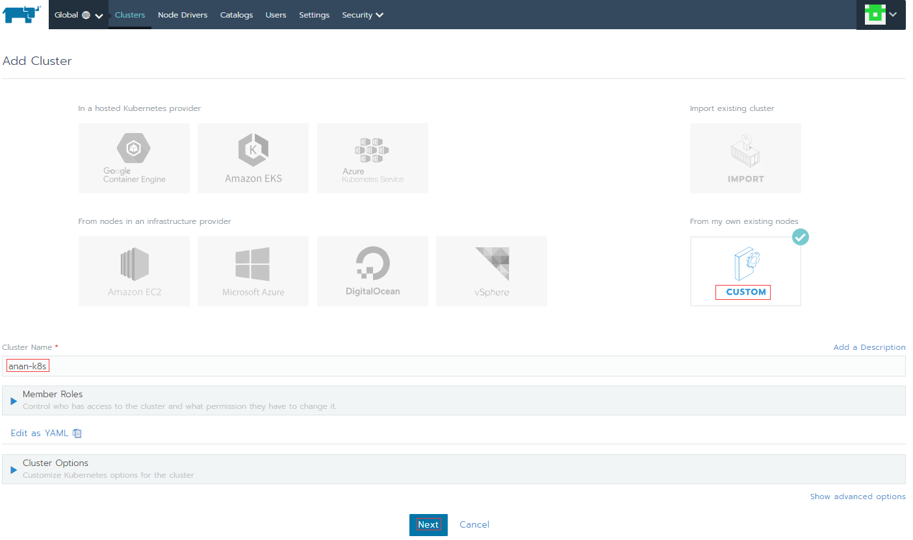
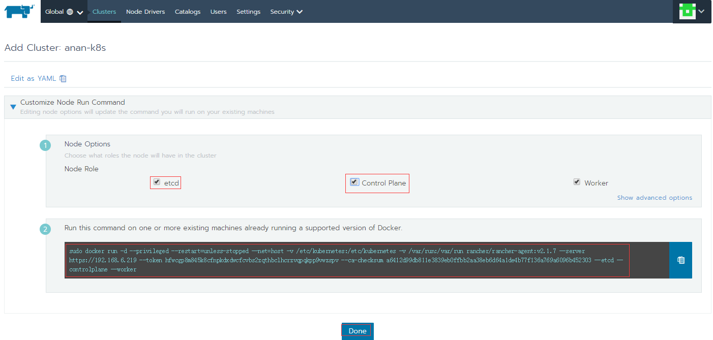

## Rancher install

### 安装Docker

略

### 安装Rancher Server

在安装好docker的节点上执行以下命令，部署Rancher Server服务

```
[root@hadoop1]~# sudo docker run -d -p 80:80 -p 443:443 --restart=always -v /data/rancher/db:/var/lib/mysql -name my-rancher rancher/rancher:stable 
Unable to find image 'rancher/rancher:stable' locally
stable: Pulling from rancher/rancher
6cf436f81810: Pull complete
...
821c0eae95fd: Pull complete
Digest: sha256:1943e9b7d802992d3c61184af7ae2ca5d414c15152bc40ec995e71e28cb80844
Status: Downloaded newer image for rancher/rancher:stable
304b229f11f25250f5d1f56c4938716f17fa409f0c03310c395469505ded3c38
# 检查
[root@hadoop1]~# docker ps
CONTAINER ID        IMAGE                    COMMAND             CREATED             STATUS              PORTS                                      NAMES
304b229f11f2        rancher/rancher:stable   "entrypoint.sh"     19 seconds ago      Up 18 seconds       0.0.0.0:80->80/tcp, 0.0.0.0:443->443/tcp   my-rancher
```

### 添加集群

访问：ip:80，例如：https://192.168.6.219:80

1.`Add cluster`

2.Rancher支持一般主流的云主机，如ASW，Azure,阿里云等，我这里直接用的是裸机所以选择	`CUSTOM`

3.在`Cluster Name`处为kubernetes集群命名，如anan-k8s

4.点击`Member Roles`为集群添加用户，默认只有一个admin用户

5.为集群选择k8s版本，网络以及云主机类型等，我这里直接用默认的

6.配置以上信息后，点`Next`到下一步



#### 安装Rancher Agent

将黑色框内的命令拿到准备作为kubernetes的worker节点上去执行



在worker节点上执行以下命令

```shell
[root@hadoop1]~# sudo docker run -d --privileged --restart=unless-stopped --net=host -v /etc/kubernetes:/etc/kubernetes -v /var/run:/var/run rancher/rancher-agent:v2.1.7 --server https://192.168.6.219 --token hfwcgp8m845k8cfnpkdxdwcfcvbs2zqthbclhcrzvqpqkpp9vwzspv --ca-checksum a6412d99db811e3839eb0ffbb2aa38eb6d64a1de4b77f136a769a6096b452303 --etcd --controlplane --worker
Unable to find image 'rancher/rancher-agent:v2.1.7' locally
v2.1.7: Pulling from rancher/rancher-agent
6cf436f81810: Already exists
...
c5997b613e9e: Pull complete
Digest: sha256:865ec8052bfa002b8f6d8011735779c6f9ef044252e7573bba7ba6c951f5b086
Status: Downloaded newer image for rancher/rancher-agent:v2.1.7
4e27fefba5e4af5123e996aaff400e17e7d6c47b02bd8c1b6c226c7f210c9f34
[root@hadoop1]~#
```

> 最佳实践worker节点与管理节点不放在一个节点上

到此为止我们已经基于rancher安装好了kubernetes集群