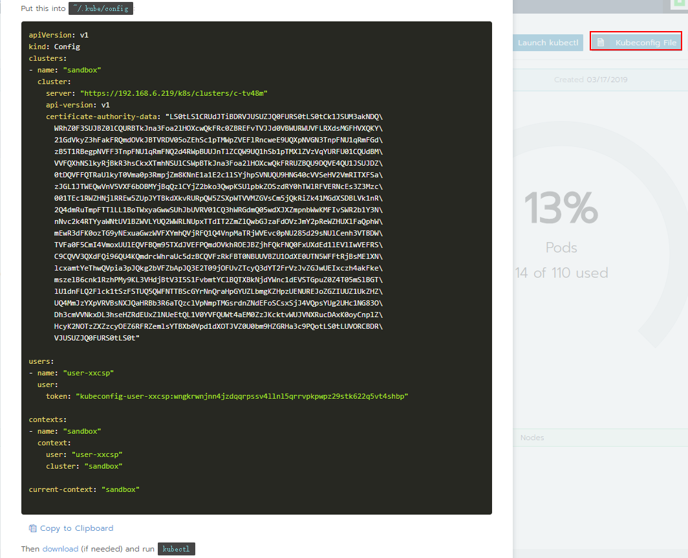

#### Rancher发生"Unable to connect to the server: x509: certificate signed by unknown authority"问题解决

```sh
[root@hadoop1]/opt/helm# kubectl create -f rbac-config.yaml
Unable to connect to the server: x509: certificate signed by unknown authority (possibly because of "crypto/rsa: verification error" while trying to verify candidate authority certificate "cattle-ca")
[root@hadoop1]/opt/helm# kubectl get node
Unable to connect to the server: x509: certificate signed by unknown authority (possibly because of "crypto/rsa: verification error" while trying to verify candidate authority certificate "cattle-ca")
[root@hadoop1]/opt/helm# 
```

解决方案：

错误提示已经非常的明显了，证书有问题。

错误信息让我立刻想到我rancher集群的server重启过，于是我重新去打开Rancher`主页`->`cluster:cluster name`->`Kuberconfig File`发现`certificate-authority-data`的值跟我本地的`.kube/config`里`certificate-authority-data`的值不一样了；验证了想法后将`.kube/config`备份，然后将集群上的`Kuberconfig File`内容重新追加到`.kube/config`中；再执行`kubectl get node`不会再发生错误。

如果本文有幸能帮助到您，给个`start`不胜感激，谢谢！

操作日志如下：



```shell
[root@hadoop1]~/.kube# mv  config config.bak
[root@hadoop1]~/.kube# cat config.bak
apiVersion: v1
kind: Config
clusters:
- name: "sandbox"
  cluster:
    server: "https://192.168.6.219/k8s/clusters/c-6bqrw"
    api-version: v1
    certificate-authority-data: "LS0tLS1CRUdJTiBDRVJUSUZJQ0FURS0tLS0tCk1JSUM3akNDQ\
      WRhZ0F3SUJBZ0lCQURBTkJna3Foa2lHOXcwQkFRc0ZBREFvTVJJd0VBWURWUVFLRXdsMGFHVXQKY\
      21GdVkyZ3hFakFRQmdOVkJBTVRDV05oZEhSc1pTMWpZVEFlRncweE9UQXlNVFV4TmpRek5EbGFGd\
      zB5T1RBeQpNVEl4TmpRek5EbGFNQ2d4RWpBUUJnTlZCQW9UQ1hSb1pTMXlZVzVqYURFU01CQUdBM\
      VVFQXhNSlkyRjBkR3hsCkxXTmhNSUlCSWpBTkJna3Foa2lHOXcwQkFRRUZBQU9DQVE4QU1JSUJDZ\
      0tDQVFFQXBwYVdxMkJNSVVqMnMzLy8KWjJWaGU2M1p5UTBxSklkYU9hdlJSR0JDc2V5OWExc0JGU\
      nhFUVlwZjZRMFlqc0V4UklEZE9CZlBnRTdud0ttUgpoK2lHSEpMTVpRd21lTnhic0o4NjdkSThKU\
      HBBRlN5UGkrUERjakVGb3N2MlNqeGlNVFduOFB5L25mcDZJODRrCjA5ZFprWWczam1SUXVxNlh2N\
      0hmNExpSWc4NWpTUVJia28wRUFMRGRHZDZLdVpvRVYzam9TQThyMHo0aCtjWHgKdi9CbnhqMkZZT\
      mRXVzZmU0hEOGc3UzY3aFNFcGt4MzBqVFJGZVZ4WXZjTUZnMDA0WEl5cjJTZDBEdFgvQUpueQpMV\
      jd5MXBVU1I5clB5a09ZSUFJYkJoS0trOCtWME43dHF2SUV6NDNHckxXUFpQS0NwbUJpc0h2TzQ2K\
      2c0UHpSCkQ3dk9kUUlEQVFBQm95TXdJVEFPQmdOVkhROEJBZjhFQkFNQ0FxUXdEd1lEVlIwVEFRS\
      C9CQVV3QXdFQi96QU4KQmdrcWhraUc5dzBCQVFzRkFBT0NBUUVBWldZSU5yby82akFoWFlRZno1M\
      EZYVzk5YVRwbEg3MWprRlNYTkZ2ZQo3bFpoY2w3alJSRkw2KzVQYm1LejV1amczUk9jMTRoSW81Q\
      U1hV0YvQUxMNUZ1RURPd1JtejhTbzNvcnQvM1pvClFreVd5WDlVNlFNeVZTU2R3V2pzaFVmSG41d\
      mtobU0rT3FYZ3pKd0RLVEhlektOYWFzSTZjeVl3akJVVnZFK1YKbzNncnhkVjhlc3ZVZmNqRS84Q\
      kRiL1ZFSXhPZnRrZnZBb3MrakJMbzk5VHlRODZLYUNIN3hrTkpycEdGNzUzTQpOaVJacEZCd1RrW\
      HhUVDJGdlRBazNzY01yeXVrRWQrSHJzbzZqeFJJSllyYU5CYmZTUVB2T25lc0JUSjR2SWxTCmZMS\
      mZjUi9YOFY1V2dqQ0VSaWNuYVB4a0VhT2hLaHlYUUd1WTVmd3BxMlNNSkE9PQotLS0tLUVORCBDR\
      VJUSUZJQ0FURS0tLS0t"

users:
- name: "user-cpt2w"
  user:
    token: "kubeconfig-user-cpt2w:pbpkds4tl48cgd9nmfjfggbcr2tfq56h8sfr4f8fj2tt57jvx2kglp"

contexts:
- name: "sandbox"
  context:
    user: "user-cpt2w"
    cluster: "sandbox"

current-context: "sandbox"

[root@hadoop1]~/.kube# cat config
apiVersion: v1
kind: Config
clusters:
- name: "sandbox"
  cluster:
    server: "https://192.168.6.219/k8s/clusters/c-tv48m"
    api-version: v1
    certificate-authority-data: "LS0tLS1CRUdJTiBDRVJUSUZJQ0FURS0tLS0tCk1JSUM3akNDQ\
      WRhZ0F3SUJBZ0lCQURBTkJna3Foa2lHOXcwQkFRc0ZBREFvTVJJd0VBWURWUVFLRXdsMGFHVXQKY\
      21GdVkyZ3hFakFRQmdOVkJBTVRDV05oZEhSc1pTMWpZVEFlRncweE9UQXpNVGN3TnpFNU1qRmFGd\
      zB5T1RBegpNVFF3TnpFNU1qRmFNQ2d4RWpBUUJnTlZCQW9UQ1hSb1pTMXlZVzVqYURFU01CQUdBM\
      VVFQXhNSlkyRjBkR3hsCkxXTmhNSUlCSWpBTkJna3Foa2lHOXcwQkFRRUZBQU9DQVE4QU1JSUJDZ\
      0tDQVFFQTRaUlkyT0Vma0p3RmpjZm8KNnE1a1E2c1lSYjhpSVNUQU9HNG40cVVSeHV2VmRITXFSa\
      zJGL1JTWEQwVnV5VXF6bDBMYjBqQzlCYjZ2bko3QwpKSUlpbkZOSzdRY0hTWlRFVERNcEs3Z3Mzc\
      001TEc1RWZHNjlRREw5ZUpJYTBkdXkvRURpQW5ZSXpWTVVMZGVsCm5jQkRiZk41MGdXSDBLVk1nR\
      2Q4dmRuTmpFTTlLL1BoTWxyaGwwSUhJbUVRV01CQ3hWRGdmQ05wdXJXZmpnbWwKMFIvSWR2b1Y3N\
      nNvc2k4RTYyaWNtUVlBZWVLYUQ2WWRLNUpxTTdIT2ZmZlQwbGJzaFdOVzJmY2pReWZHUXlFaQphW\
      mEwR3dFK0ozTG9yNExuaGwzWVFXYmhQVjRFQ1Q4VnpMaTRjWVEvc0pNU285d29sNUlCenh3VTBDW\
      TVFa0F5CmI4VmoxUUlEQVFBQm95TXdJVEFPQmdOVkhROEJBZjhFQkFNQ0FxUXdEd1lEVlIwVEFRS\
      C9CQVV3QXdFQi96QU4KQmdrcWhraUc5dzBCQVFzRkFBT0NBUUVBZU1OdXE0UTN5WFFtRjBsMElXN\
      lcxamtYeThwQVpia3pJQkg2bVFZbApJQ3E2T09jOFUvZTcyQ3dYT2FrVzJvZGJwUEIxczh4akFke\
      mszelB6cnk1RzhPMy9KL3VHdjBtV3I5S1FvbmtYClBQTXBkNjdYWnc1dEVSTGpuZ0Z4T05mSlBGT\
      lU1dnFLQ2Flck1tSzFSTUQ5QWFNTTBScGYrNnQraHpGYUZLbmgKZHpzUENUREJoZGZIUUZ1UkZHZ\
      UQ4MmJzYXpVRVBsNXJQaHRBb3R6aTQzclVpNmpTMGsrdnZNdEFoSCsxSjJ4VQpsYUg2UHc1NG83O\
      Dh3cmVVNkxDL3hseHZRdEUxZlNUeEtQL1V0YVFQUWt4aEM0ZzJKcktvWUJVNXRucDAxK0oyCnplZ\
      HcyK2NOTzZXZzcyOEZ6RFRZemlsYTBXb0Vpd1dXOTJVZ0U0bm9HZGRHa3c9PQotLS0tLUVORCBDR\
      VJUSUZJQ0FURS0tLS0t"

users:
- name: "user-xxcsp"
  user:
    token: "kubeconfig-user-xxcsp:wngkrwnjnn4jzdqqrpssv4llnl5qrrvpkpwpz29stk622q5vt4shbp"

contexts:
- name: "sandbox"
  context:
    user: "user-xxcsp"
    cluster: "sandbox"

current-context: "sandbox"

[root@hadoop1]~/.kube#
[root@hadoop1]~/.kube# kubectl get node
NAME      STATUS   ROLES                      AGE   VERSION
hadoop1   Ready    controlplane,etcd,worker   38d   v1.13.4
```

