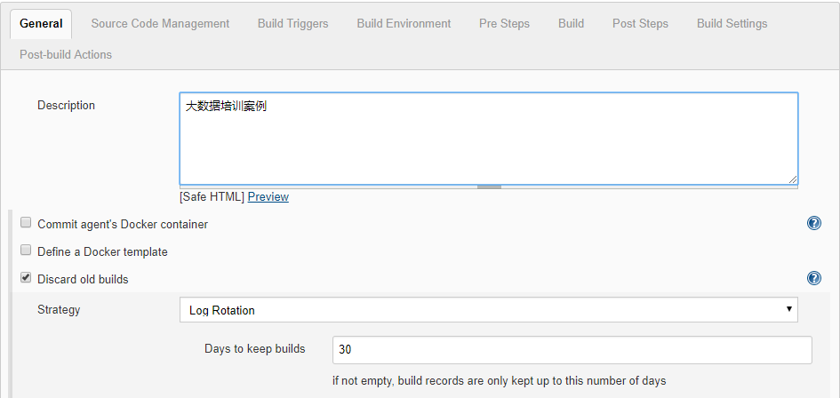
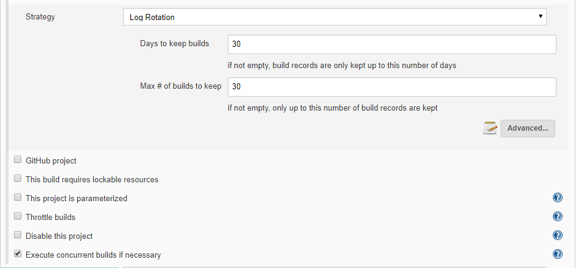
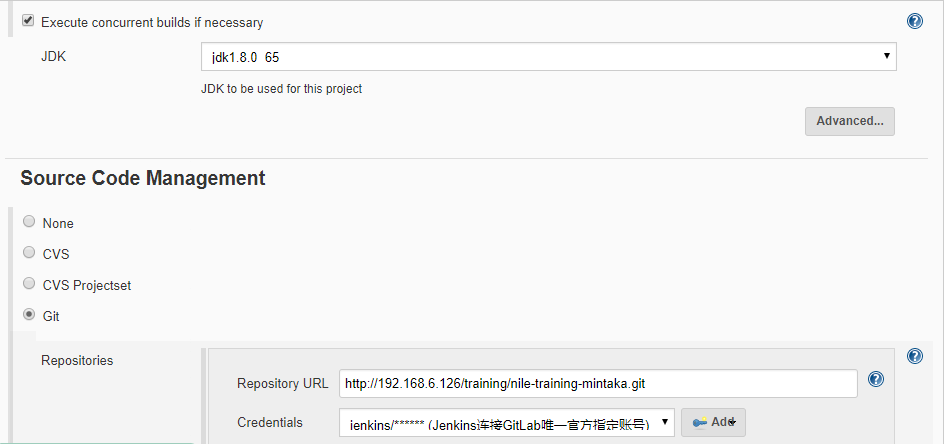
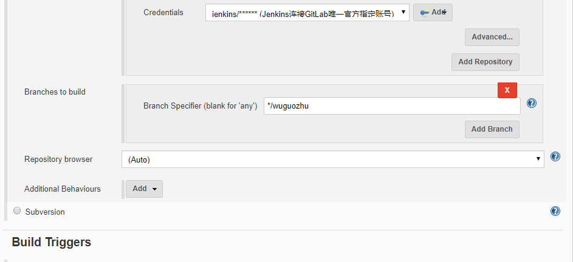
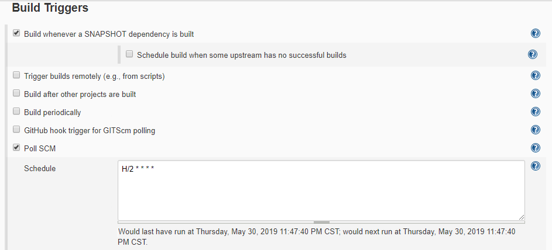
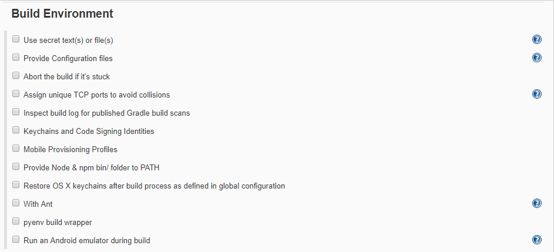
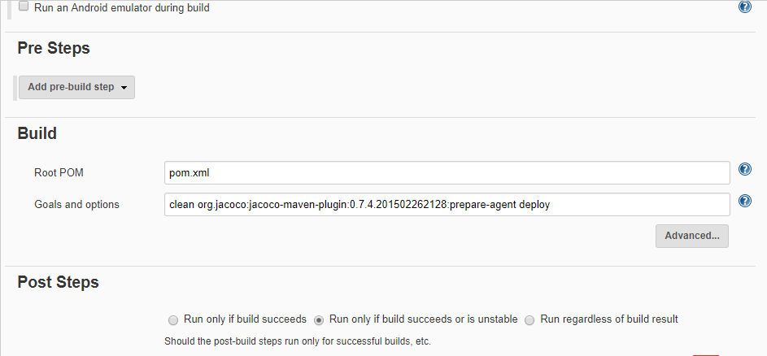
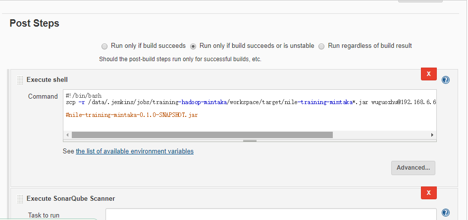
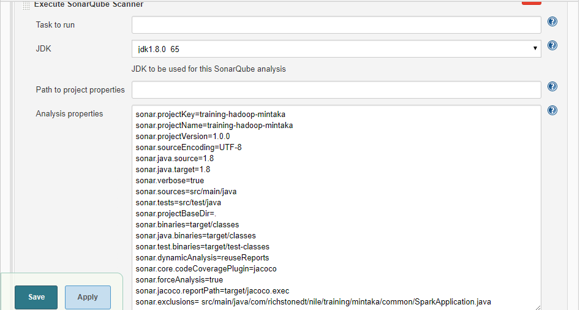

```
sonar.projectKey=training-hadoop-mintaka
sonar.projectName=training-hadoop-mintaka
sonar.projectVersion=1.0.0
sonar.sourceEncoding=UTF-8
sonar.java.source=1.8
sonar.java.target=1.8
sonar.verbose=true
sonar.sources=src/main/java
sonar.tests=src/test/java
sonar.projectBaseDir=.
sonar.binaries=target/classes
sonar.java.binaries=target/classes
sonar.test.binaries=target/test-classes
sonar.dynamicAnalysis=reuseReports
sonar.core.codeCoveragePlugin=jacoco
sonar.forceAnalysis=true
sonar.jacoco.reportPath=target/jacoco.exec
sonar.exclusions= src/main/java/com/richstonedt/nile/training/mintaka/common/SparkApplication.java
```

