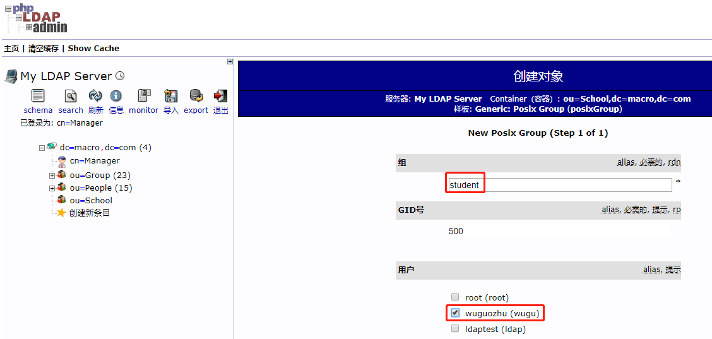

# PHPLdapAdmin的安装及使用

## 前言

OpenLdap方便集成于各种SSO系统，但是命令操作极其复杂，且容易出错；本篇文章为实践OpenLDAP管理工具Phpldapadmin的安装及使用。

- 内容概述

1.环境准备及部署

2.phpldapadmin的访问及使用

- 测试环境

1.CM和CDH版本为5.16.1

2.Phpldapadmin版本为1.2.3

## 环境准备及部署

1.安装PHP环境及依赖

```shell
yum -y install httpd php php-ldap php-gd php-mbstring php-pear php-bcmath php-xml
```


2.下载最新的phpldapadmin安装包

```shell
wget https://nchc.dl.sourceforge.net/project/phpldapadmin/phpldapadmin-php5/1.2.3/phpldapadmin-1.2.3.tgz
```


3.将下载的压缩包解压至/var/www/html目录下

```shell
tar -zxf phpldapadmin-1.2.3.tgz
mv phpldapadmin-1.2.3 phpldapadmin
```


4.进入/var/www/html/phpldapadmin/conf目录下，并将config.php.example重命名为config.php文件

```shell
cp config.php.example config.php
```


5.编辑config.php的，将OpenLDAP的信息添加到该配置文件中

```php
$servers->setValue('server','host','hadoop0.macro.com');
$servers->setValue('server','port',389);
$servers->setValue('server','base',array('dc=macro,dc=com'));
$servers->setValue('login','auth_type','cookie');
$servers->setValue('login','bind_id','cn=Manager,dc=macro,dc=com');
$servers->setValue('login','bind_pass','123456');
$servers->setValue('server','tls',false);
```

主要配置LDAP的服务器地址，Base DN，管理员账号及密码（可选择性的配置）

6.配置完成后启动httpd服务

```shell
[root@hadoop1 config]# systemctl  restart httpd
[root@hadoop1 config]# systemctl  status httpd
```


## phpldapadmin访问及使用

1.在浏览器输入http://192.168.0.191/phpldapadmin访问


2.点击“登录”，配置文件中配置了管理员的账号所以默认显示为管理员账号


3.输入管理员密码进行认证，登录成功后显示如下界面：


## 创建OpenLDAP基础域

1.点击“创建新条目”，选择“Organisational Unit”


2.创建基础域School


3.点击“创建对象”


4.点击“提交”完成创建


备注：我发现基础域的名称都是大写的所以更名了一下

## 创建OpenLDAP组

1.在School下面创建一个student组


2.选择“Posix Group”


3.输入组名并选择wuguozhu用户属于该组



4.点击“创建对象”


5.点击“提交”完成student组创建


6.登录服务器查看wuguozhu用户拥有的组

```
[root@hadoop1 html]#  systemctl restart sssd
[root@hadoop1 html]# id wuguozhu
uid=1000(wuguozhu) gid=1000(wuguozhu) groups=1000(wuguozhu),1001(supergroup),500(student)
[root@hadoop1 html]#
```


备注：有必要时可以删除sssd缓存`rm -rf /var/lib/sss/db/cache_default.ldb `

## 创建OpenLDAP用户

1.在Users基础域下创建一个zhangsan的用户


2.选择默认“User Account”


3.填写用户基本信息


4.点击“创建对象”


6.登录服务器查看zsan用户

```shell
id zsan
```

