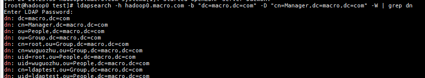
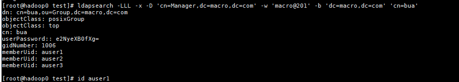
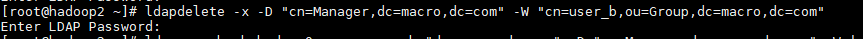

### Ldap常用命名

用户组ldif文件

```shell
[root@hadoop0 ldap]# cat anan-group.ldif
dn: cn=ranan,ou=Group,dc=macro,dc=com
objectClass: posixGroup
objectClass: top
cn: ranan
userPassword: {SSHA}HeN0fwslTm2/gYsWRbFyTXIolgqZ0Qpc
gidNumber: 1006

dn: cn=wanan,ou=Group,dc=macro,dc=com
objectClass: posixGroup
objectClass: top
cn: wanan
userPassword: {SSHA}AHnuGlB99W84ZEEOx9kogl+vTYH0/t4n
gidNumber: 1007
[root@hadoop0 ldap]#
```

用户ldif文件

```shell
[root@hadoop0 ldap]# cat anan-user.ldif
dn: uid=ranan,ou=People,dc=macro,dc=com
uid: ranan
cn: ranan
objectClass: account
objectClass: posixAccount
objectClass: top
objectClass: shadowAccount
userPassword: {SSHA}HeN0fwslTm2/gYsWRbFyTXIolgqZ0Qpc
shadowLastChange: 17564
loginShell: /bin/false
uidNumber: 1006
gidNumber: 1006
homeDirectory: /var/lib/ranan

dn: uid=wanan,ou=People,dc=macro,dc=com
uid: wanan
cn: wanan
objectClass: account
objectClass: posixAccount
objectClass: top
objectClass: shadowAccount
userPassword: {SSHA}AHnuGlB99W84ZEEOx9kogl+vTYH0/t4n
shadowLastChange: 17564
loginShell: /bin/bash
uidNumber: 1007
gidNumber: 1007
homeDirectory: /var/lib/wanan
```

注意：每个dn以空行分开

用户密码生成

```shell
slappasswd -h {SSHA} -s password
e.g:
slappasswd -h {SSHA} -s ranan
```


#### 添加用户

```
ldapadd -D "cn=Manager,dc=macro,dc=com" -W -x -f <ldif file>
e.g:
ldapadd -D "cn=Manager,dc=macro,dc=com" -W -x -f 
```

**查看用户**

```
ldapsearch -h hadoop0.macro.com -b "dc=macro,dc=com" -D "cn=Manager,dc=macro,dc=com" -W | grep dn
```



**查看用户组**

```
ldapsearch -LLL -x -D 'cn=Manager,dc=macro,dc=com' -w 'macro@201' -b 'dc=macro,dc=com' 'cn=bua'
```



**删除用户**

```
ldapdelete -x -D "cn=Manager,dc=macro,dc=com" -W "cn=user_b,ou=Group,dc=macro,dc=com"
```



**添加用户到已有组**

```
[root@hadoop0 test]# cat update.ldif
dn: cn=bua,ou=Group,dc=macro,dc=com
changetype: modify
add: memberUid
memberUid: auser1
```

添加命令

```
ldapmodify -x -D "cn=Manager,dc=macro,dc=com" -W -f update.ldif
```

**备份与还原**

备份

```shell
ldapsearch -x -b "dc=163,dc=com" -D "uid=authz,ou=Public,dc=163,dc=com" -w "AzdfD863M4" > ldap.20180626.ldif
```

参数说明

- `-x`：进行简单的验证
- `-D`：用来绑定服务器的DN
- `-w`：绑定DN的密码
- `-b`：要查询的根节点 authz账号要有`"dc=163,dc=com"`的查询权限

还原

```shell
ldapadd -x -c -D "cn=admin,dc=163,dc=com" -w "smile" -f ldap.20180626.ldif
```

参数说明

- `-c`：出错后继续执行程序不终止，默认出错即停止
- `-f`：从文件内读取信息还原，而不是标准输入 还原的DN最好为管理员账号，至少也要有要LDAP的写入权限